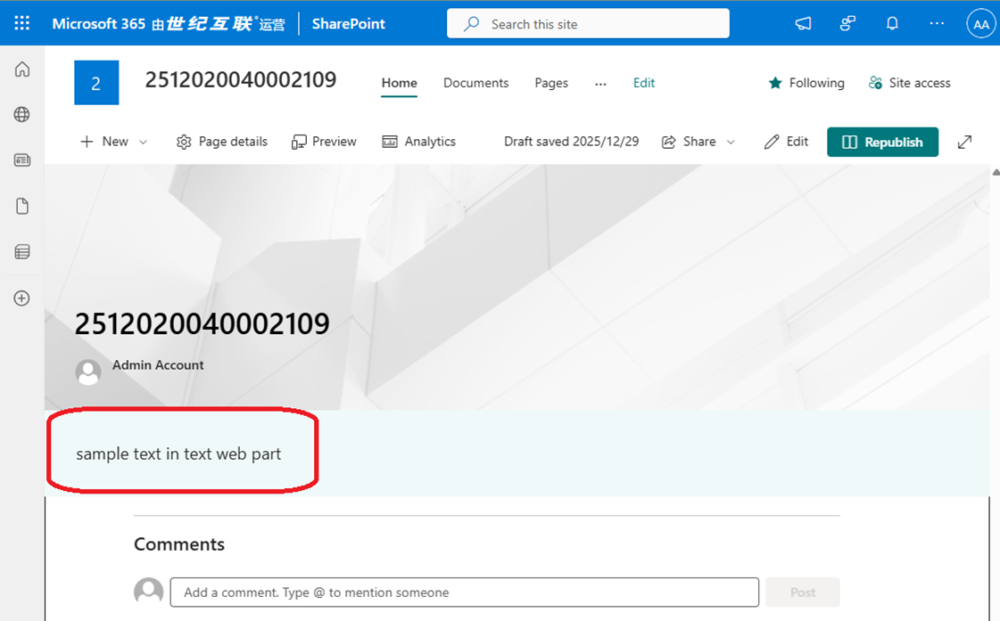

# Automating SharePoint Page Notifications via PowerShell & Microsoft Graph API

## Overview

After large-scale SharePoint migrations, organizations often need to notify users that a site has moved to a new URL. For example, when migrating hundreds or thousands of sites, administrators may want to add a banner or text notice to the original site so users can easily locate the new site location.

SharePoint provides several manual approaches—such as adding a banner, inserting a Text Web Part, publishing News, or developing an SPFx component. However, **SharePoint currently lacks built‑in automation** to update modern pages at scale.

To address this gap, this script uses **Microsoft Graph API** to automatically insert a text Web Part into a SharePoint modern page.

---

## Background and Motivation

A customer recently required a solution that, after site migration, would **automatically place a notice** on the original site to redirect users to the new site URL.

However:

### Existing tools have limitations

- **Add-PnPPageTextPart**, a PnP PowerShell command intended for adding a Text Web Part, currently has **known bugs and stability issues**, and cannot reliably support large-scale automation. Fixes are expected in future PnP releases.
- SharePoint Online does not offer direct native PowerShell cmdlets to programmatically modify modern page layout.
- SPFx requires deployment, packaging, tenant admin approval, and cannot inject content into existing pages automatically.

## What This Script Does

This PowerShell script:

1. Obtains an **access token** using client credentials (App Registration + secret).
2. Calls **Microsoft Graph API in the Mooncake (China) cloud**.
3. Adds a **new horizontal section** to an existing page.
4. Injects a **Text Web Part** containing a customizable HTML message.
5. Allows flexible configuration of:
   - Section ID, emphasis, layout  
   - Column ID, width  
   - Web Part ID  
   - HTML content  

This makes it ideal for large-migration scenarios where hundreds of site pages must display the same message such as:

> “This site has moved. Please visit the new site at: …”

---

## Use Cases

- Post‑migration site relocation notices  
- Large‑scale homepage updates (hundreds/thousands of sites)  
- Automated UX improvements for legacy pages  
- Org‑wide announcements  
- Deprecation notices for old sites  

---

## Prerequisites

- An Azure AD / Entra ID App Registration with:
  - **Client ID**
  - **Client Secret**
  - Permission: `Sites.ReadWrite.All` (Application) Or Sites.Selected (Application)
- Admin consent granted
- Modern SharePoint pages (classic pages are not supported)
- PowerShell 5.1 or PowerShell 7+

---

## How to Use

1. Edit the parameters in the script:
   - Tenant ID  
   - Client ID  
   - Client Secret  
   - Site ID  
   - Page ID  
   - Text content HTML

2. Run the PowerShell script.

3. The script:
   - Authenticates using Microsoft Graph  
   - Builds a horizontal section payload  
   - Inserts a Text Web Part into the specified modern page  
   - Returns the Graph API result  

---

## Reference Documentation

- Microsoft Graph API:  
  **Site Page – Add Horizontal Section**  
  https://learn.microsoft.com/en-us/graph/api/sitepage-post-horizontalsection?view=graph-rest-1.0