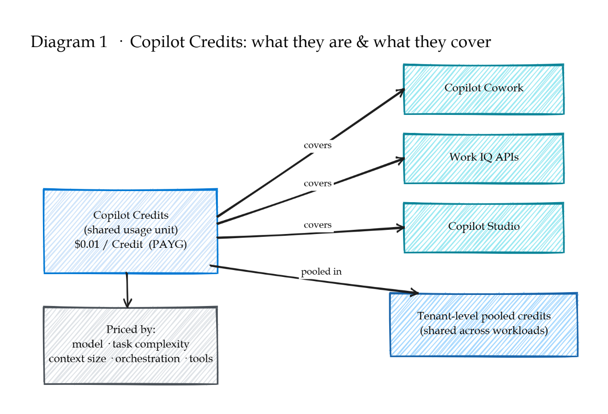
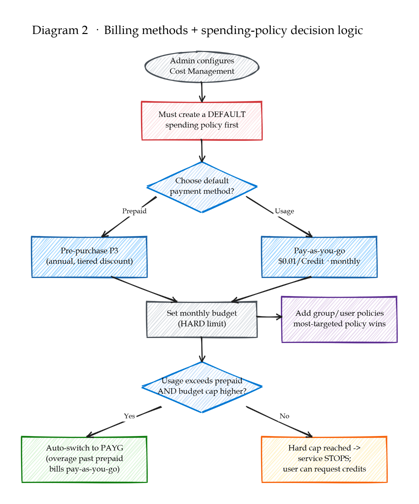
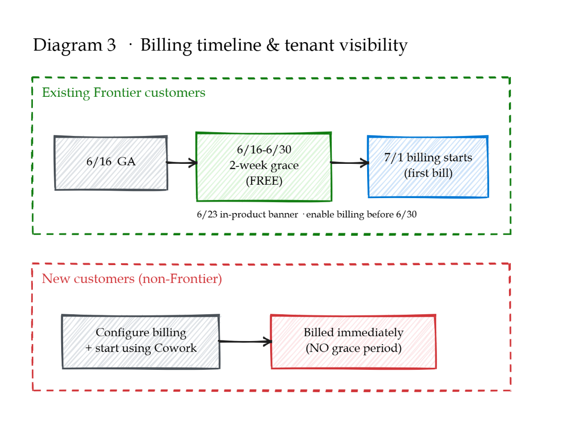

# CoWork Copilot Credit Usage-Based Billing Setup: Hands-On Walkthrough and Real-World Customer Questions

## Background

Billing for existing Frontier customers takes effect on July 1. Any tenant already using Cowork within Frontier will not be billed before July 1—even for usage incurred between June 16 (GA) and June 30.

## How is CoWork billed?

Two payment models are available, both metered in Copilot Credits:

1.     Prepaid — purchase Copilot Credits up front.

2.     Pay-as-you-go — bind an Azure Subscription (i.e., a credit card associated); you are charged for what you consume, settled at month-end. Concerned about overspending? Configure Cost Management per the article referenced below.

## How do I configure CoWork Cost Management?

Some users consume tokens aggressively, and administrators often want to keep this in check. The article below contains the complete steps for configuring a CoWork Cost Management Policy:

https://learn.microsoft.com/en-us/microsoft-365/copilot/usage-based-billing-manage-copilot-credits

## Product Update Digest — Copilot Credit Usage-Based Billing Model

### Quick Facts

Diagram 1 — What Credits are and what they cover

Diagram 2 — Billing methods + spending-policy decision logic

Diagram 3 — Billing timeline & tenant visibility

## The Customer’s Real-World Question

In production, customers typically assign different spending limits by user tier to optimize cost management—e.g., Policy A for power users (allowed to consume more Credits/Tokens) and Policy B for standard users (limited consumption). This raises three key questions:

| # | Question | Answer |
| --- | --- | --- |
| 1 | When prepaid credits exist, does the system consume them first before switching to pay-as-you-go? | Yes. Prepaid credits are deducted first; once exhausted, any overage automatically switches to pay-as-you-go. |
| 2 | If the customer first creates a default Spending Policy scoped to All Users, will security groups not covered by any policy automatically fall under this default policy? | By design, the default policy acts as a fallback and applies to any user not covered by a more specific policy. |
| 3 | How do I configure tiered per-user monthly limits across security groups, and which policy wins when multiple apply? | Create a separate policy per group (Policy A with a higher limit, Policy B with a lower limit). When policies conflict, the higher budget prevails. At GA, policies can only target groups (individual-user scope is not yet supported), and the same group cannot appear in two policies simultaneously. |

----------
----------
----------

# CoWork Copilot Credit 用量计费模式：实战跑通与客户真实问题

## 背景

现有 Frontier 客户的计费自 7 月 1 日起正式生效。任何已在 Frontier 中使用 Cowork 的租户，在 7 月 1 日之前都不会产生费用——即便 6 月 16 日（GA）至 6 月 30 日期间已有实际用量，也不计费。

## CoWork 如何收费？

目前提供两种付费方式，二者均以 Copilot Credits 计量：

1.     预充值：直接购买 Copilot Credits。

2.     按量付费（Pay-as-you-go）：绑定 Azure Subscription（即绑定信用卡），用多少扣多少，月底结算扣款。若担心超额，需参照下文文章配置 Cost Management 加以管控。

## 如何配置 CoWork Cost Management？

部分用户 Token 消耗较为激进，管理员往往希望加以管控。下面这篇文章包含配置 CoWork Cost Management Policy 的完整步骤：

https://learn.microsoft.com/en-us/microsoft-365/copilot/usage-based-billing-manage-copilot-credits

## Product Update 知识点摘要 —— Copilot Credit 用量计费模式

### 要点速览

图 1 —— Credits 是什么、覆盖谁

图 2 —— 两种计费方式 + 支出策略决策逻辑

图 3 —— 计费时间线与租户可见性

## 客户最真实的问题

在真实生产环境中，客户通常会为不同级别的用户划分不同限额，以实现最优的成本管控。例如：策略 A 面向高级用户，允许其消耗更多 Credits / Tokens；策略 B 面向普通用户，限制其消耗。由此引出以下三个关键问题：

| # | 问题 | 答案 |
| --- | --- | --- |
| 1 | 当存在预付积分时，系统是否先消耗预付积分，再切换到按量付费（pay-as-you-go）？ | 是。系统优先扣减预付积分；一旦用尽，超出部分自动切换至按量付费。 |
| 2 | 客户先创建了一条受众为 All Users 的默认 Spending Policy，那么未被纳入任何策略的安全组，是否会自动由该默认策略覆盖？ | 按设计，默认策略作为兜底（fallback），适用于任何未被更具针对性策略覆盖的用户。 |
| 3 | 如何跨安全组配置分层的“每用户每月限额”？当多条策略同时适用时，哪条生效？ | 为每个组分别创建一条策略（策略 A 设高限额，策略 B 设低限额）。当策略冲突时，以“较高预算”者生效。在 GA 阶段，策略只能作用于组（尚不支持个人用户级别），且同一个组不能同时出现在两条策略中。 |