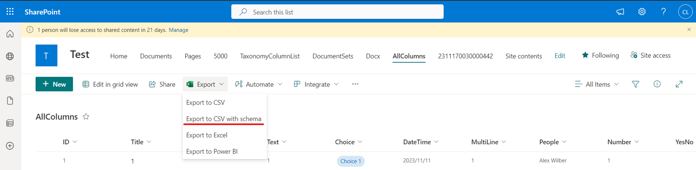
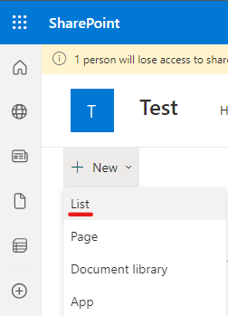
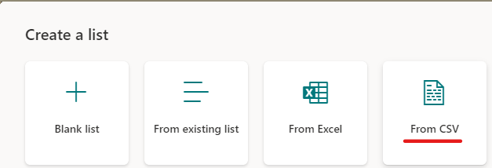

# Now SharePoint Online provides a very convenient feature that allows you to easily copy a list to another site or tenant:





However, if you want to migrate a list from online to on-premises or from on-premises to on-premises, you can follow the methods below:

# What can this script do?
Copying existing list to another environment (Online >> OnPrem or OnPrem >> OnPrem). (We can easily use gpt or github copilot to change this script to meet your scenario)

# Quick start
Assuming I have a sharepoint list with multiple columns and items: 


What this script will do is - it will help generate another indentical list with the same data: 


Currently this scirpt doens't support multi-values-column (single-value is ok), which means, if you have a people picker column that allow multiple values then this script will skip that column (data loss). 

# Use gpt to help you change the code to meet different enviorment (different columns)
Now imaging we have another brand-new list that needs to be copied, let's print out all the columns:  
### 1. Get-PnPField -List $ListName | ? { $_.Hidden -eq $False } | select InternalName, Title, TypeDisplayName | ft -a
```
InternalName              Title                    TypeDisplayName
------------              -----                    ---------------
Title                     Title                    Single line of text
LinkTitle                 Title                    Computed
_ColorTag                 Color Tag                Single line of text
ComplianceAssetId         Compliance Asset Id      Single line of text
Column1                   Column1                  Single line of text
Column2                   Column2                  Choice
Column3                   Column3                  Date and Time
Column4                   Column4                  Multiple lines of text
Column5                   Column5                  Person or Group
Column6                   Column6                  Number
Column7                   Column7                  Yes/No
Column9                   Column9                  Currency
Column10                  Column10                 Location
CountryOrRegion           Column10: Country/Region Single line of text
State                     Column10: State          Single line of text
City                      Column10: City           Single line of text
PostalCode                Column10: Postal Code    Single line of text
Street                    Column10: Street         Single line of text
GeoLoc                    Column10: Coordinates    Geolocation
DispName                  Column10: Name           Single line of text
Column11                  Column11                 Thumbnail
Column12                  Column12                 Managed Metadata
ID                        ID                       Counter
ContentType               Content Type             Computed
Modified                  Modified                 Date and Time
Created                   Created                  Date and Time
Author                    Created By               Person or Group
Editor                    Modified By              Person or Group
_UIVersionString          Version                  Single line of text
Attachments               Attachments              Attachments
Edit                      Edit                     Computed
LinkTitleNoMenu           Title                    Computed
DocIcon                   Type                     Computed
ItemChildCount            Item Child Count         Lookup
FolderChildCount          Folder Child Count       Lookup
_ComplianceFlags          Label setting            Lookup
_ComplianceTag            Retention label          Lookup
_ComplianceTagWrittenTime Retention label Applied  Lookup
_ComplianceTagUserId      Label applied by         Lookup
_IsRecord                 Item is a Record         Computed
AppAuthor                 App Created By           Lookup
AppEditor                 App Modified By          Lookup
```

### 2. Remove those system columns from #1 then use below prompt in Gpt:
The following is the column information for a SharePoint list, including the InternalName, Title, and TypeDisplayName for each column:
```
InternalName              Title                    TypeDisplayName
------------              -----                    ---------------
Title                     Title                    Single line of text
Column1                   Column1                  Single line of text
Column2                   Column2                  Choice
Column3                   Column3                  Date and Time
Column4                   Column4                  Multiple lines of text
Column5                   Column5                  Person or Group
Column6                   Column6                  Number
Column7                   Column7                  Yes/No
Column9                   Column9                  Currency
Column10                  Column10                 Location
CountryOrRegion           Column10: Country/Region Single line of text
State                     Column10: State          Single line of text
City                      Column10: City           Single line of text
PostalCode                Column10: Postal Code    Single line of text
Street                    Column10: Street         Single line of text
GeoLoc                    Column10: Coordinates    Geolocation
DispName                  Column10: Name           Single line of text
Column11                  Column11                 Thumbnail
Column12                  Column12                 Managed Metadata
Modified                  Modified                 Date and Time
Created                   Created                  Date and Time
Author                    Created By               Person or Group
Editor                    Modified By              Person or Group
Attachments               Attachments              Attachments
```
Task 1: Please help me list which ones are Person or Group, which ones are Hyperlink or Picture, which ones are Currency, which ones are Thumbnail, which ones are Managed Metadata, which ones are Lookup, and which ones are Attachments. I want a table for a clear overview for those ones I just mentioned, ignore those ones I didn't mention.  
Task 2: Based on the column information above, complete the following powershell command by filling in all the fields using the mentioned InternalName. Ignore those columns with the following TypeDisplayName: Person or Group, Hyperlink or Picture, Currency, Thumbnail, Managed Metadata, Lookup, Attachments. This is the PowerShell script that needs your completion: 
```
Add-PnPListItem -List $TargetListName -Values @{ "Title" = $item["Title"]; "Text" = $item["Text"]; }
```  
Task 3: Pls try to generate code for me, below is an example: 
```
    # Author, Created By
    Write-Host "Handling Author and Created By fields for item $($t.Id)"
    $user = $item["Author"].Email
    Set-PnPListItem -List $TargetListName -Identity $t.Id -Values @{"Author" = $user } | Out-Null

    # People Picker
    Write-Host "Handling People Picker field for item $($t.Id)"
    $user = $item["People"].Email
    Set-PnPListItem -List $TargetListName -Identity $t.Id -Values @{"People" = $user } | Out-Null

    # Hyperlink
    Write-Host "Handling Hyperlink field for item $($t.Id)"
    $url = $item["Hyperlink"].Url
    Set-PnPListItem -List $TargetListName -Identity $t.Id -Values @{"Hyperlink" = $url } | Out-Null

    # Currency
    Write-Host "Handling Currency field for item $($t.Id)"
    $currency = $item["Currency"]
    Set-PnPListItem -List $TargetListName -Identity $t.Id -Values @{"Currency" = $currency } | Out-Null

    # Thumbnail Image field
    Write-Host "Handling Image field for item $($t.Id)"
    $jsonString = $item.FieldValues["Image"] 
    # The value of the Thumbnail field is a JSON string, which needs to be converted to a JSON object first
    $jsonObject = ConvertFrom-Json -InputObject $jsonString
    $fileName = $jsonObject.fileName
    $serverRelativeUrl = $jsonObject.serverRelativeUrl
    # Download the image locally
    Get-PnPFile -Url $serverRelativeUrl -AsFile -Path $env:USERPROFILE\downloads -Filename $fileName -Force
    # Upload the image to the target list
    Set-PnPImageListItemColumn -List $TargetListName -Identity $t.Id -Field "Image" -Path $env:USERPROFILE\downloads\$fileName | Out-Null
    
    # Managed Metadata
    Write-Host "Handling Managed Metadata field for item $($t.Id)"
    $term = $item["ManagedMetadata"]
    Set-PnPListItem -List $TargetListName -Identity $t.Id -Values @{"ManagedMetadata" = $term.TermGuid } | Out-Null
    
    # Lookup
    Write-Host "Handling Lookup field for item $($t.Id)"
    $lookup = $item["Lookup"]
    Set-PnPListItem -List $TargetListName -Identity $t.Id -Values @{"Lookup" = $lookup.LookupId } | Out-Null

    # Attachments
    Write-Host "Handling attachments for item $($t.Id)"
    $attachments = $item["Attachments"]
    if ($attachments -eq $true) {
        # Download Attachments
        Get-PnPListItemAttachment -List $ListName -Identity $item.Id -Path $env:USERPROFILE\downloads -Force | Out-Null
        # Get Attachments Properties
        $filesProperties = Get-PnPProperty -ClientObject $item -Property "AttachmentFiles"
        $filesProperties | % {
            $fileName = $_.FileName
            Add-PnPListItemAttachment -List $TargetListName -Identity $t.Id -Path $env:USERPROFILE\downloads\$fileName | Out-Null
        }
    }

    # Editor, Modified By, Modified
    Write-Host "Handling Editor and Modified By fields for item $($t.Id)"
    $user = $item["Editor"].Email
    Set-PnPListItem -List $TargetListName -Identity $t.Id -Values @{"Editor" = $user; "Modified" = $item["Modified"] } | Out-Null
```
Based on the table you provide from Task 1, when a column is Person or Group (in our table it's Column5), then you generate below code, and so on: 
```
    # People Picker
    Write-Host "Handling People Picker field for item $($t.Id)"
    $user = $item["Column5"].Email
    Set-PnPListItem -List $TargetListName -Identity $t.Id -Values @{"Column5" = $user } | Out-Null
```

### 3. You will get below response from gpt:

Task 1: Overview Table

| InternalName       | TypeDisplayName         |
| ------------------ | ----------------------- |
| Column5            | Person or Group         |
| LinkTitle           | Hyperlink or Picture    |
| Column9            | Currency                |
| Column11           | Thumbnail               |
| Column12           | Managed Metadata        |
| Attachments        | Attachments             |

Task 2: PowerShell Command Completion

```powershell
Add-PnPListItem -List $TargetListName -Values @{
    "Title" = $item["Title"];
    "Column1" = $item["Column1"];
    "Column2" = $item["Column2"];
    "Column3" = $item["Column3"];
    "Column4" = $item["Column4"];
    "Column6" = $item["Column6"];
    "Column7" = $item["Column7"];
    "Column10" = $item["Column10"];
    "CountryOrRegion" = $item["CountryOrRegion"];
    "State" = $item["State"];
    "City" = $item["City"];
    "PostalCode" = $item["PostalCode"];
    "Street" = $item["Street"];
    "GeoLoc" = $item["GeoLoc"];
    "DispName" = $item["DispName"];
}
```

Task 3: PowerShell Code Generation

```powershell
# Person or Group
Write-Host "Handling People Picker field for item $($t.Id)"
$user = $item["Column5"].Email
Set-PnPListItem -List $TargetListName -Identity $t.Id -Values @{"Column5" = $user } | Out-Null

# Hyperlink or Picture
Write-Host "Handling Hyperlink field for item $($t.Id)"
$url = $item["LinkTitle"].Url
Set-PnPListItem -List $TargetListName -Identity $t.Id -Values @{"LinkTitle" = $url } | Out-Null

# Currency
Write-Host "Handling Currency field for item $($t.Id)"
$currency = $item["Column9"]
Set-PnPListItem -List $TargetListName -Identity $t.Id -Values @{"Column9" = $currency } | Out-Null

# Thumbnail
Write-Host "Handling Thumbnail field for item $($t.Id)"
$jsonString = $item["Column11"]
$jsonObject = ConvertFrom-Json -InputObject $jsonString
$fileName = $jsonObject.fileName
$serverRelativeUrl = $jsonObject.serverRelativeUrl
Get-PnPFile -Url $serverRelativeUrl -AsFile -Path $env:USERPROFILE\downloads -Filename $fileName -Force
Set-PnPImageListItemColumn -List $TargetListName -Identity $t.Id -Field "Column11" -Path $env:USERPROFILE\downloads\$fileName | Out-Null

# Managed Metadata
Write-Host "Handling Managed Metadata field for item $($t.Id)"
$term = $item["Column12"]
Set-PnPListItem -List $TargetListName -Identity $t.Id -Values @{"Column12" = $term.TermGuid } | Out-Null

# Lookup (Assuming "Lookup" is the internal name of the Lookup column)
Write-Host "Handling Lookup field for item $($t.Id)"
$lookup = $item["Lookup"]
Set-PnPListItem -List $TargetListName -Identity $t.Id -Values @{"Lookup" = $lookup.LookupId } | Out-Null

# Attachments
Write-Host "Handling attachments for item $($t.Id)"
$attachments = $item["Attachments"]
if ($attachments -eq $true) {
    Get-PnPListItemAttachment -List $ListName -Identity $item.Id -Path $env:USERPROFILE\downloads -Force | Out-Null
    $filesProperties = Get-PnPProperty -ClientObject $item -Property "AttachmentFiles"
    $filesProperties | ForEach-Object {
        $fileName = $_.FileName
        Add-PnPListItemAttachment -List $TargetListName -Identity $t.Id -Path $env:USERPROFILE\downloads\$fileName | Out-Null
    }
}
```

### 4. Replace those code in script, do a code review, and don't forget to change Author and Editor, Created and Modified (datetime):
```powershell
    # Author, Created By, Created
    Write-Host "Handling Author and Created By fields for item $($t.Id)"
    $user = $item["Author"].Email
    Set-PnPListItem -List $TargetListName -Identity $t.Id -Values @{"Author" = $user; "Created" = $item["Created"] } | Out-Null    

    # Editor, Modified By, Modified
    Write-Host "Handling Editor and Modified By fields for item $($t.Id)"
    $user = $item["Editor"].Email
    Set-PnPListItem -List $TargetListName -Identity $t.Id -Values @{"Editor" = $user; "Modified" = $item["Modified"] } | Out-Null    
```
