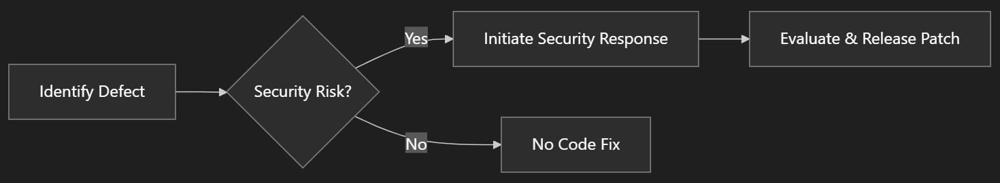
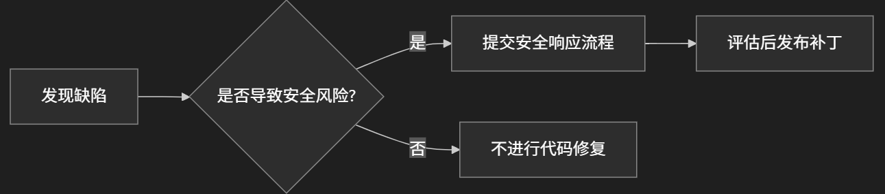

# The Developer's Journey in Chasing Tech Trends: Reflections on Migrating from Legacy Features to Modern Solutions  
## Introduction  
I was recently asked to share some thoughts on the topic of deprecated features. This is a common theme in the tech world, especially as we see rapid advancements in SharePoint.

This article explores lifecycle management strategies for deprecated features and provides guidance for developers and administrators transitioning to modern solutions.  

## 1. Modern Solutions vs Legacy Features  

### 1.1 The Inevitability of Technological Progress  
Legacy features (e.g., SharePoint Classic Views, legacy authentication) often come with critical limitations:  
- **Performance Bottlenecks**: Inability to leverage modern hardware architecture (e.g., Expensive Queries in Classic pages)  
- **Feature Gaps**: Lack of deep integration capabilities with emerging technologies  

### 1.2 Core Advantages of Modern Solutions  
Modern implementations like SharePoint Modern experience:  
- **Enhanced UX**: Responsive design and a more contemporary user experience  
- **Scalability**: Modern development standards that support broader integration and extensibility  
- **Code Level Enhancements**: Continuous updates and improvements to the underlying codebase, code-level technical support

## 2. Microsoft's Support Policy for Deprecated Features  

### 2.1 Technical Support Boundaries  
- **Code Fixes**: Only provided for deprecated features meeting specific criteria:  

- **Feature Development**: All enhancements cease upon deprecation announcement  

### 2.2 Hidden Technical Debt  
Not all code-level functions that are no longer actively developed will be publicly declared, which means Microsoft may not announce all code-level deprecated functions:  

| Characteristic | Explicitly Deprecated | Hidden Tech Debt |  
|----------------|-----------------------|------------------|  
| Official Notice | ✅ Published         | ❌ No announcement |  
| Code Activity   | No commits in 1 year  | Unmaintained ≥ 1 years |  
| Alternatives    | Provided migration path | Requires proactive research |  

Pls note, I'm just trying to give you a general idea, the actual table may not be accurate.  

## 3. Staying Updated with Official Tech Updates  

### Real-Time Tracking Channels  
- **Cloud Service Users**:  
  [M365 Message Center](https://admin.microsoft.com/Adminportal/Home#/MessageCenter) → Subscribe to "Feature" tags  
- **On-Premises Users**:  
  [SharePoint Deprecation Tracker](https://github.com/MicrosoftDocs/OfficeDocs-SharePoint/blob/public/SharePoint/SharePointServer/what-s-new/what-s-deprecated-or-removed-from-SharePoint-Server-Subscription-Edition.md)  

## Conclusion  
Technological evolution isn't about discarding the past, but building a more capable digital future. Recognizing the complexity of enterprise system migrations, Microsoft's engineering teams stand ready to assist through:  
- Architecture assessments  
- Data migration support  
- Hybrid transition planning  

Take action now to keep your technology stack agile! 🚀  

-----
-----
-----

# 开发者们总是在追逐技术热点的路上：从老旧功能迁移到现代方案的一些思考

## 引言  
我最近被问到关于老旧功能（Deprecated Features）的一些看法，这在技术圈是一个常见的话题，尤其是在我们看到 SharePoint 迅速发展的背景下。

本文将解析老旧功能（Deprecated Features）的技术生命周期管理策略，并为开发者和管理员提供迁移到现代方案的指导建议。

## 一、为何推荐现代功能替代老旧方案？  

### 1.1 技术演进的必然选择  
老旧功能（如 SharePoint 经典视图、旧版身份验证等）往往存在以下局限性：  
- **性能瓶颈**：无法充分利用现代硬件架构，老技术的设计瓶颈导致无法满足现代用户的需求（如Classic Expierence页面的Expensive Queries）  
- **功能缺失**：无法拓展与新技术的深度集成  

### 1.2 现代方案的核心优势  
以 SharePoint 现代站点为例，它提供：  
- **增强体验**：响应式设计、更现代的用户体验  
- **可扩展性**：符合最新的开发标准，支持更广泛的集成和扩展 
- **代码级别的增强**：持续更新和改进底层代码库，代码级别的技术支持

## 二、微软对已弃用功能的支持政策  

### 2.1 技术支持边界  
- **代码级修复**：仅针对符合以下条件的已弃用功能：  

- **功能增强**：自宣布弃用之日起，停止所有新功能开发  

### 2.2 隐藏的技术债务  
不是所有代码级别不再追加投入的类目都会被公开声明：  

| 特征 | 显性弃用功能 | 隐性技术债务 |  
|-------|--------------|--------------|  
| 官方公告 | ✅ 明确发布 | ❌ 无公告 |  
| 代码活跃度 | 近1年无提交 | 近1年无维护 |  
| 替代方案 | 提供平替或者建议 | 需主动调研 |  

请注意，我只是想给你一个大概念，实际表格可能不准确。  

## 三、获取官方技术动态  

### 实时追踪渠道  
- **云服务用户**：  
  [M365 消息中心](https://admin.microsoft.com/Adminportal/Home#/MessageCenter) → 订阅 "Feature"相关的标签  

- **本地化部署用户**：  
https://github.com/MicrosoftDocs/OfficeDocs-SharePoint/blob/public/SharePoint/SharePointServer/what-s-new/what-s-deprecated-or-removed-from-SharePoint-Server-Subscription-Edition.md

## 结语  
技术革新不是对过去的否定，而是为了构建更强大的数字未来。我们理解企业级系统迁移的复杂性，微软工程师团队始终准备通过快速支持计划为您提供架构评估、数据迁移和混合模式过渡支持。  

立即行动，让您的技术栈保持敏捷！ 🚀  