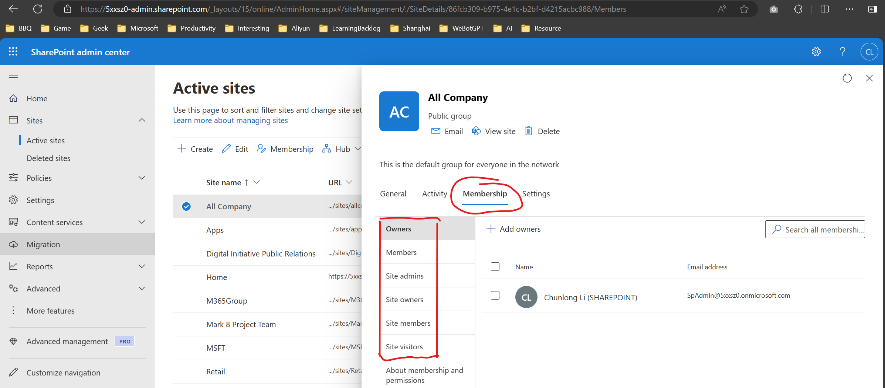
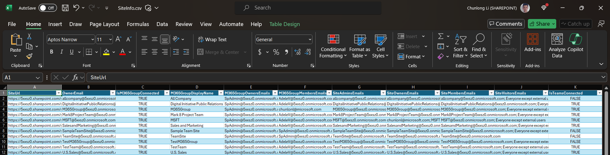

# SharePoint Site Ownership / Membership Reporting





This folder contains PowerShell tooling to export ownership and membership related data for one or all SharePoint Online site collections into a CSV file.  
The modern (certificate‑based application) implementation lives in `GetSiteOwnerInfo.ps1` and exposes reusable functions (prefixed with `Get-SPO*` plus a backward compatible wrapper `GetSiteOwnerInfo`).

## What the script collects

For every site collection:
- Basic site metadata (URL, primary owner email, Teams connection flag, M365 Group linkage)
- SharePoint associated groups (Owners / Members / Visitors) and their member email addresses
- Site Collection Administrators (including any Everyone* style principals)
- Connected Microsoft 365 Group (if any): display name, owner emails, member emails
- Teams connectivity indication (from tenant site properties)

Optional helper (not part of CSV by default):
- `Get-SPOM365GroupOwnersExpanded` can hydrate M365 Group owners with richer Microsoft Graph user profile data (job title, phones, etc.) when you have Graph directory permissions.

---

## Prerequisites

### PowerShell environment
- PowerShell 7.0+ (required by recent PnP.PowerShell builds)
- PnP PowerShell module:
  ```powershell
  Install-Module PnP.PowerShell -Scope CurrentUser -Force
  ```

### Permissions & Roles
- The Azure AD (Entra ID) App must be granted sufficient application (app-only) permissions for:
  - SharePoint: `Sites.FullControl.All` (Application) (minimum to enumerate tenant sites and groups)
  - (Optional, only if you will call the extended owner expansion helper) Microsoft Graph:
    - `Group.Read.All` (Application)
    - `Directory.Read.All` (Application)

- Admin consent must be granted after assigning these permissions.
- The certificate private key must reside on the machine running the script (CurrentUser\My or LocalMachine\My). The public key is uploaded to the App Registration.

---

## Step-by-step: Register the Azure AD (Entra ID) Application with a Certificate

1. Open Entra ID (Azure AD) Portal > App registrations > New registration  
   - Name: `SPO Owner Reporter` (example)  
   - Supported account types: Single tenant (usually)  
   - Redirect URI: leave empty for app-only usage  

2. After creation, note:
   - Application (client) ID
   - Directory (tenant) ID (tenant primary domain is also needed e.g. `contoso.onmicrosoft.com`)

3. Create (or reuse) a self-signed certificate (example below) and export public key (.cer).

   Example creation (Current User store):
   ```powershell
   $certName = "CN=SPOOwnerReporter"
   $cert = New-SelfSignedCertificate -Subject $certName -CertStoreLocation Cert:\CurrentUser\My -KeySpec Signature -KeyExportPolicy Exportable -KeyLength 2048 -NotAfter (Get-Date).AddYears(2)
   Export-Certificate -Cert $cert -FilePath .\SPOOwnerReporter.cer
   # (Optional PFX if you need to move it to another machine)
   # Export-PfxCertificate -Cert $cert -FilePath .\SPOOwnerReporter.pfx -Password (Read-Host -AsSecureString "PfxPassword")
   Write-Host "Thumbprint: $($cert.Thumbprint)"
   ```

4. In the App Registration > Certificates & secrets > Upload certificate > select the `.cer` you exported.

5. Assign API permissions:
   - Add a permission > SharePoint > Application permissions > select `Sites.FullControl.All` > Add
   - (Optional extended owners) Microsoft Graph > Application permissions > `Group.Read.All`, `Directory.Read.All`
   - Click `Grant admin consent`.

6. Record for script usage:
   - ClientId (Application ID)
   - Tenant primary domain (e.g. `contoso.onmicrosoft.com`)
   - Certificate Thumbprint (from step 3)

---

## Core functions summary (from `GetSiteOwnerInfo.ps1`)

| Function | Purpose |
|----------|---------|
| Connect-SPOWithCert | Establish PnP connection with cert (per site or admin center) |
| Get-SPOBasicSiteMetadata | Retrieve tenant-level site properties (owner, GroupId, Teams flag) |
| Get-SPOSiteMembership | Collect associated group memberships + site collection admins |
| Get-SPOM365GroupInfo | Collect M365 Group owners/members (if site is group-connected) |
| New-SPOOwnerInfoRecord | Flatten data to a single object for export |
| Export-SPOOwnerInfoCsv | Append one or many records to CSV |
| Get-SPOOwnerInfo | Orchestrate retrieval for a single site (returns record) |
| Get-SPOOwnerInfoForAllSites | Enumerate every site collection and export |
| Get-SPOM365GroupOwnersExpanded | (Optional) Enrich M365 Group owners via Graph |
| GetSiteOwnerInfo | Backward compatible wrapper (gathers + exports single row) |

---

## CSV Columns

Output (one row per site):
- SiteUrl
- OwnerEmail
- IsM365GroupConnected (True/False)
- M365GroupDisplayName
- M365GroupOwnersEmails (semicolon-delimited)
- M365GroupMembersEmails (semicolon-delimited)
- SiteAdminsEmails (semicolon-delimited)
- SiteOwnersEmails (semicolon-delimited)
- SiteMembersEmails (semicolon-delimited)
- SiteVisitorsEmails (semicolon-delimited)
- IsTeamsConnected (True/False)

---

## Certificate (App-Only) Usage Examples

### Single site
```powershell
# Dot-source functions
. "$PSScriptRoot\GetSiteOwnerInfo.ps1"

$Tenant     = "contoso.onmicrosoft.com"
$ClientId   = "<GUID-OF-APP>"
$Thumbprint = "<CERT-THUMBPRINT>"
$SiteUrl    = "https://contoso.sharepoint.com/sites/Finance"
$CsvPath    = ".\SiteOwnership.csv"

# Returns a record object
$record = Get-SPOOwnerInfo -SiteUrl $SiteUrl -ClientId $ClientId -Tenant $Tenant -Thumbprint $Thumbprint -Verbose
Export-SPOOwnerInfoCsv -Record $record -Path $CsvPath
```

### All sites (tenant crawl)
```powershell
. "$PSScriptRoot\GetSiteOwnerInfo.ps1"

$Tenant     = "contoso.onmicrosoft.com"
$ClientId   = "<GUID-OF-APP>"
$Thumbprint = "<CERT-THUMBPRINT>"
$CsvPath    = ".\AllSitesOwnership.csv"

Get-SPOOwnerInfoForAllSites -Tenant $Tenant -ClientId $ClientId -Thumbprint $Thumbprint -CvsPath $CsvPath -Verbose
```

### Backward compatible wrapper (single site, direct export)
```powershell
. "$PSScriptRoot\GetSiteOwnerInfo.ps1"

GetSiteOwnerInfo -SiteUrl "https://contoso.sharepoint.com/sites/HR" `
  -CvsPath ".\SiteOwnership.csv" `
  -ClientId "<GUID-OF-APP>" -Tenant "contoso.onmicrosoft.com" -Thumbprint "<CERT-THUMBPRINT>" -Verbose
```

### Optional: Expanded M365 Group owner details
```powershell
. "$PSScriptRoot\GetSiteOwnerInfo.ps1"

# Precondition: You already connected (any site) with cert using Connect-SPOWithCert or Get-SPOOwnerInfo earlier.
$groupId = "<M365-GROUP-GUID>"
$owners  = Get-SPOM365GroupOwnersExpanded -GroupId $groupId -Verbose
$owners | Format-Table DisplayName, Email, JobTitle
```

---

## Error handling & notes

- Each site is processed inside a try/catch in `Get-SPOOwnerInfoForAllSites`; failures are logged and enumeration continues.
- Output is appended: delete existing CSV first if you want a clean header-only start.
- Emails for Everyone* style principals appear by Title (not a resolvable SMTP address).
- When no M365 Group is present, related columns are blank and `IsM365GroupConnected` is False.
- Throttling / rate limiting: For very large tenants you can add delays or filter site templates before looping (modify function if needed).

---

## Disclaimer

Microsoft does not provide production-ready scripts via this sample. You must review, test, adapt, and validate before using in production. This script is a demo and out of official support scope. Use at your own risk.

---
