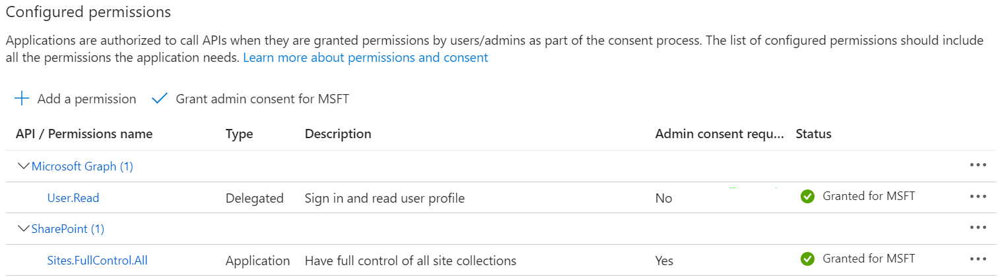
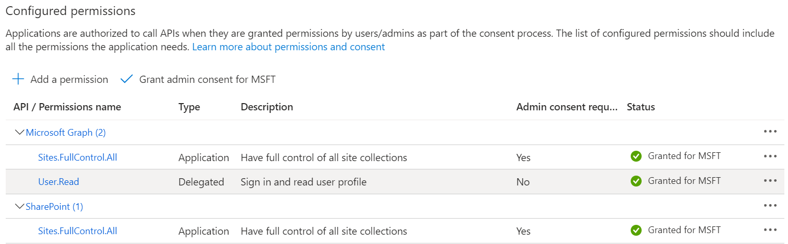
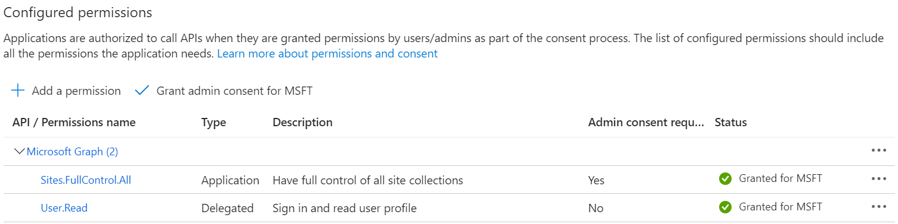
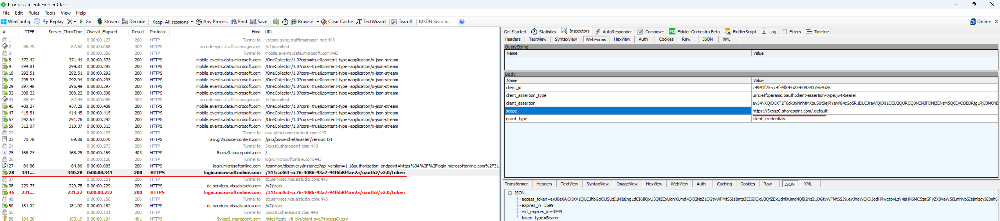
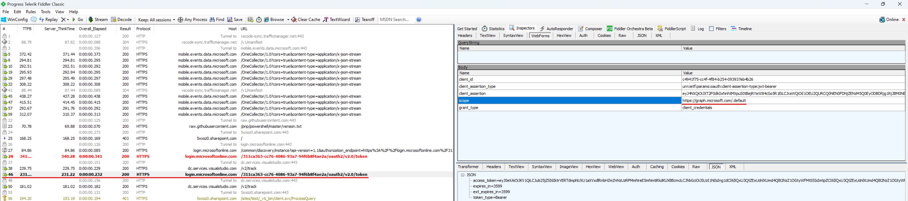
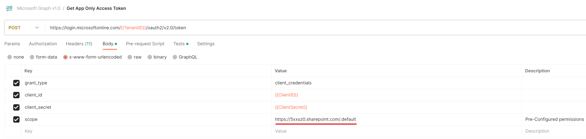

# Obtaining Access Token for SharePoint REST API and Microsoft Graph API with Certificates

This article demonstrates how to obtain an Access Token using certificates and use that Access Token to call SharePoint REST API and Microsoft Graph API.

## Step 1: Azure AD App Registration

Register your application in Azure AD App Registration and ensure that the application is assigned the appropriate permissions. Please note the following:

a. If you want to obtain an Access Token to call Microsoft Graph API, grant the corresponding Graph permissions to the application.

b. If you want to obtain an Access Token to call SharePoint REST API, grant the appropriate SharePoint permissions to the application.

c. You can also use `sites.selected` in a hybrid scenario; refer to [my other article](https://github.com/Chunlong101/SharePointTips/blob/master/Sites.Selected/README.md).


## Step 2: Upload Certificate

Upload your certificate to Azure AD app registration (you can refer to creating a self-assigned certificate [here](https://github.com/Chunlong101/SharePointTips/blob/46146e6517c15e1548b196f9b3f82a5ff086b2ac/Get%20access%20token%20with%20a%20certificate%20to%20call%20sharepoint%20rest%20api%20and%20graph%20api/GetAccessTokenByCert.ps1#L2)). Your certificate should have two formats, pfx and cer. Upload the cer and keep the pfx with the private key locally:


## Step 3: Obtain Access Token

Method 1 - Using PnP PowerShell:

```powershell
$password = (ConvertTo-SecureString -AsPlainText 'xxx' -Force)
Connect-PnPOnline -Url "https://5xxsz0.sharepoint.com/sites/test" -ClientId c4941f75-cc4f-4f84-b254-093937eb4b26 -CertificatePath 'C:\Users\chunlonl\Desktop\Tools\Cert\pnp.pfx' -CertificatePassword $password -Tenant '5xxsz0.onmicrosoft.com'
Get-PnPAccessToken -ResourceTypeName SharePoint # Use this token to call SharePoint REST API
Get-PnPAccessToken -ResourceTypeName Graph # Use this token to call Microsoft Graph API
```

Method 2 - Using a Custom PowerShell Script:

https://github.com/Chunlong101/SharePointTips/blob/master/Get%20access%20token%20with%20a%20certificate%20to%20call%20sharepoint%20rest%20api%20and%20graph%20api/GetAccessTokenByCert.ps1

Method 3 - Using Postman:

First, use this code to obtain the client_assertion: 

https://github.com/Chunlong101/SharePointTips/blob/1b96f4508eb858a7dfa1b35d2a1a2efe135d271c/Get%20access%20token%20with%20a%20certificate%20to%20call%20sharepoint%20rest%20api%20and%20graph%20api/GetAccessTokenByCert.ps1#L81

Then, use the client_assertion in Postman to obtain the token:


Note, the client_assertion in the above image is actually a JWT token generated according to certain rules, consisting of three main parts: header, payload, and signature. 


## Pls note, technically now you have another option to get access token and call SharePoint REST API, which is ACS. But ACS is legacy：[SharePoint Add-In retirement in Microsoft 365 | Microsoft Learn](https://learn.microsoft.com/en-us/sharepoint/dev/sp-add-ins/retirement-announcement-for-add-ins), SharePoint Add-Ins will stop working for new tenants as of November 1st, 2024 and they will stop working for existing tenants and will be fully retired as of April 2nd, 2026. Which means, if you want to call SharePoint REST API, then before 2026 yes you can still use ACS to get the access token then use it to call SharePoint REST API, however I recommend using Certificate way (introduced in this article) to get the access token and call SharePoint REST API.


## Please note that currently, you can only call the SharePoint REST API on Azure App Registration using a certificate, and SharePoint permissions must be added. The app registered on Azure App Registration using its client ID + client secret cannot successfully call the SharePoint REST API. Below are some details of my findings on this conclusion, for reference only.

Upload the certificate to Azure App Registration and give it "SharePoint" (not Graph) permissions:


Use PFX to connect PnP:
```powershell
$pfxPassword = ConvertTo-SecureString -String "YourPassword" -Force -AsPlainText
Connect-PnPOnline -Url https://5xxsz0.sharepoint.com/sites/test -ClientId c4941f75-cc4f-4f84-b254-093937eb4b26 -CertificatePath C:\Users\chunlonl\Desktop\YourCertificate.pfx -CertificatePassword $pfxPassword -Tenant 311ca363-cc76-4086-93a7-94f6b8f4ae2a
Get-PnPAccessToken
Get-PnPSite
Disconnect-PnPOnline
```

Output:
```json
{
  "aud": "https://graph.microsoft.com",
  "iss": "https://sts.windows.net/311ca363-cc76-4086-93a7-94f6b8f4ae2a/",
  "iat": 1700533357,
  "nbf": 1700533357,
  "exp": 1700537257,
  "aio": "E2VgYPheEfF+ldKru5nOf058/ZKaBAA=",
  "app_displayname": "Cert",
  "appid": "c4941f75-cc4f-4f84-b254-093937eb4b26",
  "appidacr": "2",
  "idp": "https://sts.windows.net/311ca363-cc76-4086-93a7-94f6b8f4ae2a/",
  "idtyp": "app",
  "oid": "a4a3826f-9d77-48bb-a403-9408213cee81",
  "rh": "0.AUoAY6McMXbMhkCTp5T2uPSuKgMAAAAAAAAAwAAAAAAAAACJAAA.",
  "sub": "a4a3826f-9d77-48bb-a403-9408213cee81",
  "tenant_region_scope": "AS",
  "tid": "311ca363-cc76-4086-93a7-94f6b8f4ae2a",
  "uti": "8gwNd_4ZNEm6YthNmqjeAA",
  "ver": "1.0",
  "wids": [
    "0997a1d0-0d1d-4acb-b408-d5ca73121e90"
  ],
  "xms_tcdt": 1671416148
}
```

URL                                                     CompatibilityLevel
---                                                     ------------------
https://5xxsz0.sharepoint.com/sites/Test                15

It was found that PnP + certificate + "Azure AD registered >> grant permissions >> SharePoint (non-Graph)" permissions can work.

Next, use the above token in Postman to call the REST API, but an error occurred. This is a bit strange because the token in PnP is for Graph ("aud": "https://graph.microsoft.com"), but the permission is only for SharePoint. Get-PnPSite can return successfully, but the REST API cannot. As you can see below (if you keep reading), when connecting with a certificate, the scope is "https://5xxsz0.sharepoint.com/.default", although the aud is "https://graph.microsoft.com". Scope and aud are two parameters, two different things:
```json
{"error_description":"Exception of type 'Microsoft.IdentityModel.Tokens.AudienceUriValidationFailedException' was thrown."}
```

At this time, calling the Graph API results in access denied because only SharePoint permissions were granted, not Graph permissions.

But if "Graph" permissions are added, the token can successfully call the Graph API:


At this point, using the following command to get the SharePoint access token, it can successfully call the REST API:
```powershell
Get-PnPAccessToken -ResourceTypeName SharePoint
```
Output:
```json
{
  "aud": "https://5xxsz0.sharepoint.com",
  "iss": "https://sts.windows.net/311ca363-cc76-4086-93a7-94f6b8f4ae2a/",
  "iat": 1700534590,
  "nbf": 1700534590,
  "exp": 1700538490,
  "aio": "E2VgYDglfcPr9Kfs+XsUHZ5ueGVXBgA=",
  "app_displayname": "Cert",
  "appid": "c4941f75-cc4f-4f84-b254-093937eb4b26",
  "appidacr": "2",
  "idp": "https://sts.windows.net/311ca363-cc76-4086-93a7-94f6b8f4ae2a/",
  "idtyp": "app",
  "oid": "a4a3826f-9d77-48bb-a403-9408213cee81",
  "rh": "0.AUoAY6McMXbMhkCTp5T2uPSuKgMAAAAAAPEPzgAAAAAAAACJAAA.",
  "roles": [
    "Sites.FullControl.All"
  ],
  "sid": "47113bb6-e5d3-48c7-856a-c09b823abae4",
  "sub": "a4a3826f-9d77-48bb-a403-9408213cee81",
  "tid": "311ca363-cc76-4086-93a7-94f6b8f4ae2a",
  "uti": "REbbIY9DIE2mb_lCQjwDAQ",
  "ver": "1.0"
}
```

Now remove the "SharePoint" permissions and execute the following command:


```powershell
$pfxPassword = ConvertTo-SecureString -String "YourPassword" -Force -AsPlainText
Connect-PnPOnline -Url https://5xxsz0.sharepoint.com/sites/test -ClientId c4941f75-cc4f-4f84-b254-093937eb4b26 -CertificatePath C:\Users\chunlonl\Desktop\YourCertificate.pfx -CertificatePassword $pfxPassword -Tenant 311ca363-cc76-4086-93a7-94f6b8f4ae2a
Get-PnPAccessToken
Get-PnPSite
Get-PnPAccessToken -ResourceTypeName SharePoint
Disconnect-PnPOnline
```

Output:
```json
{
  "aud": "https://graph.microsoft.com",
  "iss": "https://sts.windows.net/311ca363-cc76-4086-93a7-94f6b8f4ae2a/",
  "iat": 1700535077,
  "nbf": 1700535077,
  "exp": 1700538977,
  "aio": "E2VgYGje/nqeu7LnEXcdqbkbTVozAA==",
  "app_displayname": "Cert",
  "appid": "c4941f75-cc4f-4f84-b254-093937eb4b26",
  "appidacr": "2",
  "idp": "https://sts.windows.net/311ca363-cc76-4086-93a7-94f6b8f4ae2a/",
  "idtyp": "app",
  "oid": "a4a3826f-9d77-48bb-a403-9408213cee81",
  "rh": "0.AUoAY6McMXbMhkCTp5T2uPSuKgMAAAAAAAAAwAAAAAAAAACJAAA.",
  "roles": [
    "Sites.FullControl.All"
  ],
  "sub": "a4a3826f-9d77-48bb-a403-9408213cee81",
  "tenant_region_scope": "AS",
  "tid": "311ca363-cc76-4086-93a7-94f6b8f4ae2a",
  "uti": "7J4jAKHnckyGzDgqjogYAA",
  "ver": "1.0",
  "wids": [
    "0997a1d0-0d1d-4acb-b408-d5ca73121e90"
  ],
  "xms_tcdt": 1671416148
}
```

Get-PnPSite: The remote server returned an error: (401) Unauthorized. (Only the graph token and graph permissions are present, but the scope parameter for certificate connection is "https://5xxsz0.sharepoint.com/.default", and it should call the REST API.)

```json
{
  "aud": "https://5xxsz0.sharepoint.com",
  "iss": "https://sts.windows.net/311ca363-cc76-4086-93a7-94f

6b8f4ae2a/",
  "iat": 1700535069,
  "nbf": 1700535069,
  "exp": 1700538969,
  "aio": "E2VgYHhk3jc5fMOh36aPFK5fdgraCwA=",
  "app_displayname": "Cert",
  "appid": "c4941f75-cc4f-4f84-b254-093937eb4b26",
  "appidacr": "2",
  "idp": "https://sts.windows.net/311ca363-cc76-4086-93a7-94f6b8f4ae2a/",
  "idtyp": "app",
  "oid": "a4a3826f-9d77-48bb-a403-9408213cee81",
  "rh": "0.AUoAY6McMXbMhkCTp5T2uPSuKgMAAAAAAPEPzgAAAAAAAACJAAA.",
  "sid": "228afa7d-c177-4f63-96a3-9b8c40a54441",
  "sub": "a4a3826f-9d77-48bb-a403-9408213cee81",
  "tid": "311ca363-cc76-4086-93a7-94f6b8f4ae2a",
  "uti": "gVVOsRa40EqSEneRsPvRAA",
  "ver": "1.0"
}
```

Check Fiddler:
```powershell
Connect-PnPOnline -Url https://5xxsz0.sharepoint.com/sites/test -ClientId c4941f75-cc4f-4f84-b254-093937eb4b26 -CertificatePath C:\Users\chunlonl\Desktop\YourCertificate.pfx -CertificatePassword $pfxPassword -Tenant 311ca363-cc76-4086-93a7-94f6b8f4ae2a
```
This command triggers:


Get-PnPAccessToken triggers:


Other commands do not generate token requests to Azure, so it is inferred that the "Get-PnPAccessToken -ResourceTypeName SharePoint" command directly returns the token with scope=https://5xxsz0.sharepoint.com/.default.

(Using Fiddler to capture the Connect-PnPOnline and Get-PnPAccessToken commands run in Visual Studio Code Terminal sometimes does not capture anything. Use PowerShell 7 instead of VS Code to capture the traffic.)

In conclusion, the difference lies in the scope parameter when obtaining the token, which results in different aud values for the token. Different scopes and aud values can only call different APIs (Graph vs. REST API), corresponding to different permissions in Azure App Registration (Graph vs. SharePoint).

Can I call the SharePoint REST API with client ID + client secret (Azure App Registration)? The answer is no, it will report a 401 error, "Unsupported app only token." Changing the scope parameter in the request to get a token with the correct aud and permissions still fails to call the REST API, which is a bit strange:


Therefore, you can only use a certificate to call the SharePoint REST API on Azure App Registration, and the following SharePoint permissions must be added. The app registered on Azure App Registration using its client ID + client secret cannot successfully call the SharePoint REST API:


-----

-----

-----

# 使用证书获取 SharePoint 和 Microsoft Graph API 的 Access Token

本文演示如何使用证书的方式获取 Access Token，并用该Access Token调用 SharePoint REST API 和 Microsoft Graph API。

## 第一步：Azure AD App 注册

在 Azure AD App 注册中注册应用程序，并确保为该应用程序分配相应的权限。请注意以下事项：

a. 如果您希望获取 Access Token 以调用 Microsoft Graph API，请为应用程序授予相应的 Graph 权限。

b. 如果您希望获取 Access Token 以调用 SharePoint REST API，请为应用程序授予相应的 SharePoint 权限。

c. 您还可以混合使用 `sites.selected`，请参考[我的另一篇文章](https://github.com/Chunlong101/SharePointTips/blob/master/Sites.Selected/README.md)。


## 第二步：上传证书

上传你的证书到azure ad app registration（可以参考这里自制证书：[here](https://github.com/Chunlong101/SharePointTips/blob/46146e6517c15e1548b196f9b3f82a5ff086b2ac/Get%20access%20token%20with%20a%20certificate%20to%20call%20sharepoint%20rest%20api%20and%20graph%20api/GetAccessTokenByCert.ps1#L2)）。你的证书应该有两个格式，pfx 和 cer，上传 cer 格式的证书，保留带有私钥的 pfx 证书在本地：


## 第三步：获取 Access Token

方法1 - 使用PnP PowerShell: 

```powershell
$password = (ConvertTo-SecureString -AsPlainText 'xxx' -Force)
Connect-PnPOnline -Url "https://5xxsz0.sharepoint.com/sites/test" -ClientId c4941f75-cc4f-4f84-b254-093937eb4b26 -CertificatePath 'C:\Users\chunlonl\Desktop\Tools\Cert\pnp.pfx' -CertificatePassword $password  -Tenant '5xxsz0.onmicrosoft.com'
Get-PnPAccessToken -ResourceTypeName SharePoint # 使用此令牌调用 SharePoint REST API
Get-PnPAccessToken -ResourceTypeName Graph # 使用此令牌调用 Microsoft Graph API
```

方法2 - 使用自制PowerShell脚本：

https://github.com/Chunlong101/SharePointTips/blob/master/Get%20access%20token%20with%20a%20certificate%20to%20call%20sharepoint%20rest%20api%20and%20graph%20api/GetAccessTokenByCert.ps1

方法3 - 使用Postman：

首先需要使用这段代码来获得client_assertion：https://github.com/Chunlong101/SharePointTips/blob/1b96f4508eb858a7dfa1b35d2a1a2efe135d271c/Get%20access%20token%20with%20a%20certificate%20to%20call%20sharepoint%20rest%20api%20and%20graph%20api/GetAccessTokenByCert.ps1#L81

然后在Postman中使用client_assertion来获取token：


注，上图的client_assertion其实就是按照一定规则来攒一个JWT token，主要三部分：header, payload, signature：


## 请注意，从技术上讲，您现在有另一个选项可以获取访问令牌并调用 SharePoint REST API，即 ACS。但是 ACS 已经过时：[SharePoint Add-In retirement in Microsoft 365 | Microsoft Learn](https://learn.microsoft.com/en-us/sharepoint/dev/sp-add-ins/retirement-announcement-for-add-ins)，SharePoint Add-Ins 将于 2024 年 11 月 1 日停止为新的租户提供服务，并将于 2026 年 4 月 2 日停止为现有租户提供服务并完全停用。这意味着，如果您想调用 SharePoint REST API，在 2026 年之前，您仍然可以使用 ACS 获取访问令牌，然后使用该令牌调用 SharePoint REST API，但我建议使用证书方式（在本文中介绍）获取访问令牌并调用 SharePoint REST API。


## 请注意，当前只能用证书的方式call通auzre app registration上面的sharepoint rest api，且必须加SharePoint权限，在azure app registration上面注册的app用其client id + client secret是call不通sharepoint rest api的。以下是我分享的关于这一结论的一些细节，仅供参考。

将cer上传到azure app registration，给个“SharePoint”（不是Graph）的权限：


用pfx连pnp：
$pfxPassword = ConvertTo-SecureString -String "YourPassword" -Force -AsPlainText
Connect-PnPOnline -Url https://5xxsz0.sharepoint.com/sites/test -ClientId c4941f75-cc4f-4f84-b254-093937eb4b26 -CertificatePath C:\Users\chunlonl\Desktop\YourCertificate.pfx -CertificatePassword $pfxPassword -Tenant 311ca363-cc76-4086-93a7-94f6b8f4ae2a
Get-PnPAccessToken
Get-PnPSite
Disconnect-PnPOnline

输出：
{
  "aud": "https://graph.microsoft.com",
  "iss": "https://sts.windows.net/311ca363-cc76-4086-93a7-94f6b8f4ae2a/",
  "iat": 1700533357,
  "nbf": 1700533357,
  "exp": 1700537257,
  "aio": "E2VgYPheEfF+ldKru5nOf058/ZKaBAA=",
  "app_displayname": "Cert",
  "appid": "c4941f75-cc4f-4f84-b254-093937eb4b26",
  "appidacr": "2",
  "idp": "https://sts.windows.net/311ca363-cc76-4086-93a7-94f6b8f4ae2a/",
  "idtyp": "app",
  "oid": "a4a3826f-9d77-48bb-a403-9408213cee81",
  "rh": "0.AUoAY6McMXbMhkCTp5T2uPSuKgMAAAAAAAAAwAAAAAAAAACJAAA.",
  "sub": "a4a3826f-9d77-48bb-a403-9408213cee81",
  "tenant_region_scope": "AS",
  "tid": "311ca363-cc76-4086-93a7-94f6b8f4ae2a",
  "uti": "8gwNd_4ZNEm6YthNmqjeAA",
  "ver": "1.0",
  "wids": [
    "0997a1d0-0d1d-4acb-b408-d5ca73121e90"
  ],
  "xms_tcdt": 1671416148
}

Url                                                     CompatibilityLevel
---                                                     ------------------
https://5xxsz0.sharepoint.com/sites/Test                15

发现pnp + cert + "Azure Ad registered >> grant permissions >> sharepoint（非graph）"权限是可以work的。

接着用以上token去postman里call rest api发现报错，这个地方有点奇怪，因为pnp里的token是graph，但permission只给了sharepoint，pnp能成功返回，rest api却不能，当时应该抓一抓“Get-PnPSite”的fiddler，但你接着看到下文你就会知道，用证书连的时候，scope其实是“https://5xxsz0.sharepoint.com/.default”，虽然aud是“https://graph.microsoft.com”，scope和aud是两个参数，两个东西：
{"error_description":"Exception of type 'Microsoft.IdentityModel.Tokens.AudienceUriValidationFailedException' was thrown."}

这个时候call graph api是access denied，因为只给了sharepoint权限，没有给graph权限。

但如果又去加了“Graph”的权限的话，重新拿token之后就可以成功call通graph api：


但此时，用以下命令拿到sharepoint的access token的话，是可以用它call通rest api的：
Get-PnPAccessToken -ResourceTypeName SharePoint
{
  "aud": "https://5xxsz0.sharepoint.com",
  "iss": "https://sts.windows.net/311ca363-cc76-4086-93a7-94f6b8f4ae2a/",
  "iat": 1700534590,
  "nbf": 1700534590,
  "exp": 1700538490,
  "aio": "E2VgYDglfcPr9Kfs+XsUHZ5ueGVXBgA=",
  "app_displayname": "Cert",
  "appid": "c4941f75-cc4f-4f84-b254-093937eb4b26",
  "appidacr": "2",
  "idp": "https://sts.windows.net/311ca363-cc76-4086-93a7-94f6b8f4ae2a/",
  "idtyp": "app",
  "oid": "a4a3826f-9d77-48bb-a403-9408213cee81",
  "rh": "0.AUoAY6McMXbMhkCTp5T2uPSuKgMAAAAAAPEPzgAAAAAAAACJAAA.",
  "roles": [
    "Sites.FullControl.All"
  ],
  "sid": "47113bb6-e5d3-48c7-856a-c09b823abae4",
  "sub": "a4a3826f-9d77-48bb-a403-9408213cee81",
  "tid": "311ca363-cc76-4086-93a7-94f6b8f4ae2a",
  "uti": "REbbIY9DIE2mb_lCQjwDAQ",
  "ver": "1.0"
}

现在拿掉“SharePoint”权限，然后执行以下命令：


$pfxPassword = ConvertTo-SecureString -String "YourPassword" -Force -AsPlainText
Connect-PnPOnline -Url https://5xxsz0.sharepoint.com/sites/test -ClientId c4941f75-cc4f-4f84-b254-093937eb4b26 -CertificatePath C:\Users\chunlonl\Desktop\YourCertificate.pfx -CertificatePassword $pfxPassword -Tenant 311ca363-cc76-4086-93a7-94f6b8f4ae2a
Get-PnPAccessToken
Get-PnPSite
Get-PnPAccessToken -ResourceTypeName SharePoint
Disconnect-PnPOnline

输出：
{
  "aud": "https://graph.microsoft.com",
  "iss": "https://sts.windows.net/311ca363-cc76-4086-93a7-94f6b8f4ae2a/",
  "iat": 1700535077,
  "nbf": 1700535077,
  "exp": 1700538977,
  "aio": "E2VgYGje/nqeu7LnEXcdqbkbTVozAA==",
  "app_displayname": "Cert",
  "appid": "c4941f75-cc4f-4f84-b254-093937eb4b26",
  "appidacr": "2",
  "idp": "https://sts.windows.net/311ca363-cc76-4086-93a7-94f6b8f4ae2a/",
  "idtyp": "app",
  "oid": "a4a3826f-9d77-48bb-a403-9408213cee81",
  "rh": "0.AUoAY6McMXbMhkCTp5T2uPSuKgMAAAAAAAAAwAAAAAAAAACJAAA.",
  "roles": [
    "Sites.FullControl.All"
  ],
  "sub": "a4a3826f-9d77-48bb-a403-9408213cee81",
  "tenant_region_scope": "AS",
  "tid": "311ca363-cc76-4086-93a7-94f6b8f4ae2a",
  "uti": "7J4jAKHnckyGzDgqjogYAA",
  "ver": "1.0",
  "wids": [
    "0997a1d0-0d1d-4acb-b408-d5ca73121e90"
  ],
  "xms_tcdt": 1671416148
}

Get-PnPSite: The remote server returned an error: (401) Unauthorized. （只有graph token和graph权限的时候，用证书连还给返回，因为用证书连的时候scope参数为“https://5xxsz0.sharepoint.com/.default”，理应call rest api）

{
  "aud": "https://5xxsz0.sharepoint.com",
  "iss": "https://sts.windows.net/311ca363-cc76-4086-93a7-94f6b8f4ae2a/",
  "iat": 1700535069,
  "nbf": 1700535069,
  "exp": 1700538969,
  "aio": "E2VgYHhk3jc5fMOh36aPFK5fdgraCwA=",
  "app_displayname": "Cert",
  "appid": "c4941f75-cc4f-4f84-b254-093937eb4b26",
  "appidacr": "2",
  "idp": "https://sts.windows.net/311ca363-cc76-4086-93a7-94f6b8f4ae2a/",
  "idtyp": "app",
  "oid": "a4a3826f-9d77-48bb-a403-9408213cee81",
  "rh": "0.AUoAY6McMXbMhkCTp5T2uPSuKgMAAAAAAPEPzgAAAAAAAACJAAA.",
  "sid": "228afa7d-c177-4f63-96a3-9b8c40a54441",
  "sub": "a4a3826f-9d77-48bb-a403-9408213cee81",
  "tid": "311ca363-cc76-4086-93a7-94f6b8f4ae2a",
  "uti": "gVVOsRa40EqSEneRsPvRAA",
  "ver": "1.0"
}

再看Fiddler：
Connect-PnPOnline -Url https://5xxsz0.sharepoint.com/sites/test -ClientId c4941f75-cc4f-4f84-b254-093937eb4b26 -CertificatePath C:\Users\chunlonl\Desktop\YourCertificate.pfx -CertificatePassword $pfxPassword -Tenant 311ca363-cc76-4086-93a7-94f6b8f4ae2a
该命令触发的是：


Get-PnPAccessToken
触发的是：


其他命令不产生去azure拿token的动作，所以推断“Get-PnPAccessToken -ResourceTypeName SharePoint”这条命令就直接把scope=https://5xxsz0.sharepoint.com/.default的token返回给我们了。

（用Fiddler去抓Visual Studio Code里面Terminal跑Connect-PnPOnline和Get-PnPAccessToken，有时候抓不到东西，不用VS Code新开PowerShell 7就可以抓到）

综上所述，可以看到，区别是拿token时候的参数scope，换的不同token的aud，不同的scope和aud只能call不同的api（graph vs rest api），对应在azure app registration中的不同权限（graph vs sharepoint）。

我用client id + client secret的时候（azure app registration）可以call通sharepoint rest api么？答案是不能，会报错401，Unsupported app only token。直接在request里头改scope参数，但这样拿到的token虽然aud是对的，permissions也有，但就是call不通rest api，这就有点奇怪了：


所以，只能用证书的方式call通auzre app registration上面的sharepoint rest api，且必须加以下SharePoint权限，在azure app registration上面注册的app用其client id + client secret是call不通sharepoint rest api的：
