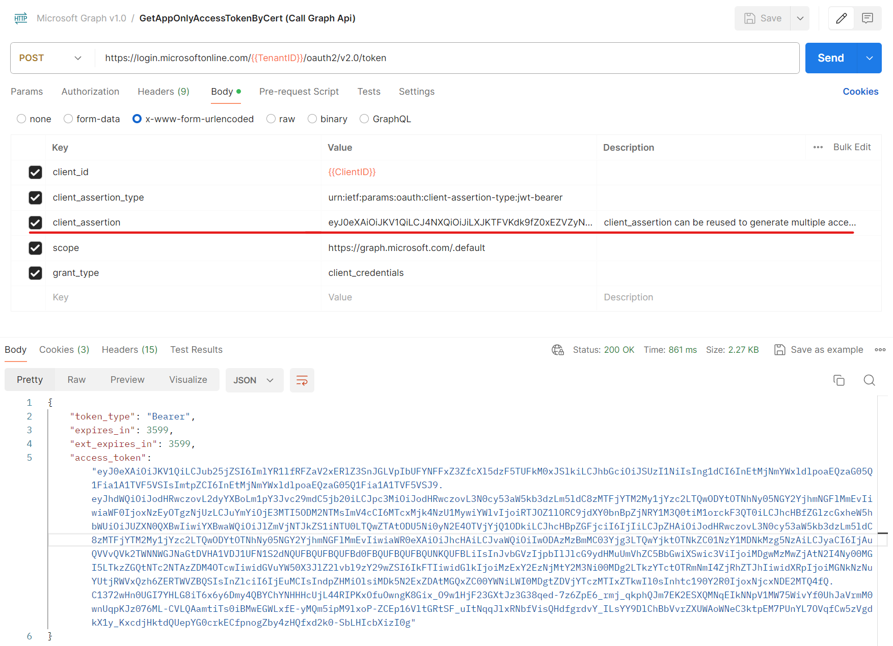
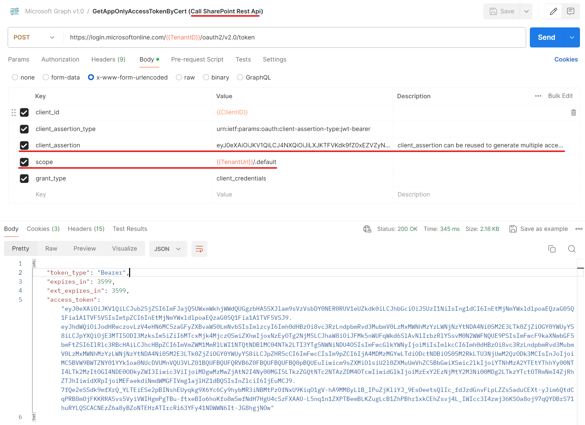
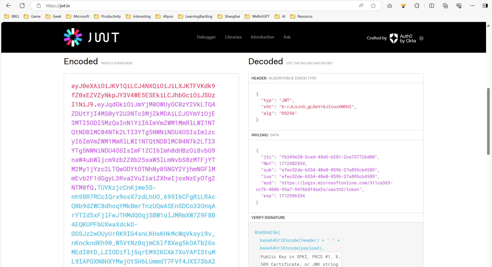
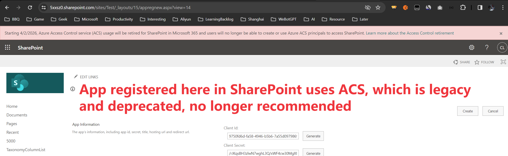

# Obtaining Access Token for SharePoint REST API and Microsoft Graph API with Certificates

This article demonstrates how to obtain an Access Token using certificates and use that Access Token to call SharePoint REST API and Microsoft Graph API.

## Step 1: Azure AD App Registration

Register your application in Azure AD App Registration and ensure that the application is assigned the appropriate permissions. Please note the following:

a. If you want to obtain an Access Token to call Microsoft Graph API, grant the corresponding Graph permissions to the application.

b. If you want to obtain an Access Token to call SharePoint REST API, grant the appropriate SharePoint permissions to the application.

c. You can also use `sites.selected` in a hybrid scenario; refer to [my other article](https://github.com/Chunlong101/SharePointTips/blob/master/Sites.Selected/README.md).


## Step 2: Upload Certificate

Upload your certificate to Azure AD app registration (you can refer to creating a self-assigned certificate [here](https://github.com/Chunlong101/SharePointTips/blob/46146e6517c15e1548b196f9b3f82a5ff086b2ac/Get%20access%20token%20with%20a%20certificate%20to%20call%20sharepoint%20rest%20api%20and%20graph%20api/GetAccessTokenByCert.ps1#L2)). Your certificate should have two formats, pfx and cer. Upload the cer and keep the pfx with the private key locally:


## Step 3: Obtain Access Token

Method 1 - Using PnP PowerShell:

```powershell
$password = (ConvertTo-SecureString -AsPlainText 'xxx' -Force)
Connect-PnPOnline -Url "https://5xxsz0.sharepoint.com/sites/test" -ClientId c4941f75-cc4f-4f84-b254-093937eb4b26 -CertificatePath 'C:\Users\chunlonl\Desktop\Tools\Cert\pnp.pfx' -CertificatePassword $password -Tenant '5xxsz0.onmicrosoft.com'
Get-PnPAccessToken -ResourceTypeName SharePoint # Use this token to call SharePoint REST API
Get-PnPAccessToken -ResourceTypeName Graph # Use this token to call Microsoft Graph API
```

Method 2 - Using a Custom PowerShell Script:

https://github.com/Chunlong101/SharePointTips/blob/master/Get%20access%20token%20with%20a%20certificate%20to%20call%20sharepoint%20rest%20api%20and%20graph%20api/GetAccessTokenByCert.ps1

Method 3 - Using Postman:

First, use this code to obtain the client_assertion: 

https://github.com/Chunlong101/SharePointTips/blob/1b96f4508eb858a7dfa1b35d2a1a2efe135d271c/Get%20access%20token%20with%20a%20certificate%20to%20call%20sharepoint%20rest%20api%20and%20graph%20api/GetAccessTokenByCert.ps1#L81

Then, use the client_assertion in Postman to obtain the token:





Note, the client_assertion in the above image is actually a JWT token generated according to certain rules, consisting of three main parts: header, payload, and signature. 



#### Pls note, technically now you have another option to get access token and call SharePoint REST API, which is ACS. But ACS is legacy：[SharePoint Add-In retirement in Microsoft 365 | Microsoft Learn](https://learn.microsoft.com/en-us/sharepoint/dev/sp-add-ins/retirement-announcement-for-add-ins), SharePoint Add-Ins will stop working for new tenants as of November 1st, 2024 and they will stop working for existing tenants and will be fully retired as of April 2nd, 2026. Which means, if you want to call SharePoint REST API, then before 2026 yes you can still use ACS to get the access token then use it to call SharePoint REST API, however I recommend using Certificate way (introduced in this article) to get the access token and call SharePoint REST API.



-----

-----

-----

# 使用证书获取 SharePoint 和 Microsoft Graph API 的 Access Token

本文演示如何使用证书的方式获取 Access Token，并用该Access Token调用 SharePoint REST API 和 Microsoft Graph API。

## 第一步：Azure AD App 注册

在 Azure AD App 注册中注册应用程序，并确保为该应用程序分配相应的权限。请注意以下事项：

a. 如果您希望获取 Access Token 以调用 Microsoft Graph API，请为应用程序授予相应的 Graph 权限。

b. 如果您希望获取 Access Token 以调用 SharePoint REST API，请为应用程序授予相应的 SharePoint 权限。

c. 您还可以混合使用 `sites.selected`，请参考[我的另一篇文章](https://github.com/Chunlong101/SharePointTips/blob/master/Sites.Selected/README.md)。


## 第二步：上传证书

上传你的证书到azure ad app registration（可以参考这里自制证书：[here](https://github.com/Chunlong101/SharePointTips/blob/46146e6517c15e1548b196f9b3f82a5ff086b2ac/Get%20access%20token%20with%20a%20certificate%20to%20call%20sharepoint%20rest%20api%20and%20graph%20api/GetAccessTokenByCert.ps1#L2)）。你的证书应该有两个格式，pfx 和 cer，上传 cer 格式的证书，保留带有私钥的 pfx 证书在本地：


## 第三步：获取 Access Token

方法1 - 使用PnP PowerShell: 

```powershell
$password = (ConvertTo-SecureString -AsPlainText 'xxx' -Force)
Connect-PnPOnline -Url "https://5xxsz0.sharepoint.com/sites/test" -ClientId c4941f75-cc4f-4f84-b254-093937eb4b26 -CertificatePath 'C:\Users\chunlonl\Desktop\Tools\Cert\pnp.pfx' -CertificatePassword $password  -Tenant '5xxsz0.onmicrosoft.com'
Get-PnPAccessToken -ResourceTypeName SharePoint # 使用此令牌调用 SharePoint REST API
Get-PnPAccessToken -ResourceTypeName Graph # 使用此令牌调用 Microsoft Graph API
```

方法2 - 使用自制PowerShell脚本：

https://github.com/Chunlong101/SharePointTips/blob/master/Get%20access%20token%20with%20a%20certificate%20to%20call%20sharepoint%20rest%20api%20and%20graph%20api/GetAccessTokenByCert.ps1

方法3 - 使用Postman：

首先需要使用这段代码来获得client_assertion：https://github.com/Chunlong101/SharePointTips/blob/1b96f4508eb858a7dfa1b35d2a1a2efe135d271c/Get%20access%20token%20with%20a%20certificate%20to%20call%20sharepoint%20rest%20api%20and%20graph%20api/GetAccessTokenByCert.ps1#L81

然后在Postman中使用client_assertion来获取token：


注，上图的client_assertion其实就是按照一定规则来攒一个JWT token，主要三部分：header, payload, signature：


#### 请注意，从技术上讲，您现在有另一个选项可以获取访问令牌并调用 SharePoint REST API，即 ACS。但是 ACS 已经过时：[SharePoint Add-In retirement in Microsoft 365 | Microsoft Learn](https://learn.microsoft.com/en-us/sharepoint/dev/sp-add-ins/retirement-announcement-for-add-ins)，SharePoint Add-Ins 将于 2024 年 11 月 1 日停止为新的租户提供服务，并将于 2026 年 4 月 2 日停止为现有租户提供服务并完全停用。这意味着，如果您想调用 SharePoint REST API，在 2026 年之前，您仍然可以使用 ACS 获取访问令牌，然后使用该令牌调用 SharePoint REST API，但我建议使用证书方式（在本文中介绍）获取访问令牌并调用 SharePoint REST API。

