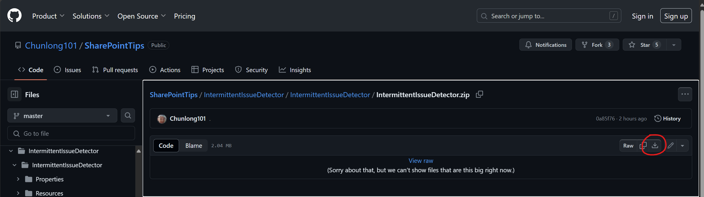
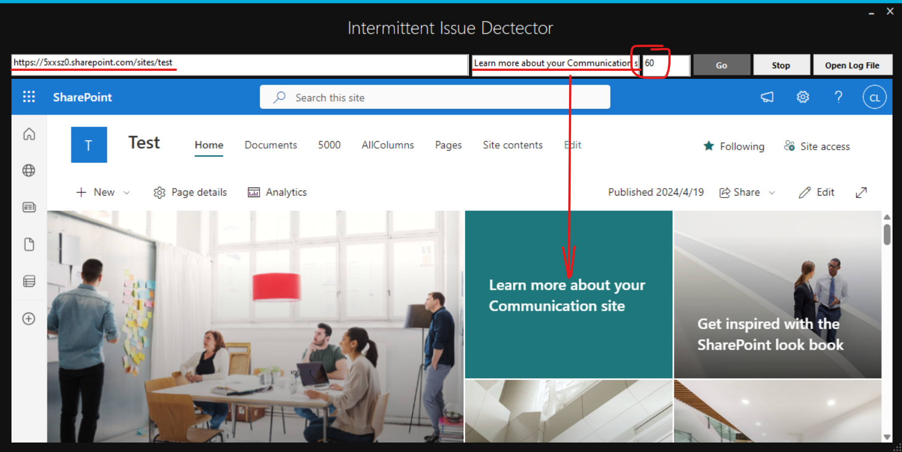

# Web Intermittent Issue Detector

The Web Intermittent Issue Detector is a tool designed to detect intermittent issues, aiming to assist users in automatically discovering and debugging those problems that occur infrequently and are difficult to reproduce. In many cases, users may encounter intermittent web issues that occur only once a day or even every few days. Typically, users have no means to actively identify and reproduce such issues, and developers find themselves equally powerless, as they can only react to problems occasionally bothering users, feeling frustrated and helpless. With this tool, users and developers no longer need to rely on luck to manually detect these issues; the entire process of discovery and debugging can be automated.

## Usage

1. Download and install the tool: [IntermittentIssueDetector.zip](https://github.com/Chunlong101/SharePointTips/blob/master/IntermittentIssueDetector/IntermittentIssueDetector/IntermittentIssueDetector.zip)

2. Open the tool and configure parameters, including the page URL and refresh frequency. For example, in the image below, we set the tool to refresh the page "https://5xxsz0.sharepoint.com/sites/test" every 60 seconds. If the page content contains the phrase "Learn more about your Communication site" the tool will log a successful page load; otherwise, it will log a failed page load, it also records the duration of how long the page load takes:

4. Enhancing issue analysis with additional tools:
   - **HAR or Fiddler**:
      - Press `F12` to open the developer tools inside this detector and [capture a HAR network trace](https://learn.microsoft.com/en-us/azure/azure-portal/capture-browser-trace).
      - Alternatively, use [Fiddler](https://learn.microsoft.com/en-us/power-query/web-connection-fiddler), and [setting Fiddler filters](https://www.youtube.com/watch?v=DtTBLa0SeM8).
   - **Wireshark or Network Monitoring**:
      - Consider using [Wireshark](https://www.wireshark.org) to capture network traffic
      - Alternatively, you can collect network traces using [Network Monitor](https://learn.microsoft.com/en-us/troubleshoot/windows-client/networking/collect-data-using-network-monitor).

----- 
----- 
----- 

# Web间歇性问题检测器

Web间歇性问题检测器是一个用于检测间歇性问题的工具，旨在帮助用户自动发现和调试那些发生概率很低、难以重现的问题。在许多情况下，用户可能会遇到间歇性的网页问题，这些问题可能一天甚至几天才会发生一次，通常用户没有方法来主动地挖掘和重现这类问题，开发者在面对同样的境遇时也很被动，只能任由问题时不时地打扰用户，束手无策，令人不胜其烦。有了这个工具之后，用户和开发者不再需要手动地凭运气去检测这些问题，整个问题的发现和调试流程都可以被自动化。

## 使用方法

1. 下载并安装工具: https://github.com/Chunlong101/SharePointTips/blob/master/IntermittentIssueDetector/IntermittentIssueDetector/IntermittentIssueDetector.zip

2. 打开工具并配置参数，包括页面URL、刷新频率等。例如，在下图中，我们设置了每隔60秒刷新一次页面"https://5xxsz0.sharepoint.com/sites/test", 如果刷出来的页面的内容中出现了"Learn more about your Communication site"的字样, 那么工具将会记录一条成功加载页面的日志；反之，将记录一条加载页面失败的日志，在日志中还会记载页面加载的时间:

   
4. 使用其他工具增强问题分析：
   - **HAR or Fiddler**：
      - 您可以按 `F12` 键打开检测器的的开发者工具[捕获HAR网络追踪](https://learn.microsoft.com/en-us/azure/azure-portal/capture-browser-trace)。
      - 或者[使用Fiddler捕获日志](https://learn.microsoft.com/en-us/power-query/web-connection-fiddler),[设置Fiddler过滤器](https://www.youtube.com/watch?v=DtTBLa0SeM8)。
   - **网络监控**：
      - 您可以使用[Wireshark](https://www.wireshark.org)来捕获网络流量。
      - 或者，您可以使用[Network Monitor](https://learn.microsoft.com/en-us/troubleshoot/windows-client/networking/collect-data-using-network-monitor)收集网络追踪数据，。
