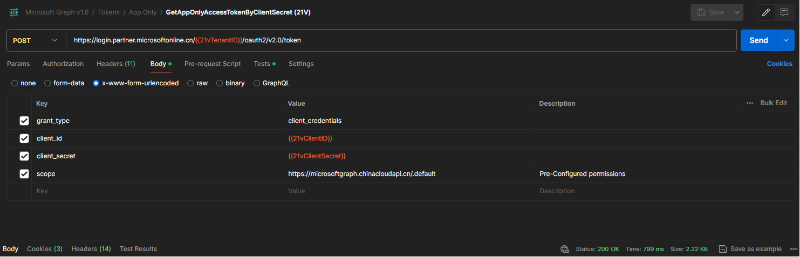
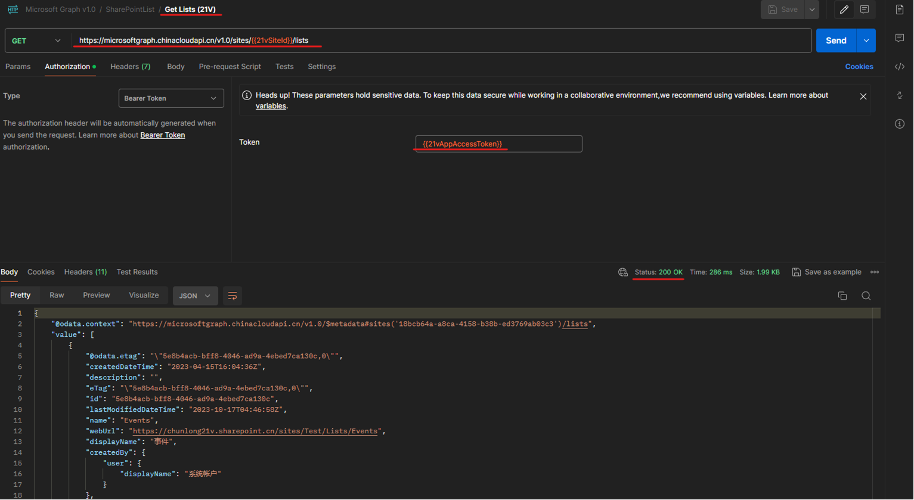
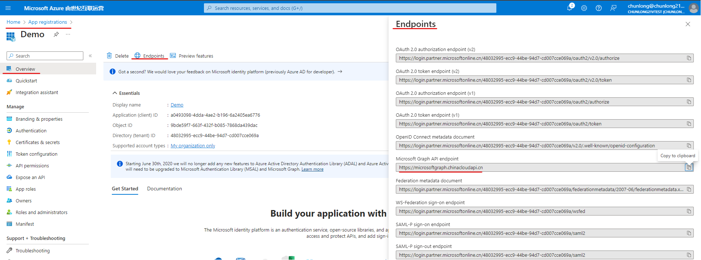

# 在 21V Gallatin 环境中使用 Microsoft Graph API

在 21V Gallatin 环境中使用 Microsoft Graph API 的步骤与 Global 环境基本相同，但在 21V Gallatin 环境中，一些参数和Endpoint需要进行适当修改，例如：

1. 获取 Token：

   

2. 调用 Graph API：

   

3. 在21V的Portal上可以查看到所有相关的Endpoint：

   

----- 
----- 
----- 

# Using Microsoft Graph API in 21V Gallatin Environment

The steps for using Microsoft Graph API in the 21V Gallatin environment are similar to those in the Global environment, but in the 21V Gallatin environment, some parameters and endpoints need to be appropriately modified, such as:

1. Obtain Token:

   

2. Call Graph API:

   

3. All relevant endpoints can be viewed on the 21V Portal:

   