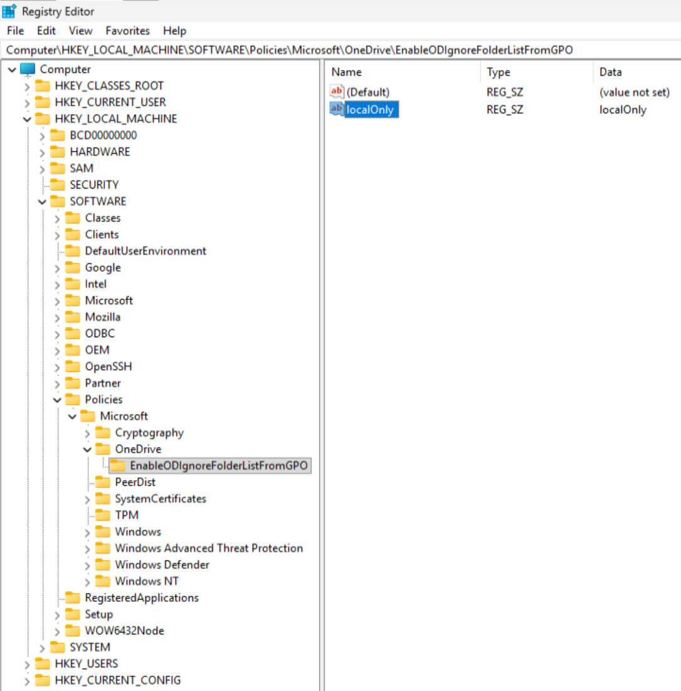
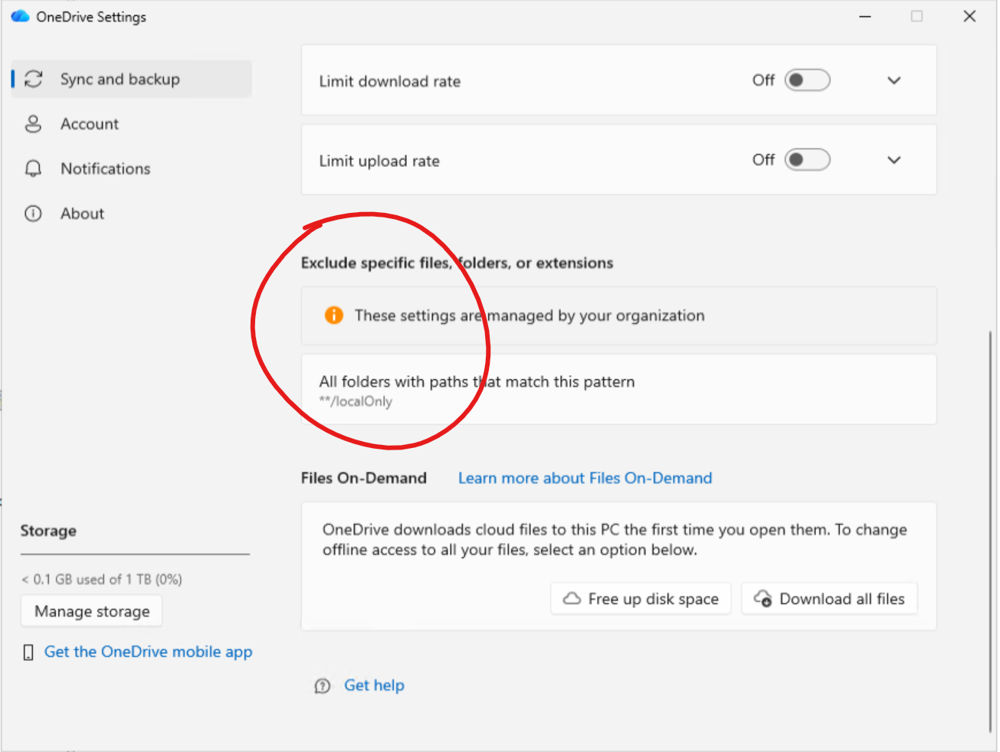
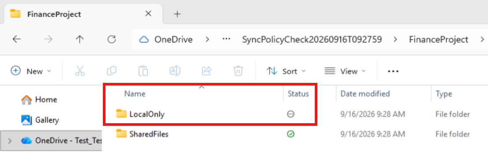

# OneDrive 文件夹排除：域 GPO 部署与验证

> 来源：本地实验环境操作记录及用户反馈；不是微软官方测试报告  
> 测试日期：2026-09-16  
> 入库日期：2026-09-16  
> 标签：OneDrive、Group Policy、ADMX、EnableODIgnoreFolderListFromGPO、文件夹排除  
> 状态：用户确认域 GPO 部署及下述正反对照测试成功；未验证软件升级后的配置保留

## 配置效果截图

### 图 1：客户端注册表中的文件夹排除规则



截图显示 GPO 已在客户端生成以下配置：

| 项目 | 配置 |
|---|---|
| 子键 | `HKEY_LOCAL_MACHINE\SOFTWARE\Policies\Microsoft\OneDrive\EnableODIgnoreFolderListFromGPO` |
| 值名 | `localOnly` |
| 类型 | `REG_SZ` |
| 值数据 | `localOnly` |

**值名和数据均为要排除的文件夹名称。** 图中的 `(Default)` 是注册表默认项，无需修改。

### 图 2：OneDrive 显示组织管理的排除规则



截图位于 OneDrive 的 **Sync and backup → Advanced settings → Exclude specific files, folders, or extensions** 区域，显示：

- **These settings are managed by your organization**：该设置由组织管理。
- **All folders with paths that match this pattern**，下方为 `**/localOnly`：客户端以模式形式展示按文件夹名称配置的排除规则。

**GPO 列表中仍只填写 `localOnly`，不要将界面的 `**/localOnly` 作为 GPO 输入。** 此显示形式不表示该策略接受通配符或完整路径；规则按完整文件夹名称匹配，且不区分大小写。

### 图 3：文件资源管理器中的排除状态与正常同步对照



截图展示测试目录 `SyncPolicyCheck20260916T092759\FinanceProject`，两个文件夹的 Status 列形成直观对照：

| 文件夹 | 状态图标 | 含义 |
|---|---|---|
| `LocalOnly` | 灰色圆圈内横线 | 被排除同步，文件夹保留在本机；本次测试中的新建内容不上传 |
| `SharedFiles` | 绿色空心圆圈内勾号 | 正常同步、在本地可用，作为未被排除的对照 |

**`LocalOnly` 与策略中的 `localOnly` 匹配，说明名称匹配不区分大小写。** 绿色空心勾号表示本地可用，不等同于“始终保留在此设备上”。

三张截图依次展示了注册表配置、客户端规则呈现及资源管理器状态。实际上传结果仍结合下文的本地与网页端文件对照测试确认。

## 1. 背景与结论

本实验用于验证：通过域组策略让 Windows OneDrive 跳过上传指定名称的文件夹，同时保持其他内容正常同步。

本次成功配置：

```text
HKEY_LOCAL_MACHINE\SOFTWARE\Policies\Microsoft\OneDrive
└─ EnableODIgnoreFolderListFromGPO
   └─ localOnly    REG_SZ    localOnly
```

**关键要求：**

1. 在 OneDrive 策略路径下使用 `EnableODIgnoreFolderListFromGPO` 子键，其中包含 `REG_SZ` 字符串列表。
2. 本版本 GPO 生成的字符串值，其值名和数据均为文件夹名称。
3. 必须先应用策略，再完全退出并重启 OneDrive，最后创建全新测试内容。
4. 按完整文件夹名称匹配，不区分大小写、不支持通配符，不是完整路径匹配。

| 已验证项目 | 结果 |
|---|---|
| 不同项目路径下的 `LocalOnly` | 均排除上传 |
| 策略填写 `localOnly`，实际目录为 `LocalOnly` | 匹配，不区分大小写 |
| `LocalOnlyBackup` | 正常上传，不按前缀排除 |
| 普通对照目录内的文件 | 正常上传 |

本次成功流程使用 GPO。**独立手工写入后的完整复测、版本升级持久性、全部云环境的功能可用性，不在已验证范围内。**

## 2. 实验环境

| 项目 | 本次环境 |
|---|---|
| AD 域 | `L.Workspace` |
| 域控制器 | `DC` |
| Windows 客户端 | `Win11` |
| 计算机对象 | `CN=Win11,CN=Computers,DC=L,DC=Workspace` |
| 客户端用户配置文件 | `C:\Users\SPAdmin` |
| 实际运行的 OneDrive 文件版本 | `26.158.0816.0003` |
| OneDrive 根目录 | `C:\Users\SPAdmin\OneDrive - Test_Test_Hello21V` |
| 域中央模板存储 | 本次不存在，使用 DC 本地模板 |
| 测试 GPO | `TEST-OneDrive-FolderExclusion-Win11` |
| 安全筛选 | 仅 `Win11` 计算机应用 |

**复用说明：**其他环境需替换域名、计算机名、版本目录和 OneDrive 根目录。目录中的组织名称不能单独证明账户所属云环境。本实验结果也不能推导所有租户都已获得该功能。

## 3. 测试准备

- 使用无敏感信息的测试文件；OneDrive 已登录且普通同步正常。
- 保留现有策略及测试前状态，不修改 Default Domain Policy、KFM 或登录策略。
- 本次仅测试文件夹排除，不额外配置 `DisableChangesToODIgnoreList`、`DisableDefaultODIgnoreList`。
- HKLM 策略不是仅针对某个测试父目录；先确认没有业务目录使用 `localOnly` 这一名称。
- 管理员窗口用于域策略及 HKLM 检查；文件测试使用普通用户 PowerShell。
- OneDrive 始终以正常登录用户身份运行，不以管理员身份启动。

文件夹排除首次出现在 2026-07-31 的 `26.134.0713.0007` Windows Production Ring 发布说明，标注逐步推出。版本号达到要求不等于已确认功能实际生效。

## 4. Win11：取得对应版本模板

确认已加入域：

```powershell
Get-CimInstance Win32_ComputerSystem | Select-Object Name, Domain, PartOfDomain
```

本次输出为 `Win11 / L.Workspace / True`。

查找模板：

```powershell
$Adm = 'C:\Users\SPAdmin\AppData\Local\Microsoft\OneDrive\26.158.0816.0003\adm'
Get-Item -LiteralPath "$Adm\OneDrive.admx"
Get-ChildItem -LiteralPath $Adm -Filter OneDrive.adml -Recurse | Select-Object -ExpandProperty FullName
```

英文编辑器使用同一版本根目录下的：

```text
...\adm\OneDrive.admx
...\adm\OneDrive.adml
```

将文件复制到 DC 的暂存目录：

```text
C:\Temp\OneDrive-26.158.0816.0003
├─ OneDrive.admx
└─ en-US
   └─ OneDrive.adml
```

源目录英文 ADML 在 `adm` 根目录，安装时放入目标 `en-US` 子目录。中文编辑器应使用对应版本的 `zh-CN\OneDrive.adml`；不要混用不同版本或错误语言。

## 5. DC：安装管理模板

在 DC 管理员 PowerShell 中确认中央存储：

```powershell
Import-Module ActiveDirectory
$Domain = (Get-ADDomain).DNSRoot
$CentralStore = "\\$Domain\SYSVOL\$Domain\Policies\PolicyDefinitions"
[pscustomobject]@{
    Domain = $Domain
    CentralStore = $CentralStore
    CentralStoreExists = Test-Path -LiteralPath $CentralStore
}
```

本次 `CentralStoreExists=False`，因此将模板安装到 DC 的本地 `C:\Windows\PolicyDefinitions`，并在 DC 上编辑域 GPO。

**其他环境如已有中央存储，应使用现有中央存储。不要新建仅包含 OneDrive 模板的不完整中央存储，也不要未经评估降级共享模板。**

关闭组策略编辑器。以下安装命令仅适用于本次无中央存储、英文编辑器的分支：

```powershell
$ErrorActionPreference = 'Stop'
$Source = 'C:\Temp\OneDrive-26.158.0816.0003'
$Target = "$env:windir\PolicyDefinitions"
$Backup = "C:\Temp\OneDrive-TemplateBackup-$(Get-Date -Format 'yyyyMMdd-HHmmss')"

Get-Item -LiteralPath "$Source\OneDrive.admx" | Out-Null
Get-Item -LiteralPath "$Source\en-US\OneDrive.adml" | Out-Null
New-Item -Path "$Backup\en-US" -ItemType Directory -Force | Out-Null

if (Test-Path -LiteralPath "$Target\OneDrive.admx") {
    Copy-Item -LiteralPath "$Target\OneDrive.admx" -Destination "$Backup\OneDrive.admx"
}
if (Test-Path -LiteralPath "$Target\en-US\OneDrive.adml") {
    Copy-Item -LiteralPath "$Target\en-US\OneDrive.adml" -Destination "$Backup\en-US\OneDrive.adml"
}

New-Item -Path "$Target\en-US" -ItemType Directory -Force | Out-Null
Copy-Item -LiteralPath "$Source\OneDrive.admx" -Destination "$Target\OneDrive.admx" -Force
Copy-Item -LiteralPath "$Source\en-US\OneDrive.adml" -Destination "$Target\en-US\OneDrive.adml" -Force
Get-Item -LiteralPath "$Target\OneDrive.admx", "$Target\en-US\OneDrive.adml"
Write-Host "Backup: $Backup"
```

模板只用于管理端编辑策略；无需为了应用 GPO 将 ADMX/ADML 复制到 Win11。

## 6. DC：创建、配置并限定 GPO

打开 `gpmc.msc`，不是 `gpedit.msc`。

1. 在 `Domains → L.Workspace → Group Policy Objects` 下创建 `TEST-OneDrive-FolderExclusion-Win11`。如果已存在，确认用途后复用，不重复创建。
2. 暂不链接；先设置 `Scope → Security Filtering`。
3. 移除默认的 `Authenticated Users` 应用权限。
4. 点击 Add，在 Object Types 勾选 Computers，添加 `Win11`。
5. 在 `Delegation → Advanced` 确认 Win11 有 Read 和 Apply group policy。其他主体不得因广泛授权而应用此测试策略；如保留 Authenticated Users，只授予 Read，不使用 Deny。保留管理员及 SYSTEM 的管理权限。
6. 编辑测试 GPO，进入：

```text
Computer Configuration
→ Policies
→ Administrative Templates
→ OneDrive
→ Exclude specific kinds of folders from being uploaded
```

设置 Enabled，点击 Show，添加一行：

```text
localOnly
```

只填名称，不填路径、不加引号或分号。保存并关闭编辑器。

### 链接位置

在 DC 查询：

```powershell
Get-ADComputer -Identity Win11 | Select-Object Name, DistinguishedName
```

本次 Win11 位于 `CN=Computers`，该容器不能直接链接 GPO。因此在**已确认仅 Win11 可应用**的前提下：

1. 右键域 `L.Workspace`。
2. 选择 Link an Existing GPO。
3. 选择本次测试 GPO。
4. 确认 Link Enabled 为 Yes，Enforced 为 No。

其他环境如果 Win11 位于 OU，可链接到该 OU，无需移动计算机对象。

## 7. Win11：验证下发及实际注册表结构

在 Win11 管理员 PowerShell 中执行：

```powershell
gpupdate.exe /target:computer /force
gpresult.exe /scope computer /r
reg.exe query "HKLM\SOFTWARE\Policies\Microsoft\OneDrive\EnableODIgnoreFolderListFromGPO" /s /reg:64
```

必须先确认：

| 检查项 | 预期 |
|---|---|
| Applied Group Policy Objects | 包含 `TEST-OneDrive-FolderExclusion-Win11` |
| 排除列表 | 包含 `localOnly    REG_SZ    localOnly` |

目标配置：

```text
HKEY_LOCAL_MACHINE\SOFTWARE\Policies\Microsoft\OneDrive\EnableODIgnoreFolderListFromGPO
    localOnly                 REG_SZ    localOnly
```

正确规则的注册表表示为：

```reg
Windows Registry Editor Version 5.00

[HKEY_LOCAL_MACHINE\SOFTWARE\Policies\Microsoft\OneDrive\EnableODIgnoreFolderListFromGPO]
"localOnly"="localOnly"
```

此片段用于记录 GPO 的实际结果，不要求再手工导入。

## 8. Win11：重启 OneDrive，再创建新内容

严格执行：

```text
策略应用完成 → 完全退出并重启 OneDrive → 创建全新内容 → 网页端检查
```

通过任务栏 OneDrive 菜单退出，再从开始菜单以普通用户身份打开。暂停/恢复同步不能替代退出/重启。

必要时记录进程启动时间和实际版本：

```powershell
Get-Process -Name OneDrive -ErrorAction Stop | ForEach-Object {
    $Exe = $_.Path
    [pscustomobject]@{
        Id = $_.Id
        StartTime = $_.StartTime
        Path = $Exe
        FileVersion = $(if ($Exe) { (Get-Item -LiteralPath $Exe).VersionInfo.FileVersion } else { 'Unavailable' })
    }
} | Format-List
Get-Date
```

记录策略应用、进程启动和文件创建时间时，统一使用测试机本地时间。

## 9. 创建 PascalCase 测试内容

文件夹及文件名使用 PascalCase（首字母大写），GPO 仍保留 `localOnly`，同时验证大小写不敏感。

在 Win11 的 SPAdmin **普通 PowerShell** 中执行：

```powershell
$ErrorActionPreference = 'Stop'
$SyncRoot = 'C:\Users\SPAdmin\OneDrive - Test_Test_Hello21V'

if (-not (Test-Path -LiteralPath $SyncRoot -PathType Container)) {
    throw 'OneDrive sync root does not exist.'
}

$RunId = Get-Date -Format "yyyyMMdd'T'HHmmss"
$TestRoot = Join-Path $SyncRoot "SyncPolicyCheck$RunId"
New-Item -Path $TestRoot -ItemType Directory | Out-Null

$TestFiles = @(
    'FinanceProject\LocalOnly\PrivateDraft.txt',
    'FinanceProject\SharedFiles\MonthlySummary.txt',
    'EngineeringProject\LocalOnly\DebugNotes.txt',
    'LocalOnlyBackup\ReferenceNote.txt'
)

foreach ($RelativePath in $TestFiles) {
    $FilePath = Join-Path $TestRoot $RelativePath
    New-Item -Path (Split-Path -Path $FilePath -Parent) -ItemType Directory -Force | Out-Null
    Set-Content -LiteralPath $FilePath -Value "Non-sensitive test content: $RelativePath; run: $RunId" -Encoding UTF8
}

Write-Host "New test folder: $TestRoot"
```

结构：

```text
SyncPolicyCheck时间戳
├─ FinanceProject
│  ├─ LocalOnly
│  │  └─ PrivateDraft.txt
│  └─ SharedFiles
│     └─ MonthlySummary.txt
├─ EngineeringProject
│  └─ LocalOnly
│     └─ DebugNotes.txt
└─ LocalOnlyBackup
   └─ ReferenceNote.txt
```

每次复测生成新目录。不要重命名、移动旧的已同步内容代替新测试。

## 10. 网页端判定

打开与该本地账户对应的 OneDrive 网页，找到本次输出的新目录。等待两个正常对照文件上传，再刷新检查具体文件。

| 测试文件 | 本地 | 网页端 | 本次结果 |
|---|---|---|---|
| `FinanceProject\LocalOnly\PrivateDraft.txt` | 存在 | 不出现 | 用户确认成功 |
| `FinanceProject\SharedFiles\MonthlySummary.txt` | 存在 | 出现 | 用户确认成功 |
| `EngineeringProject\LocalOnly\DebugNotes.txt` | 存在 | 不出现 | 用户确认成功 |
| `LocalOnlyBackup\ReferenceNote.txt` | 存在 | 出现 | 用户确认成功 |

**设置页面是否显示条目不是唯一判据。** 普通对照文件未上传时，不能只因排除文件暂时未出现而判定成功。

## 11. 配置与使用要点

| 项目 | 要求或行为 |
|---|---|
| 注册表格式 | 子键内的 `REG_SZ` 列表，值名和数据均为文件夹名称 |
| GPO 部署 | 完成策略配置、安全筛选和链接，并在客户端确认应用结果 |
| 默认 Computers 容器 | 使用父级域链接，并将安全筛选限定为测试计算机 |
| 操作顺序 | 应用策略后完全重启 OneDrive，再创建全新测试内容 |
| 名称匹配 | 按完整文件夹名称匹配，不区分大小写；`LocalOnlyBackup` 正常上传 |
| 作用范围 | 同步范围内不同路径下的同名文件夹均可匹配，不按完整路径限定 |
| 已有云端内容 | 策略不会追溯删除已有云端内容 |

## 12. 撤销与清理建议

以下为收尾建议，**不属于本次已确认完成的测试结果**：

1. 先记录 GPO 设置、`gpresult`、注册表及本地/网页端对照结果。
2. 在 DC 将测试策略设为 Disabled，在 Win11 刷新计算机策略。
3. 查询注册表确认测试条目是否移除，不假定切换到“未配置”就会清除所有残留。
4. 如仍有残留，先确认没有 GPO 继续下发，仅清理已确认属于本次实验的条目。保留其他 OneDrive/KFM 配置。
5. 重启 OneDrive。取消排除可能使此前仅保留在本地的文件开始上传；因此必须只使用无敏感信息的测试内容。
6. 清理本次测试目录。删除已同步的文件会同步删除其云端副本。
7. 取消测试 GPO 链接；按实验记录要求保留或删除该测试 GPO。

## 13. 未验证范围

- 先配置再升级 OneDrive 时，注册表是否被保留及策略是否持续生效。
- 单独手工写入正确值数据后，不经过 GPO 的独立测试。
- 所有租户、云环境或其他客户端版本的可用性。
- 所有已有云端内容、下载行为或用户自助排除界面的行为。

升级测试应分开验证“配置是否仍存在”和“升级后新内容是否仍按规则排除”，不能仅凭注册表仍在就宣告成功。

## 14. 参考链接

- [Microsoft Learn：通过组策略管理 OneDrive](https://learn.microsoft.com/en-us/sharepoint/use-group-policy#manage-onedrive-using-group-policy)
- [Microsoft Learn：Exclude specific kinds of folders from being uploaded](https://learn.microsoft.com/en-us/sharepoint/use-group-policy#exclude-specific-kinds-of-folders-from-being-uploaded)
- [OneDrive Sync 发布说明](https://learn.microsoft.com/en-us/sharepoint/sync-release-notes)

注册表值数据写法依据本次 `26.158.0816.0003` 模板经 GPO 实际生成的结果。
