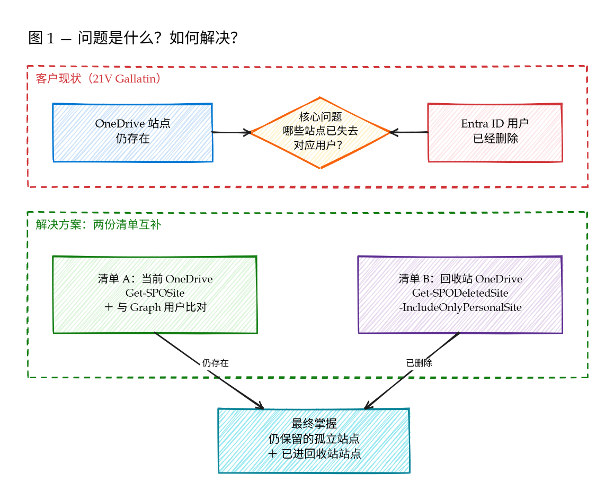
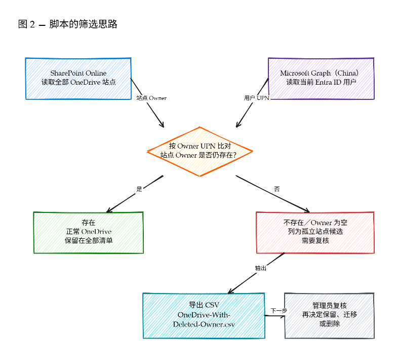

# 查询已删除用户关联的 OneDrive（21V Gallatin）

本工具用于在 Microsoft 365 21V Gallatin 环境中，查找以下两类 OneDrive：

1. OneDrive 站点仍然存在，但其记录的所有者已不在 Microsoft Entra ID 中。
2. OneDrive 站点已经删除，并进入 SharePoint 站点回收站。

脚本仅执行查询和 CSV 导出，不会删除、恢复或修改任何 OneDrive、用户及文件。

## 方案概览



脚本分别读取：

- SharePoint Online 中现存的 OneDrive 个人站点；
- Microsoft Entra ID 中当前存在的用户；
- SharePoint 站点回收站中的已删除 OneDrive。

随后以 OneDrive 的 `Owner` UPN 与 Entra ID 用户 UPN 进行比对。



> [!IMPORTANT]
> `OwnerNotFoundInEntraID` 表示站点记录的 Owner 当前无法在 Entra ID 中找到，是“用户已删除、OneDrive 仍保留”的主要候选结果。执行迁移或删除前仍应人工复核。

## 前提条件

### 管理员权限

运行人员需要：

- SharePoint 管理员权限；
- 读取 Entra ID 用户目录的权限；
- 对 Microsoft Graph 委托权限 `User.Read.All` 完成管理员同意。

### PowerShell 模块

脚本依赖：

```powershell
Microsoft.Online.SharePoint.PowerShell
Microsoft.Graph.Users
```

脚本会在未检测到 `Microsoft.Online.SharePoint.PowerShell` 或 `Microsoft.Graph.Users` 时尝试自动从 PSGallery 安装（`-Scope CurrentUser`）。如需手动预先安装，可运行：

```powershell
Install-Module Microsoft.Online.SharePoint.PowerShell -Scope CurrentUser
Install-Module Microsoft.Graph.Users -Scope CurrentUser
```

建议使用 Windows PowerShell 5.1。PowerShell 7 也可以运行，但加载 SharePoint Online 模块时可能显示 `WinPSCompatSession` 兼容性警告；该警告通常不影响本脚本。

## 注册 Gallatin Microsoft Graph 应用

全球版默认的 Microsoft Graph PowerShell 应用不会复制到 Azure China。Gallatin 租户必须使用在 Azure 中国环境中注册的自有应用。

1. 登录 [Azure 中国门户](https://portal.azure.cn)。
2. 进入 **Microsoft Entra ID > 应用注册 > 新注册**。
3. 输入应用名称，例如 `OneDrive Orphan Audit`。
4. 账户类型选择 **仅此组织目录中的账户**。
5. 完成注册后，进入 **身份验证**。
6. 选择 **添加平台 > 移动和桌面应用程序**。
7. 添加以下重定向 URI：

   ```text
   http://localhost
   ```

8. 确保 `http://localhost` 位于 **移动和桌面应用程序** 下，而不是 **Web** 平台下。
9. 在高级设置中将 **允许公共客户端流** 设置为 **是**。
10. 进入 **API 权限 > 添加权限 > Microsoft Graph > 委托的权限**。
11. 添加：

    ```text
    User.Read.All
    ```

12. 选择 **代表组织授予管理员同意**。
13. 从应用概述页复制：
    - 应用程序（客户端）ID；
    - 目录（租户）ID。

正确的应用 Manifest 应至少包含：

```json
{
  "isFallbackPublicClient": true,
  "publicClient": {
    "redirectUris": [
      "http://localhost"
    ]
  },
  "web": {
    "redirectUris": []
  }
}
```

不需要为交互式管理员登录创建 Client Secret。

## 配置脚本

打开 `Get-OrphanedOneDrive.ps1`，修改开头的配置：

```powershell
$SharePointAdminUrl = "https://<TenantName>-admin.sharepoint.cn"
$GraphTenantId = "<Directory-Tenant-ID>"
$GraphClientId = "<Application-Client-ID>"
$OutputFolder = Join-Path $PSScriptRoot "OneDrive-Orphaned-Report"
```

## 运行脚本

可以在 Visual Studio Code 中打开脚本并按 **F5**，也可以在 PowerShell 中执行：

```powershell
Set-Location "C:\Path\To\OrphanedOneDrive"
.\Get-OrphanedOneDrive.ps1
```

## 输出文件

每次运行会创建一个时间戳目录，例如：

```text
OneDrive-Orphaned-Report\20260719-182700
```

目录中包含：

| 文件 | 内容 |
|---|---|
| `OneDrive-With-Deleted-Owner.csv` | Owner 不存在、缺失或无法解析的 OneDrive 候选清单 |
| `All-Active-OneDrive-Sites.csv` | 当前仍存在的全部 OneDrive 个人站点 |
| `Deleted-OneDrive-Sites.csv` | 已进入 SharePoint 站点回收站的 OneDrive |

### Finding 字段

| Finding | 含义 | 建议 |
|---|---|---|
| `OwnerExistsInEntraID` | Owner 当前仍存在于 Entra ID | 通常无需处理 |
| `OwnerNotFoundInEntraID` | Owner UPN 当前不在 Entra ID 中 | 重点复核，最符合本工具的查询目标 |
| `OwnerMissing` | OneDrive 没有可用的 Owner 值 | 人工核实站点来源及所有权 |
| `OwnerCannotBeResolved` | Owner 值无法标准化为 UPN | 人工核实 Owner 格式及历史变更 |

## 结果解读

### OneDrive 仍存在，但 Owner 已删除

重点查看：

```text
OneDrive-With-Deleted-Owner.csv
```

优先筛选：

```text
Finding = OwnerNotFoundInEntraID
```

这表示 SharePoint 中仍保留该 OneDrive，但其记录的 Owner UPN 已无法在当前 Entra ID 用户目录中找到。

### OneDrive 已进入站点回收站

查看：

```text
Deleted-OneDrive-Sites.csv
```

该文件来自：

```powershell
Get-SPODeletedSite -IncludeOnlyPersonalSite -Limit All
```

它与“仍存在但 Owner 已删除”的清单属于不同生命周期状态，建议分别保留和审核。

## 常见问题

### AADSTS700016

示例：

```text
Application with identifier '14d82eec-...' was not found in the directory.
```

原因：使用了全球版默认 Microsoft Graph PowerShell 应用，该应用未复制到 Azure China。

处理：在 Gallatin 租户注册自有应用，并通过 `-ClientId`、`-TenantId` 和 `-Environment China` 连接。

### AADSTS7000218

示例：

```text
The request body must contain 'client_assertion' or 'client_secret'.
```

原因：Entra ID 将应用或重定向 URI 识别为机密 Web 客户端。

检查：

- `http://localhost` 必须配置在 **移动和桌面应用程序** 下；
- `publicClient.redirectUris` 必须包含 `http://localhost`；
- `web.redirectUris` 不应包含 `http://localhost`；
- `isFallbackPublicClient` 应为 `true`；
- 保存应用配置后重新发起登录。

不要通过将 Client Secret 写入脚本来规避该错误。

### 登录窗口未显示或被遮挡

脚本执行：

```powershell
Set-MgGraphOption -DisableLoginByWAM $true
```

这会禁用 WAM 并使用独立浏览器窗口登录。如果窗口未出现在前台，请检查任务栏或浏览器窗口。

## 官方参考

- [Microsoft Graph PowerShell authentication commands](https://learn.microsoft.com/powershell/microsoftgraph/authentication-commands)
- [Microsoft Graph national cloud deployments](https://learn.microsoft.com/graph/deployments)
- [Microsoft Graph SDK national cloud configuration](https://learn.microsoft.com/graph/sdks/national-clouds)
- [AADSTS7000218 troubleshooting](https://learn.microsoft.com/troubleshoot/entra/entra-id/app-integration/confidential-client-application-authentication-error-aadsts7000218)
- [Get-SPOSite](https://learn.microsoft.com/powershell/module/microsoft.online.sharepoint.powershell/get-sposite)
- [Get-SPODeletedSite](https://learn.microsoft.com/powershell/module/microsoft.online.sharepoint.powershell/get-spodeletedsite)
- [OneDrive retention and deletion](https://learn.microsoft.com/sharepoint/retention-and-deletion)
