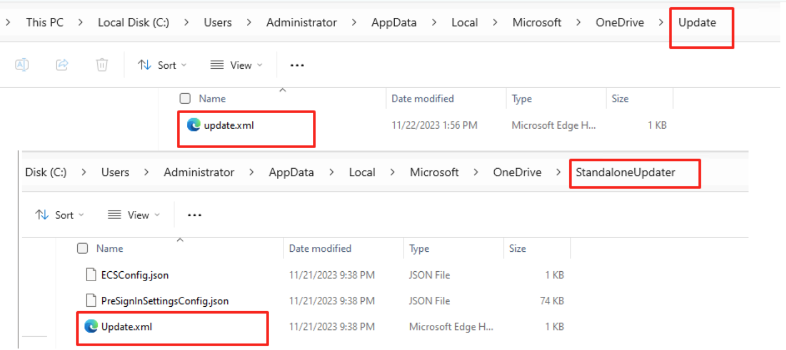
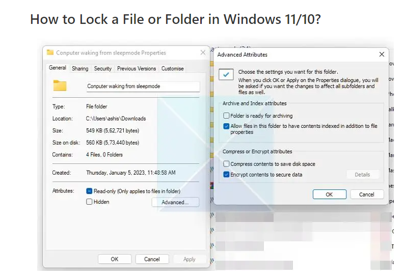

#### Currently we don't have a reliable method to prevent OneDrive from auto-upgrading, do we?

The answer is - No we don't, this scenario is not supported. Currenty there's no official settings or configurations that can help on this, Microsoft does not recommend to disable automatic updates, Mcirosoft believes in the importance of these updates for maintaining the security, performance, and overall functionality of products.

Here in this article I will share some thoughs, but pls note, not all of them are supported by Microsoft, and some of them may not reliable as the product itself as well as the design may change, so pls check them out with caution.

#### Using GPO can only control OneDrive to stay on a specific ring, but it will still auto-update after that ring is updated: https://learn.microsoft.com/en-us/sharepoint/use-group-policy#set-the-sync-app-update-ring

#### The Task Scheduler method mentioned in https://www.coretechnologies.com/blog/miscellaneous/disable-onedrive-automatic-updates (stop auto update tasks in task scheudler) also doesn't prevent OneDrive.exe from checking and automatically updating to a new version.

#### Disabling two endpoints, "oneclient.sfx.ms" seems to be the only effective way to stop OneDrive from auto-updating, but this is not supported by Microsoft (this can also be done by network layer):
```
1. Run Notepad as an administrator.
2. Navigate to and open the hosts file (located at c:\Windows\System32\drivers\etc\hosts).
3. Add the following line to the end of the file:
   
   127.0.0.1                  oneclient.sfx.ms
   
4. Save the file.
5. Keep in mind that by making this change, OneDrive will no longer update automatically until you remove this entry. You can manually update it by downloading and installing the updates, but it won't update automatically.
```

#### Locking the update.xml file, which controls OneDrive updates, including standalone and embedded updates,  Microsoft doesn't support this either:

