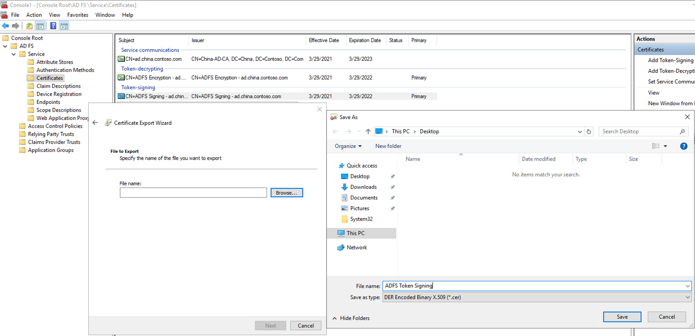
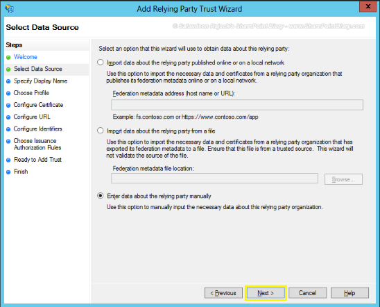
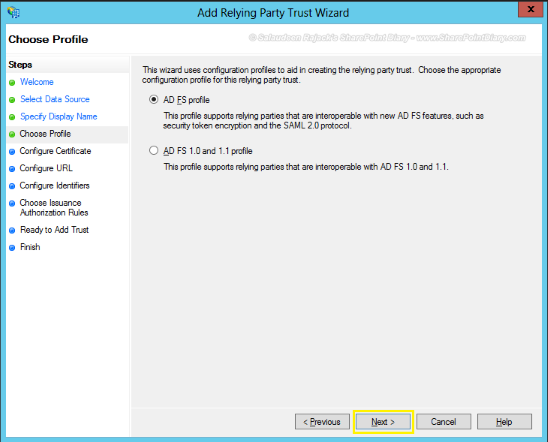
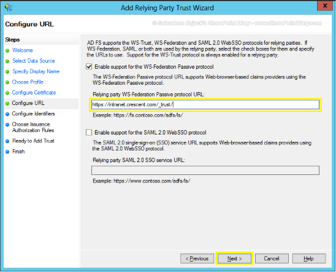
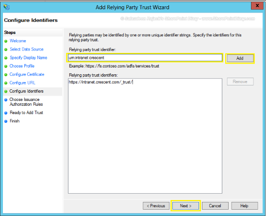
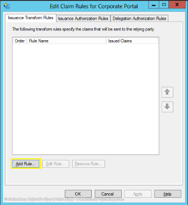
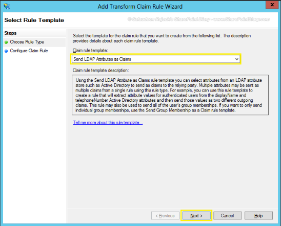
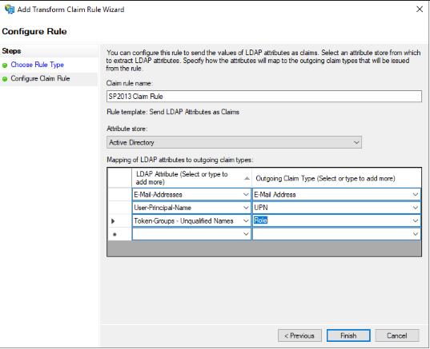
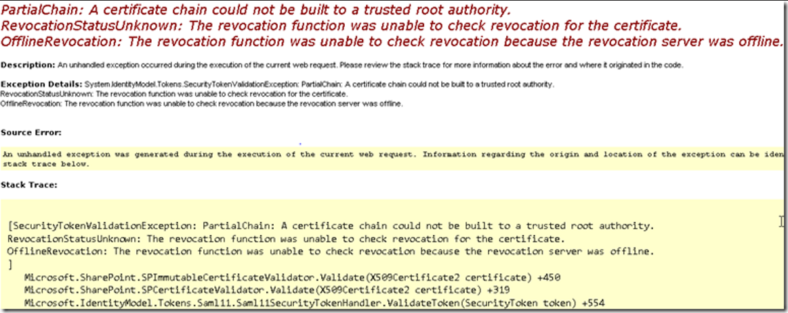
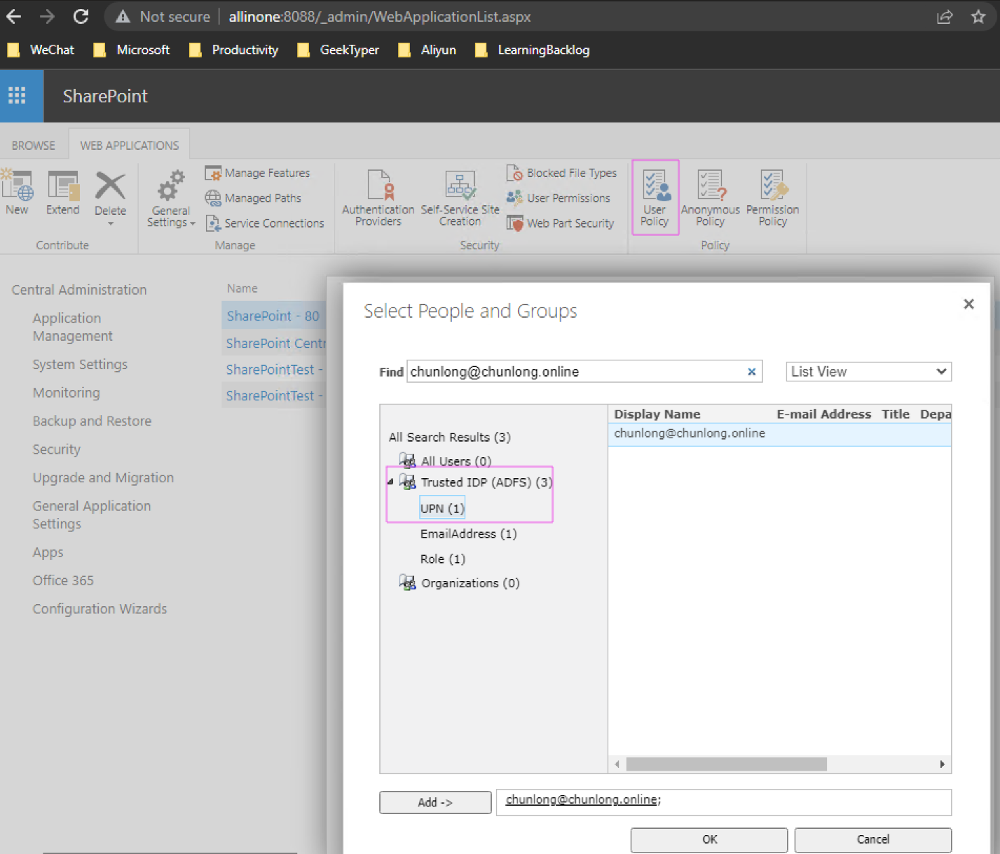

## ADFS Configuration for SharePoint Integration

### Certificate Acquisition

To initiate the configuration process for Active Directory Federation Services (ADFS), the first step requires obtaining a certificate for ADFS Communication Service. This certificate is utilized in URLs like `https://hostname/adfs/ls/IdpInitiatedSignon.aspx`. There are two primary methods for obtaining this certificate:

1. **Self-signed Certificate**: Establish a Certification Authority (CA) internally to issue the certificate. Note that while this certificate is recognized within the internal network, it may not be recognized in public networks.
   
2. **Purchase Certificate**: Acquire a certificate from a public Certificate Authority.

### Verify ADFS Installation

Before proceeding, ensure ADFS is properly installed and configured. Use the following commands to check:

```powershell
Get-AdfsEndpoint | Select-Object -ExpandProperty FullUrl | clip
Set-AdfsProperties -EnableIdPInitiatedSignonPage $true
```

Upon successful installation, access the following URL to verify: `https://chunlong.online/adfs/ls/IdpInitiatedSignon.aspx`.

### SharePoint Integration Steps

Integration of ADFS with SharePoint involves four main steps:

1. **Export ADFS Token-signing Certificate**: Export the ADFS token-signing certificate in `.cer` format. This certificate is necessary for SharePoint integration.

   

2. **Add Relying Party Trust**: Configure Relying Party Trust with the following settings:

   
   
   
   SharePoint URL: 

   
   
   URN to be used during SharePoint configuration: 
   
   

3. **Add Claim Rules**: Define claim rules as follows:

   
   
   

4. **Configure SharePoint**:

   Run the following PowerShell commands to configure SharePoint:

   ```powershell
   Add-PSSnapin "Microsoft.SharePoint.PowerShell" -ErrorAction SilentlyContinue
   
   # Register the Token Signing certificate from ADFS Server
   $cert = New-Object System.Security.Cryptography.X509Certificates.X509Certificate2("C:\Path\To\ADFS Token Signing.cer") 
   New-SPTrustedRootAuthority -Name "ADFS Token Signing" -Certificate $cert
   
   # Map the claims attributes
   $EmailMap = New-SPClaimTypeMapping -IncomingClaimType "http://schemas.xmlsoap.org/ws/2005/05/identity/claims/emailaddress" -IncomingClaimTypeDisplayName "EmailAddress" -SameAsIncoming
   $UPNMap = New-SPClaimTypeMapping -IncomingClaimType "http://schemas.xmlsoap.org/ws/2005/05/identity/claims/upn" -IncomingClaimTypeDisplayName "UPN" -SameAsIncoming
   $RoleMap = New-SPClaimTypeMapping -IncomingClaimType "http://schemas.microsoft.com/ws/2008/06/identity/claims/role" -IncomingClaimTypeDisplayName "Role" -SameAsIncoming
   $realm = "urn:sharepoint:2019"
   
   # Specify ADFS Server instance as Sign-in URL
   $signInURL="https://ad.china.contoso.com/adfs/ls/"
   
   # Create new trusted identity token issuer
   $TrustedIdentity = New-SPTrustedIdentityTokenIssuer -Name "Trusted IDP (ADFS)" -Description "ADFS Trusted Identity Provider" -realm $realm -ImportTrustCertificate $cert -ClaimsMappings $EmailMap,$upnMap,$RoleMap -SignInUrl $signInURL -IdentifierClaim $UPNMap.InputClaimType
   ```

   If encountering errors like "PartialChain: A certificate chain could not be built to a trusted root authority," follow these steps to resolve:

   

   ```powershell
   # Obtain the “SharePoint Root Authority” certificate as a physical (.cer) file
   $rootCert = (Get-SPCertificateAuthority).RootCertificate
   $rootCert.Export("Cert") | Set-Content C:\SPRootAuthority.cer -Encoding byte
   
   # Import the “SharePoint Root Authority” certificate to the Trusted Root Certification store on all SharePoint 2013 servers.
   # Steps for importing certificate to the Trusted Root Certification Authorities:
   # 1. Start > Run > MMC > Enter
   # 2. File > Add/Remove Snap-in
   # 3. Certificates > Add > Computer account > Next > Local computer > Finish > OK
   # 4. Expand Certificates (Local Computer), expand Trusted Root Certification Authorities
   # 5. Right-click Certificates > All tasks > Import
   # 6. Next > Browse > navigate to and select C:\SPRootAuthority.cer > Open > Next > Next > Finish > OK
   ```

   After successful configuration, ensure proper permissions are granted:

   

-----
-----
-----

# ADFS 配置指南

## 1. 获取证书

ADFS 通信服务需要一张证书，例如 https://hostname/adfs/ls/IdpInitiatedSignon.aspx 将使用此证书。你可以通过以下两种方式获取证书：

- **自建 CA (Certification Authority)**：自签发的证书，只在内网有效，公网不认可。
- **购买公网证书**：在公网上购买一张证书。

## 2. 验证 ADFS 安装

运行以下命令来验证 ADFS 是否正确安装：

```powershell
Get-AdfsEndpoint | select FullUrl | clip 
Set-AdfsProperties -EnableIdPInitiatedSignonPage $true 
```

访问以下链接进行验证：https://chunlong.online/adfs/ls/IdpInitiatedSignon.aspx

## 3. ADFS 与 SharePoint 对接

对接 SharePoint 分为以下四个步骤：

### 步骤 1: 导出 ADFS token-signing 证书

导出 ADFS 发行的 token-signing 证书为 *.cer 格式（也可以在元数据 XML 文件中找到）。


### 步骤 2: 添加 Relying Party Trust

添加 Relying Party Trust，并配置 SharePoint 的 URL。


### 步骤 3: 添加声明规则

添加必要的声明规则。


### 步骤 4: 在 SharePoint 上配置令牌颁发者

运行以下 PowerShell 脚本，在 SharePoint 中配置令牌颁发者。

```powershell
Add-PSSnapin "Microsoft.SharePoint.PowerShell" -ErrorAction SilentlyContinue

# Register the Token Signing certificate from ADFS Server to establish Trust between SharePoint and ADFS server
$cert = New-Object System.Security.Cryptography.X509Certificates.X509Certificate2("C:\Users\Chunlong.CHINA\Desktop\ADFS Token Signing.cer") 
New-SPTrustedRootAuthority -Name "ADFS Token Signing" -Certificate $cert

# Map the claims attributes
$EmailMap = New-SPClaimTypeMapping -IncomingClaimType "http://schemas.xmlsoap.org/ws/2005/05/identity/claims/emailaddress" -IncomingClaimTypeDisplayName "EmailAddress" -SameAsIncoming
$UPNMap = New-SPClaimTypeMapping -IncomingClaimType "http://schemas.xmlsoap.org/ws/2005/05/identity/claims/upn" -IncomingClaimTypeDisplayName "UPN" -SameAsIncoming
$RoleMap = New-SPClaimTypeMapping -IncomingClaimType "http://schemas.microsoft.com/ws/2008/06/identity/claims/role" -IncomingClaimTypeDisplayName "Role" -SameAsIncoming

$realm = "urn:sharepoint:2019"
$signInURL="https://ad.china.contoso.com/adfs/ls/"

# Create new trusted identity token issuer
$TrustedIdentity = New-SPTrustedIdentityTokenIssuer -Name "Trusted IDP (ADFS)" -Description "ADFS Trusted Identity Provider" -realm $realm -ImportTrustCertificate $cert -ClaimsMappings $EmailMap,$upnMap,$RoleMap -SignInUrl $signInURL -IdentifierClaim $UPNMap.InputClaimType
```

### 可能的错误解决方案

如果遇到 `PartialChain: A certificate chain could not be built to a trusted root authority` 的错误，按照以下步骤解决：

- 获取 “SharePoint Root Authority” 证书作为物理文件 (.cer)。
  ```powershell
  $rootCert = (Get-SPCertificateAuthority).RootCertificate
  $rootCert.Export("Cert") | Set-Content C:\SPRootAuthority.cer -Encoding byte
  ```

- 将 “SharePoint Root Authority” 证书导入到所有 SharePoint 2013 服务器的 Trusted Root Certification 存储中。

参考文档：[https://docs.microsoft.com/en-us/archive/blogs/josrod/partialchain-a-certificate-chain-could-not-be-built-to-a-trusted-root-authority](https://docs.microsoft.com/en-us/archive/blogs/josrod/partialchain-a-certificate-chain-could-not-be-built-to-a-trusted-root-authority)

## 4. 权限配置

配置完成后，请记得添加权限。

