# 跑通 SharePoint Embedded（21Vianet / Gallatin）实操记录

## 1. 注册 App

`portal.azure.cn` → App registrations → New registration。

API permissions 里加（application/delegated 权限）：
- `FileStorageContainer.Selected`
- `FileStorageContainerTypeReg.Selected`

记录 `ClientId` / `TenantId` / `ClientSecret`。

### 进入 Entra 门户的 App registrations 列表页，点击 New registration 开始新建应用：

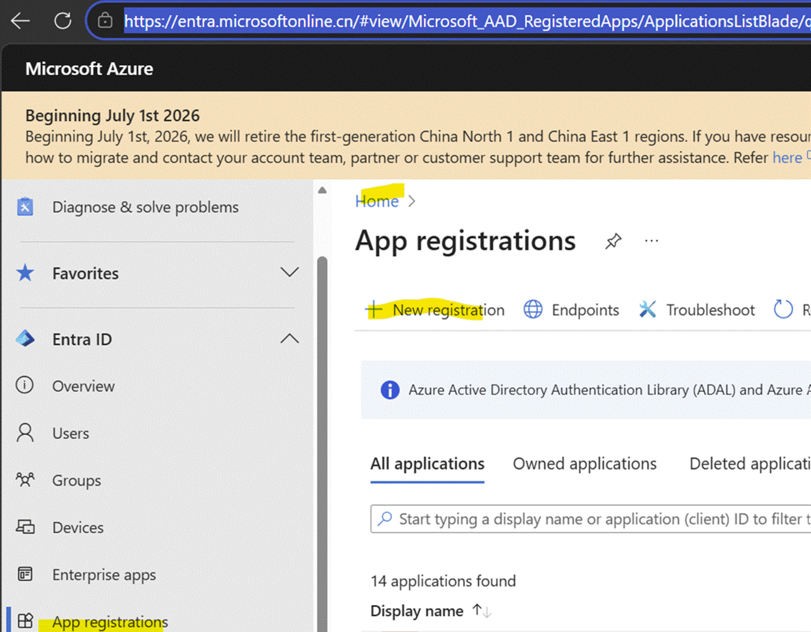

### 在 New registration 表单中填写应用名称，然后点击 Register：

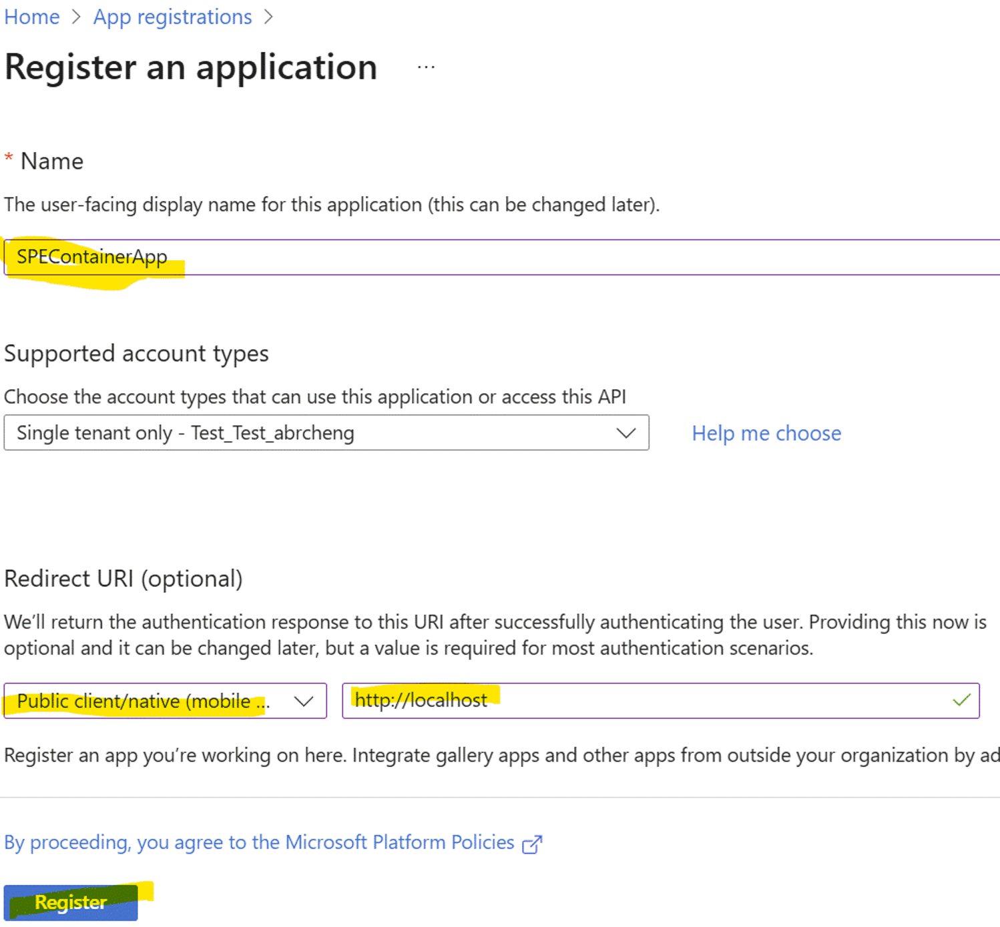

### 切到 API permissions 页面，点击 Add a permission，选择 Microsoft Graph：

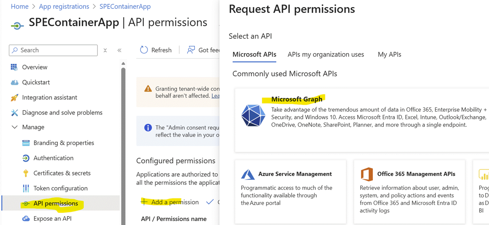

### 添加以下4个权限：

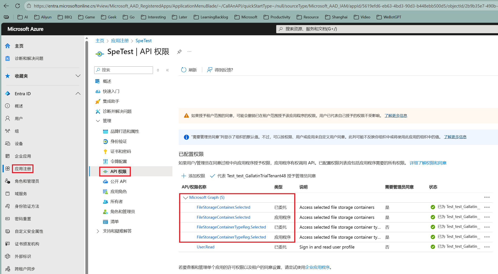

### Admin Consent 刚才添加的4个权限：

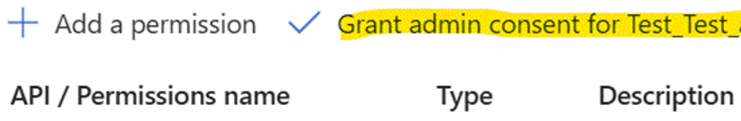

### 创建Client Secret：

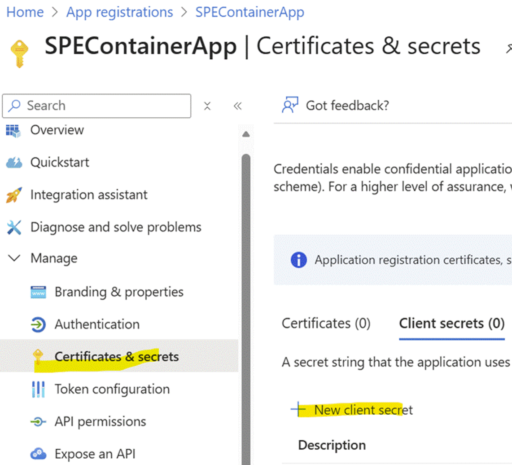

### 请记住Client Secret的过期时间：

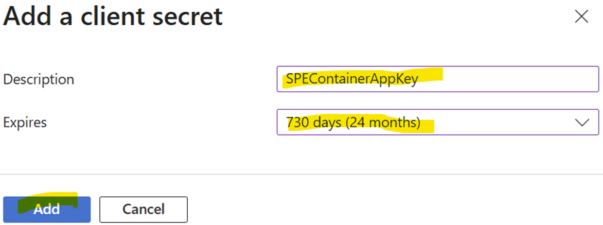

### 请记录Client Secret的值，页面刷新后无法再次查看：

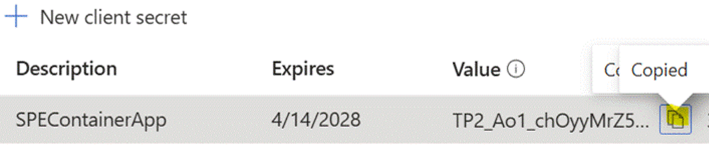

### 请记录 Client Id 以及 Tenant Id，后续步骤会用到：

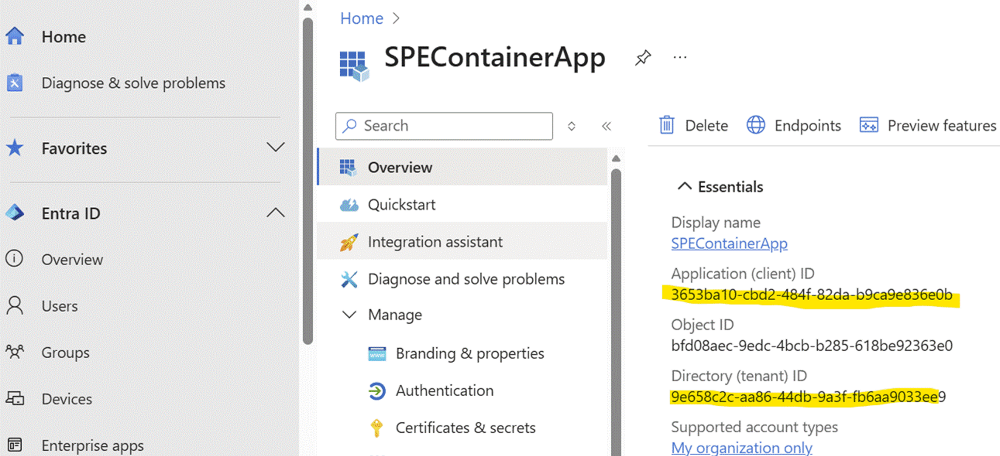

## 2. 创建 Container Type (Trial for example)

```powershell
Connect-SPOService -Url https://xxx-admin.sharepoint.cn -Region China

$ct = New-SPOContainerType `
    -ContainerTypeName "TestContainerTypeName" `
    -OwningApplicationId "{{SPEClientId}}" `
    -TrialContainerType

$ct.ContainerTypeId

Guid
----
{{SPEContainerTypeId}}
```

## 3. Admin Consent the app

全局管理员浏览器打开：

```
https://login.partner.microsoftonline.cn/{{SPETenantId}}/v2.0/adminconsent
  ?client_id={{SPEClientId}}
  &scope=https://microsoftgraph.chinacloudapi.cn/.default
  &redirect_uri=http://localhost
```

## 4. Get Access Token

```http
POST https://login.partner.microsoftonline.cn/{{SPETenantId}}/oauth2/v2.0/token
Content-Type: application/x-www-form-urlencoded

grant_type=client_credentials
&client_id={{SPEClientId}}
&client_secret={{SPEClientSecret}}
&scope=https://microsoftgraph.chinacloudapi.cn/.default
```

以 Postman 为例，通过 client_credentials flow 调用 token 端点，成功后会返回 access_token：

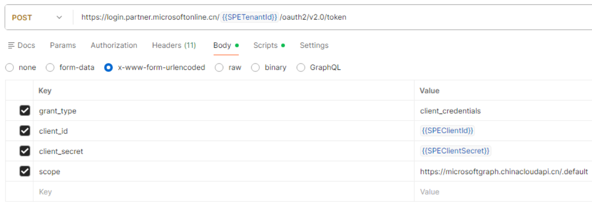

## 5. 注册 Container Type 权限

```http
PUT {{21VGraphBase}}/beta/storage/fileStorage/containerTypeRegistrations/{{SPEContainerTypeId}}

{
  "applicationPermissionGrants": [
    {
      "appId": "{{SPEClientId}}",
      "delegatedPermissions":  ["full"],
      "applicationPermissions": ["full"]
    }
  ]
}
```

## 6. 创建 Container

```http
POST {{21VGraphBase}}/v1.0/storage/fileStorage/containers

{
  "displayName": "SPEContainerTest",
  "containerTypeId": "{{SPEContainerTypeId}}"
}
```

## 7. Upload the file to container

```http
PUT {{21VGraphBase}}/v1.0/drives/{{SPEContainerId}}/root:/SPETest.txt:/content
Content-Type: application/octet-stream

Body includes the <binary>
```

## 8. 验证 — Get Container Files

```http
GET {{21VGraphBase}}/v1.0/drives/{{SPEContainerId}}/root/children
```

查看 GET children 返回的 JSON 响应，列表里能看到 SPETest.txt 即表示上传成功：以下是 Postman 调用 GET children 端点的响应示例：

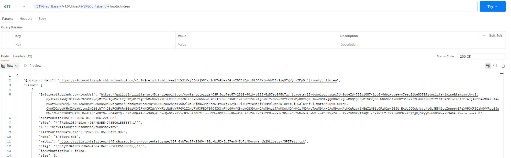

---

## 变量速查

| 变量 | 说明 |
|---|---|
| `21VGraphBase` | `https://microsoftgraph.chinacloudapi.cn` |
| `SPETenantId` | Owning / Consuming SPE 的 Tenant ID |
| `SPEClientId` | 第 1 步注册的 App 的 Client ID |
| `SPEClientSecret` | 第 1 步生成的 Client Secret |
| `SPEContainerTypeId` | 第 2 步 `$ct.ContainerTypeId` 返回的 GUID |
| `SPEContainerId` | 第 6 步返回的 `id` |

---

### 以上步骤跑通的话，说明我们的 21V 环境已经可以正常运行SPE了，可以使用以下步骤将之前创建的 Container Type 升级到付费模式或新建付费 Container Type

---

# SPE 付费 Container Type 上线完整流程（21V Gallatin）

---

## 概览

```
Step 0  Azure 计费资源准备（Owning Tenant 侧）
Step 1  连接 SPO Admin
Step 2  二选一创建付费 CT
        ├─ 路径 A：新建付费 CT
        └─ 路径 B：升级 Trial CT → 付费
Step 3  Consuming Tenant Admin Consent App
Step 4  Consuming Tenant CT Registration（授 App 容器权限）
Step 5  验证 CT 状态
Step 6  创建 Standard Container
Step 7  （仅路径 B）数据迁移 + 切流量 + 删 Trial 容器
Step 8  Azure Cost Management 验证账单
```

---

## Step 0 — Azure 计费资源准备

在 `https://portal.azure.cn`（Owning Tenant）：

| 项目 | 要求 |
|---|---|
| Subscription | Active 状态，记下 `SubscriptionId` |
| Resource Group | 选定 / 新建，记下名称 |
| Region | 选定 Gallatin 区域，例如 `China North 3` |
| 权限 | 当前账户在 Sub + RG 上 **Owner / Contributor** |
| 付款方式 | 订阅有有效付款方式 |

> 升级 Trial 时，账户在**新旧订阅上都要有 Owner/Contributor**。

---

## Step 1 — 连接 SPO Admin（Owning Tenant）

```powershell
Import-Module Microsoft.Online.SharePoint.PowerShell
Connect-SPOService -Url https://{tenant}-admin.sharepoint.cn
```

> 当前账户需为 **SharePoint Embedded Administrator**。

---

## Step 2 — 二选一创建付费 CT

### 路径 A：新建付费 CT

```powershell
# A1) 创建 Standard CT（无计费）
New-SPOContainerType `
  -ContainerTypeName "ProdCT01" `
  -OwningApplicationId <app-id>
# → 记下返回的 ContainerTypeId

# A2) 绑定计费 Profile
Add-SPOContainerTypeBilling `
  -ContainerTypeId <ct-id> `
  -AzureSubscriptionId <sub-id> `
  -ResourceGroup "RG-SPE-Prod" `
  -Region "China North 3"
```

### 路径 B：升级 Trial CT → 付费

```powershell
# 直接打计费信息
Set-SPOContainerType `
  -ContainerTypeId <existing-trial-ct-id> `
  -AzureSubscriptionId <sub-id> `
  -ResourceGroup "RG-SPE-Prod"
```

> ⚠️ Trial 容器内的数据**不会**随 CT 升级保留计费豁免；建议新建 Standard 容器后再迁移数据（见 Step 7）。

### 关键差异

| 项 | 路径 A | 路径 B |
|---|---|---|
| 命令 | `New-SPOContainerType` + `Add-SPOContainerTypeBilling` | `Set-SPOContainerType` |
| 旧数据 | 无 | 在原 Trial 容器，需迁移 |

---

## Step 3 — Consuming Tenant Admin Consent App

> 在**每一个**要使用该 CT 的 Consuming Tenant 上执行一次。Owning Tenant = Consuming Tenant 时也必须做。

由 Consuming Tenant 的 **Global Administrator** 在浏览器打开：

```
https://login.partner.microsoftonline.cn/{consumingTenantId}/adminconsent
  ?client_id={your-app-id}
  &redirect_uri={your-redirect-uri}
  &state=12345
```

点 **Accept** 后会在 Consuming Tenant 创建该 App 的 **Service Principal**，并授予所有 Required Permissions。

**验证**：`portal.azure.cn` → Entra ID → Enterprise Applications → 搜 App → Permissions 显示 **Granted for {tenant}**。

> ⚠️ 没有 Step 3，Step 4 必然 401。

---

## Step 4 — Consuming Tenant CT Registration

授予 App 对该 CT 的 Application Permissions（容器级权限）。

**取 SPO App-Only Token**（client_credentials）：
```
POST https://login.partner.microsoftonline.cn/{consumingTenantId}/oauth2/v2.0/token
grant_type=client_credentials
client_id=<app-id>
client_secret=<app-secret>
scope=https://{consumingTenant}.sharepoint.cn/.default
```

**注册**：
```http
PUT https://{consumingTenant}.sharepoint.cn/_api/v2.1/storageContainerTypes/{containerTypeId}/applicationPermissions
Authorization: Bearer <spo-app-only-token>
Content-Type: application/json
Accept: application/json
```

Body：
```json
{
  "value": [
    {
      "appId": "<your-app-id>",
      "delegated": ["full"],
      "appOnly": ["full"]
    }
  ]
}
```

> 权限可选值：`none` / `readcontent` / `writecontent` / `create` / `delete` / `read` / `write` / `enumerate` / `addpermissions` / `updatepermissions` / `deletepermissions` / `managepermissions` / `full`

**验证**：
```http
GET https://{consumingTenant}.sharepoint.cn/_api/v2.1/storageContainerTypes/{containerTypeId}/applicationPermissions
```

返回 `value` 数组中应包含你的 App 且权限符合预期。

---

## Step 5 — 验证 CT 状态

```powershell
Get-SPOContainerType -ContainerTypeId <ct-id> | Format-List
```

期望：
- `OwningApplicationId` = 你的 App
- `AzureSubscriptionId` / `ResourceGroup` / `Region` 已填充
- 计费分类是 **Standard**（非 Trial）

---

## Step 6 — 创建 Standard Container

```http
POST https://microsoftgraph.chinacloudapi.cn/v1.0/storage/fileStorage/containers
Authorization: Bearer <graph-token>
Content-Type: application/json

{
  "displayName": "Prod Container 01",
  "description": "Production container",
  "containerTypeId": "<ct-id>"
}
```

返回的容器 `id`（含 `b!...` 前缀）即业务读写目标。

---

## Step 7 —（仅路径 B）数据迁移 + 切流量 + 删 Trial 容器

1. **枚举源容器**
   ```
   GET https://microsoftgraph.chinacloudapi.cn/v1.0/drives/{trialDriveId}/root/children
   ```
2. **下载 → 上传新容器**
   - 小文件 (<4MB)：`PUT .../content`
   - 大文件：`createUploadSession` 分片
3. **校验**：对比 source / target 的 `size` 和 file count
4. **切流量**：替换业务配置中的 ContainerId → 新 Standard 容器 ID，灰度发布
5. **删除 Trial 容器**
   ```
   DELETE https://microsoftgraph.chinacloudapi.cn/v1.0/storage/fileStorage/containers/{trialContainerId}
   ```

---

## Step 8 — Azure Cost Management 验证账单

`portal.azure.cn` → **Cost Management + Billing** → **Cost analysis**：

- Scope = Step 0 的 Subscription
- Filter by Resource Group = 你的 RG
- Group by Service name → 应能看到：
  - `SharePoint Embedded - Storage`
  - `SharePoint Embedded - API Transactions`
  - `SharePoint Embedded - Egress`

> ⏱️ 首批用量 24–48 小时后出现；超过 72h 仍无条目，回查 Step 5 状态、业务是否在新容器有读写、订阅是否 Active。

---

## 完整 Checklist

- [ ] Step 0 — Azure Sub + RG 准备好（Owner / Contributor）
- [ ] Step 1 — `Connect-SPOService` 到 Owning Tenant
- [ ] Step 2 — 路径 A 或 B 创建 / 升级付费 CT
- [ ] Step 3 — Consuming Tenant **Admin Consent App**（创建 SP）
- [ ] Step 4 — Consuming Tenant **CT Registration**（PUT applicationPermissions）
- [ ] Step 5 — `Get-SPOContainerType` 验证 Standard + 计费信息
- [ ] Step 6 — 创建 Standard Container
- [ ] Step 7 — （路径 B）数据迁移 + 切流量 + 删 Trial 容器
- [ ] Step 8 — Azure Cost Management 验证账单
