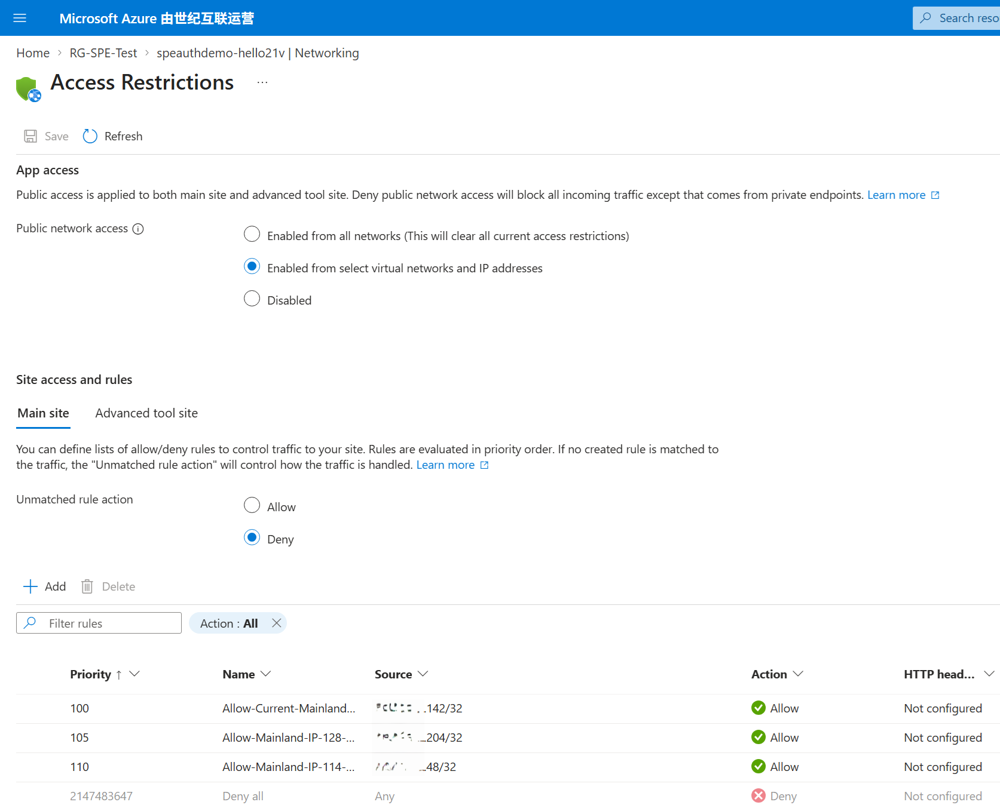
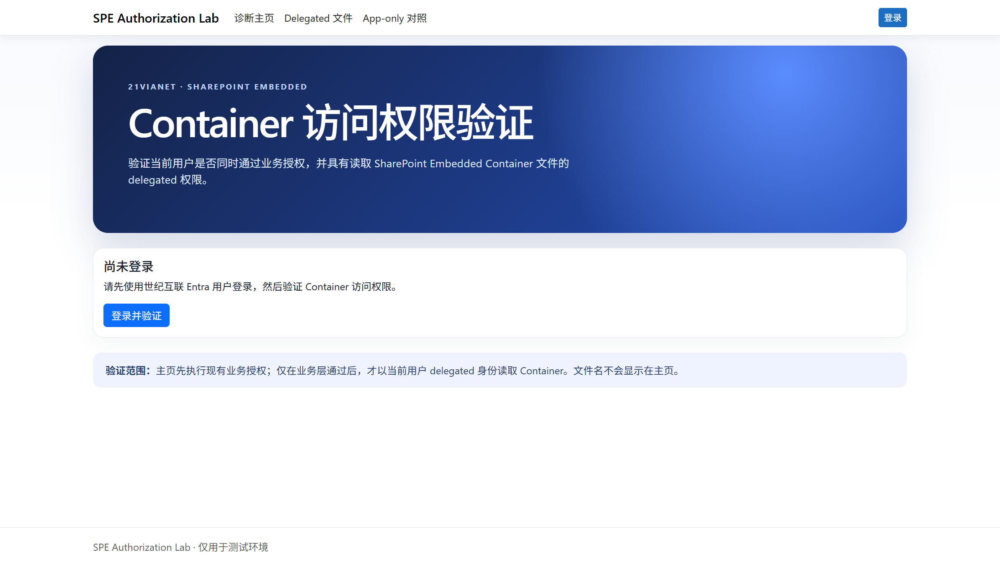
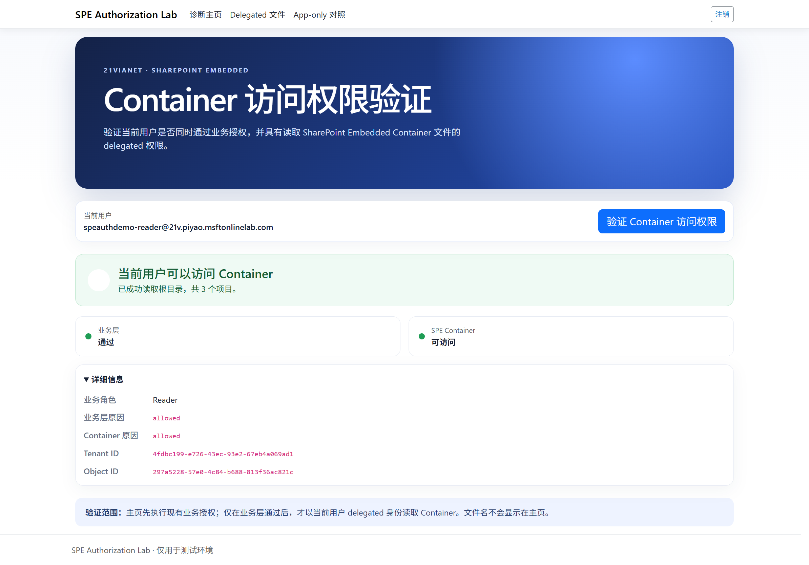
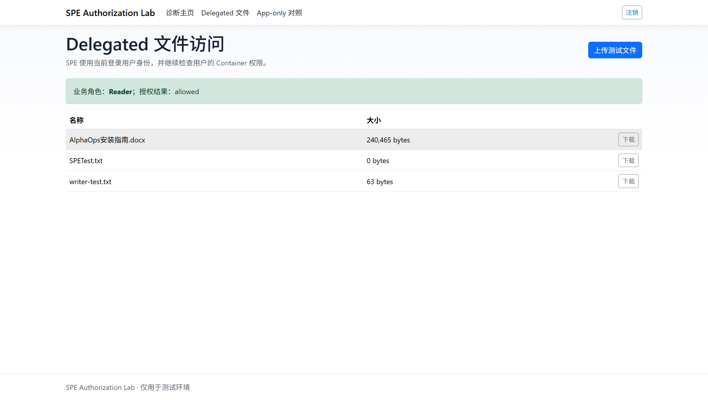
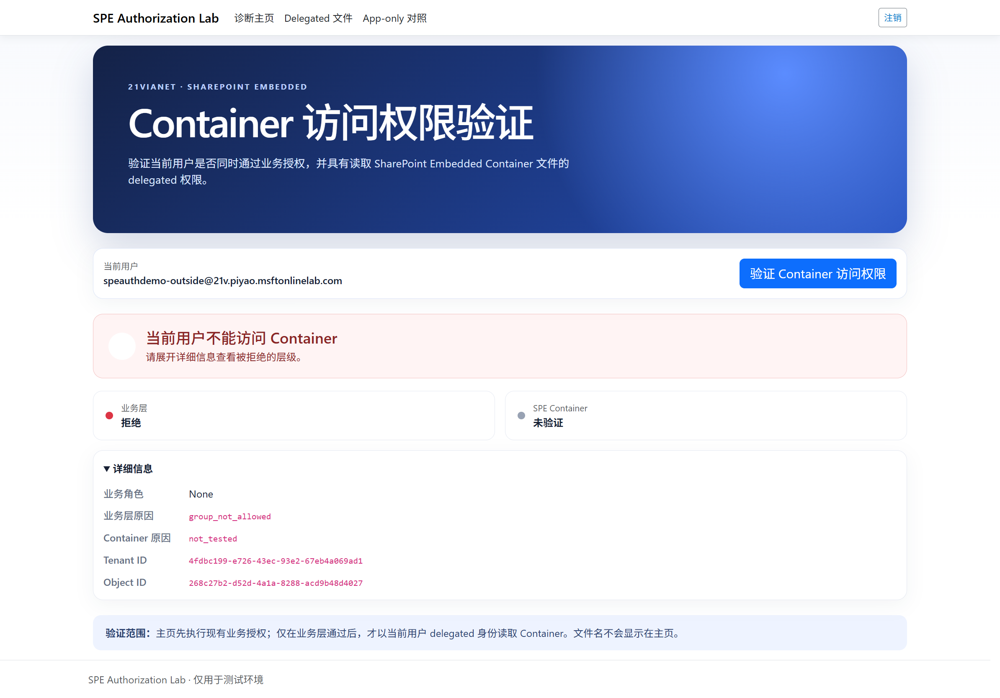

# SharePoint Embedded 用户访问权限验证 Demo（世纪互联）

本 Demo 使用 ASP.NET Core 9 验证当前世纪互联 Entra 用户是否：

1. 通过业务授权（Tenant、Entra Group/角色、IP 白名单）；
2. 具有读取指定 SharePoint Embedded（SPE）Container 文件的 delegated 权限。

验证成功时，主页只显示 Container 根目录项目数量，不显示文件名。

## 已验证环境

| 项目 | 值 |
|---|---|
| Azure / Microsoft 365 云 | 世纪互联（21Vianet） |
| Tenant ID | `4fdbc199-e726-43ec-93e2-67eb4a069ad1` |
| App ID | `84ddb0d9-4d5f-4b0e-80b4-b3530e345f9b` |
| App 名称 | `SPETest` |
| Container | `SPEContainerTest` |
| Container Type ID | `421fcae2-2826-4d4a-b193-ecfc6364bad2` |
| Azure China Resource Group | `RG-SPE-Test` |
| App Service | `speauthdemo-hello21v` |
| 生产地址 | <https://speauthdemo-hello21v.chinacloudsites.cn> |
| China Graph | `https://microsoftgraph.chinacloudapi.cn` |
| China Authority | `https://login.chinacloudapi.cn` |

> 本项目用于测试和演示。Client Secret、密码、Token、真实本地配置和 GeoIP 数据库不得提交到 Git。

---

# 1. 如何在本机运行 Demo

## 1.1 前提条件

- Windows + PowerShell 7；
- [.NET SDK 9](https://dotnet.microsoft.com/download/dotnet/9.0)；
- 可以登录 `hello21v` 世纪互联 Tenant；
- App Registration 已完成下列配置。

## 1.2 App Registration 配置

进入 `portal.azure.cn` → Microsoft Entra ID → App registrations → `SPETest`。

### Authentication

添加 Web Redirect URI：

```text
https://localhost:7155/signin-oidc
```

如需运行仓库内管理脚本，再添加 Mobile/Desktop Redirect URI：

```text
http://localhost
```

并启用 **Allow public client flows**。

### Microsoft Graph 权限

| 类型 | 权限 | 用途 |
|---|---|---|
| Delegated | `FileStorageContainer.Selected` | 以当前用户身份读取 SPE Container |
| Delegated | `GroupMember.Read.All` | Token 不包含完整 Group 时查询成员关系 |
| Application | `FileStorageContainer.Selected` | App-only 对照及管理操作 |

对需要管理员同意的权限执行 **Grant admin consent**。

### Group Claim

App manifest 的 `groupMembershipClaims` 应为：

```json
"groupMembershipClaims": "SecurityGroup"
```

这样 Security Group ID 会随登录 Token 进入应用；组过多或旧会话无 Group Claim 时，应用回退调用 `/me/checkMemberGroups`。

## 1.3 获取 Tenant 和 Container 配置

安装模块：

```powershell
Install-Module Microsoft.Online.SharePoint.PowerShell -Scope CurrentUser
Install-Module Microsoft.Graph -Scope CurrentUser
```

在项目根目录运行只读发现脚本：

```powershell
.\scripts\Discover-SpeEnvironment.ps1 `
  -TenantId "4fdbc199-e726-43ec-93e2-67eb4a069ad1"
```

脚本输出 Tenant ID、Container ID、Container URL、Container Type ID 和 Redirect URI 检查结果，不修改租户。

## 1.4 本地配置

复制配置模板：

```powershell
Copy-Item `
  .\src\SpeAuthorizationDemo\appsettings.Local.example.json `
  .\src\SpeAuthorizationDemo\appsettings.Local.json
```

填写以下非 Secret 配置：

```json
{
  "AzureAd": {
    "TenantId": "4fdbc199-e726-43ec-93e2-67eb4a069ad1"
  },
  "Spe": {
    "ContainerId": "<Discover-SpeEnvironment.ps1 输出的 Container ID>"
  },
  "AuthorizationPolicy": {
    "AllowedTenantId": "4fdbc199-e726-43ec-93e2-67eb4a069ad1",
    "ReaderGroupId": "<Reader Security Group ID>",
    "WriterGroupId": "<Writer Security Group ID>",
    "AdminGroupId": "<Admin Security Group ID>"
  },
  "LocationPolicy": {
    "AllowedCidrs": [
      "<允许的公网出口 IP>/32"
    ],
    "AllowedCountryCodes": [ "CN" ],
    "EnableDevelopmentOverride": false,
    "GeoIpDatabasePath": ""
  }
}
```

`appsettings.Local.json` 已由项目内 `.gitignore` 排除。

将 Client Secret 写入 .NET User Secrets：

```powershell
dotnet user-secrets set "AzureAd:ClientSecret" "<Client Secret Value>" `
  --project .\src\SpeAuthorizationDemo\SpeAuthorizationDemo.csproj
```

不要把 Secret 写入 JSON、脚本参数、聊天记录或 Git。

## 1.5 编译、测试和启动

```powershell
dotnet restore .\SPEBusinessAuthorizationDemo.sln

dotnet build .\SPEBusinessAuthorizationDemo.sln `
  --no-restore `
  -warnaserror

dotnet test .\SPEBusinessAuthorizationDemo.sln `
  --no-build

pwsh -NoProfile -File .\scripts\Test-ScriptSafety.ps1

dotnet dev-certs https --trust

dotnet run `
  --project .\src\SpeAuthorizationDemo\SpeAuthorizationDemo.csproj `
  --launch-profile https
```

打开：<https://localhost:7155>

---

# 2. 如何部署到 Azure China App Service

部署到公网 App Service 后，应用可以读取真实公网来源 IP，而不是本机 `127.0.0.1` / `::1`。

以下示例使用当前实测资源：

- Resource Group：`RG-SPE-Test`
- Region：`China East 2`
- Linux B1 Plan：`asp-speauthdemo-b1`
- Web App：`speauthdemo-hello21v`
- Runtime：.NET 9

## 2.1 Portal 部署步骤

### 创建 App Service

1. 登录 <https://portal.azure.cn>；
2. 进入 **App Services** → **Create Web App**；
3. 选择：
   - Subscription：当前 Azure China 订阅；
   - Resource Group：`RG-SPE-Test`；
   - Name：`speauthdemo-hello21v`；
   - Publish：Code；
   - Runtime stack：.NET 9；
   - Operating System：Linux；
   - Region：China East 2；
   - App Service Plan：Linux B1；
4. 创建完成后启用：
   - HTTPS Only；
   - Minimum TLS 1.2；
   - Always On；
   - FTPS Disabled。

### 配置环境变量

App Service → **Configuration / Environment variables**，添加：

```text
ASPNETCORE_ENVIRONMENT=Production
ASPNETCORE_FORWARDEDHEADERS_ENABLED=true
AzureAd__TenantId=4fdbc199-e726-43ec-93e2-67eb4a069ad1
AzureAd__ClientId=84ddb0d9-4d5f-4b0e-80b4-b3530e345f9b
AzureAd__ClientSecret=<Secret Value>
AzureAd__Instance=https://login.chinacloudapi.cn/
AzureAd__CallbackPath=/signin-oidc
Spe__ContainerId=<Container ID>
Spe__GraphBaseUrl=https://microsoftgraph.chinacloudapi.cn
AuthorizationPolicy__AllowedTenantId=4fdbc199-e726-43ec-93e2-67eb4a069ad1
AuthorizationPolicy__ReaderGroupId=<Reader Group ID>
AuthorizationPolicy__WriterGroupId=<Writer Group ID>
AuthorizationPolicy__AdminGroupId=<Admin Group ID>
LocationPolicy__EnableDevelopmentOverride=false
LocationPolicy__AllowedCidrs__0=<允许的公网 IP>/32
```

保存配置后 App Service 会自动重启。

### 配置生产 Redirect URI

在 `SPETest` App Registration 中添加：

```text
https://speauthdemo-hello21v.chinacloudsites.cn/signin-oidc
```

保留本地 URI：

```text
https://localhost:7155/signin-oidc
```

### 配置 IP 白名单

App Service → **Networking** → **Inbound traffic configuration** → **Access Restrictions**：

1. Public network access：**Enabled from select virtual networks and IP addresses**；
2. Main site 添加允许规则：
   - Source：IPv4；
   - IP address block：`<公网出口 IP>/32`；
   - Action：Allow；
   - Priority：100、110……；
3. Unmatched rule action：**Deny**；
4. Advanced tool site 使用相同限制。

> 平台层和应用层应配置相同 CIDR。App Service 平台先拒绝未命中 IP；请求到达应用后，业务层再次检查 `AllowedCidrs`。

当前实测白名单截图：



### 部署代码

App Service → **Deployment Center** 可使用 GitHub Actions、ZIP Deploy 或其他批准方式。本项目实测使用 ZIP Deploy，CLI 步骤见下一节。

## 2.2 Azure CLI 部署步骤

### 登录 Azure China

```powershell
az logout
az cloud set --name AzureChinaCloud
az login --tenant 4fdbc199-e726-43ec-93e2-67eb4a069ad1
az account show
```

### 注册 Provider

```powershell
az provider register --namespace Microsoft.Web
az provider show --namespace Microsoft.Web --query registrationState -o tsv
```

如果状态长时间为 `Registering`，检查 Activity Log。只要 `Microsoft.Web/serverFarms/write` 不再返回 `MissingSubscriptionRegistration`，即可继续。

### 创建 Plan 和 Web App

```powershell
$rg = "RG-SPE-Test"
$plan = "asp-speauthdemo-b1"
$app = "speauthdemo-hello21v"

az appservice plan create `
  --name $plan `
  --resource-group $rg `
  --location chinaeast2 `
  --is-linux `
  --sku B1

az webapp create `
  --name $app `
  --resource-group $rg `
  --plan $plan `
  --runtime "DOTNETCORE:9.0"

az webapp update `
  --name $app `
  --resource-group $rg `
  --https-only true `
  --set clientAffinityEnabled=false

az webapp config set `
  --name $app `
  --resource-group $rg `
  --always-on true `
  --min-tls-version 1.2 `
  --http20-enabled true `
  --ftps-state Disabled
```

### 设置非 Secret 配置

```powershell
az webapp config appsettings set `
  --resource-group $rg `
  --name $app `
  --settings `
    ASPNETCORE_ENVIRONMENT=Production `
    ASPNETCORE_FORWARDEDHEADERS_ENABLED=true `
    AzureAd__TenantId=4fdbc199-e726-43ec-93e2-67eb4a069ad1 `
    AzureAd__ClientId=84ddb0d9-4d5f-4b0e-80b4-b3530e345f9b `
    AzureAd__Instance=https://login.chinacloudapi.cn/ `
    AzureAd__CallbackPath=/signin-oidc `
    Spe__ContainerId="<Container ID>" `
    Spe__GraphBaseUrl=https://microsoftgraph.chinacloudapi.cn `
    AuthorizationPolicy__AllowedTenantId=4fdbc199-e726-43ec-93e2-67eb4a069ad1 `
    AuthorizationPolicy__ReaderGroupId="<Reader Group ID>" `
    AuthorizationPolicy__WriterGroupId="<Writer Group ID>" `
    AuthorizationPolicy__AdminGroupId="<Admin Group ID>" `
    LocationPolicy__EnableDevelopmentOverride=false `
    LocationPolicy__AllowedCidrs__0="<公网出口 IP>/32"
```

### 安全写入 Secret

```powershell
$secure = Read-Host "Client Secret Value" -AsSecureString
$plain = [System.Net.NetworkCredential]::new("", $secure).Password

try {
  az webapp config appsettings set `
    --resource-group $rg `
    --name $app `
    --settings AzureAd__ClientSecret=$plain | Out-Null
}
finally {
  $plain = $null
  $secure.Dispose()
}
```

### 配置 IP 白名单

```powershell
$cidr = "<公网出口 IP>/32"

az webapp config access-restriction add `
  --resource-group $rg `
  --name $app `
  --rule-name "Allow-Approved-Public-IP" `
  --action Allow `
  --ip-address $cidr `
  --priority 100

az webapp config access-restriction set `
  --resource-group $rg `
  --name $app `
  --default-action Deny `
  --scm-default-action Deny `
  --use-same-restrictions-for-scm-site true
```

增加第二个 IP 时，同时添加平台规则和业务配置：

```powershell
az webapp config access-restriction add `
  --resource-group $rg `
  --name $app `
  --rule-name "Allow-Second-Public-IP" `
  --action Allow `
  --ip-address "114.86.14.48/32" `
  --priority 110

az webapp config appsettings set `
  --resource-group $rg `
  --name $app `
  --settings LocationPolicy__AllowedCidrs__1="114.86.14.48/32"
```

### 发布并 ZIP 部署

```powershell
dotnet publish `
  .\src\SpeAuthorizationDemo\SpeAuthorizationDemo.csproj `
  -c Release `
  -o .\artifacts\publish

Compress-Archive `
  -Path .\artifacts\publish\* `
  -DestinationPath .\artifacts\SpeAuthorizationDemo.zip `
  -CompressionLevel Optimal `
  -Force
```

当前 App Service 禁用 SCM Basic Publishing Credentials。部署窗口内临时开启，完成后立即关闭：

```powershell
$siteId = "/subscriptions/<subscription-id>/resourceGroups/$rg/providers/Microsoft.Web/sites/$app"

az resource update `
  --ids "$siteId/basicPublishingCredentialsPolicies/scm" `
  --api-version 2022-03-01 `
  --set properties.allow=true | Out-Null

try {
  az webapp deploy `
    --resource-group $rg `
    --name $app `
    --src-path .\artifacts\SpeAuthorizationDemo.zip `
    --type zip `
    --clean true `
    --restart true

  if ($LASTEXITCODE -ne 0) {
    throw "Deployment failed."
  }
}
finally {
  az resource update `
    --ids "$siteId/basicPublishingCredentialsPolicies/scm" `
    --api-version 2022-03-01 `
    --set properties.allow=false | Out-Null
}
```

部署后验证：

```powershell
Invoke-WebRequest `
  "https://$app.chinacloudsites.cn/" `
  -UseBasicParsing
```

> 当前办公公网出口曾多次变化。使用 `/32` 时，如果出口 IP 变化，App Service 会在平台层返回 403；必须更新平台和业务两层 CIDR。生产应使用固定办公网或 VPN 出口。

---

# 3. 用户访问 Container 文件的验证链路

## 3.1 流程图

```mermaid
flowchart TD
    A[用户访问主页并登录] --> B[OIDC 验证世纪互联身份]
    B --> C[读取 tid / oid / groups Claims]
    C --> D{Tenant 是否允许?}
    D -- 否 --> X1[业务层拒绝: tenant_not_allowed]
    D -- 是 --> E{Group / 角色是否允许?}
    E -- Token 无完整 Group --> F[Graph /me/checkMemberGroups]
    F --> E
    E -- 否 --> X2[业务层拒绝: group_not_allowed]
    E -- 是 --> G{公网 IP 是否命中 AllowedCidrs?}
    G -- 否 --> X3[业务层拒绝: location_not_allowed]
    G -- 是 --> H[业务层通过]
    H --> I[获取当前用户 delegated Graph Token]
    I --> J[GET /drives/{ContainerId}/root/children]
    J -- 200 --> K[Container 可访问并显示项目数量]
    J -- 403 --> X4[Container 无权限: container_permission_denied]
    J -- Token Cache 失效 --> L[重新触发 OIDC 登录]
```

业务层失败时不会调用 SPE，Container 显示“未验证”。只有业务层通过后，才验证当前用户的 delegated Container 权限。

## 3.2 身份 Claim 解析

源码：[ClaimsUserIdentityReader.cs](src/SpeAuthorizationDemo/Authentication/ClaimsUserIdentityReader.cs)

```csharp
if (!Guid.TryParse(
    FindFirstValue(principal, "tid", MappedTenantId),
    out var tenantId))
{
    return IdentityReadResult.Failure("missing_tid");
}

if (!Guid.TryParse(
    FindFirstValue(principal, "oid", MappedObjectId),
    out var objectId))
{
    return IdentityReadResult.Failure("missing_oid");
}

var groups = principal.Claims
    .Where(claim => claim.Type is "groups" or MappedGroups)
    .Select(claim => Guid.TryParse(claim.Value, out var groupId)
        ? groupId
        : Guid.Empty)
    .Where(groupId => groupId != Guid.Empty)
    .ToHashSet();
```

同时兼容 JWT 短 Claim 和 Microsoft Identity 映射后的 URI Claim。

## 3.3 Group 成员回退查询

源码：[GraphGroupMembershipFallback.cs](src/SpeAuthorizationDemo/Authorization/GraphGroupMembershipFallback.cs)

```csharp
var token = await tokenAcquisition.GetAccessTokenForUserAsync(
    ["https://microsoftgraph.chinacloudapi.cn/GroupMember.Read.All"]);

using var request = new HttpRequestMessage(
    HttpMethod.Post,
    "https://microsoftgraph.chinacloudapi.cn/v1.0/me/checkMemberGroups");

request.Headers.Authorization =
    new AuthenticationHeaderValue("Bearer", token);
request.Content = JsonContent.Create(new
{
    groupIds = relevantGroupIds.Select(id => id.ToString()).ToArray()
});
```

若 App Service 重启导致内存 Token Cache 清空，应用返回 `reauthentication_required` 并自动重新触发 OIDC 登录，不把它误报为 Group 无权限。

## 3.4 业务授权

源码：[BusinessAuthorizationService.cs](src/SpeAuthorizationDemo/Authorization/BusinessAuthorizationService.cs)

```csharp
var identityResult = identityReader.Read(user);
if (!identityResult.IsSuccess)
    return Denied(operation, identityResult.ReasonCode);

var identity = identityResult.Identity!;
if (identity.TenantId != allowedTenantId)
    return Denied(operation, "tenant_not_allowed");

var groupResult = await groupResolver.ResolveAsync(
    identity,
    relevantGroups,
    cancellationToken);
if (!groupResult.IsSuccess)
    return Denied(operation, groupResult.ReasonCode);

var sourceIp = httpContext.Connection.RemoteIpAddress;
var country = sourceIp is null
    ? null
    : await countryResolver.ResolveCountryCodeAsync(
        sourceIp,
        cancellationToken);

var location = locationEvaluator.Evaluate(
    sourceIp,
    country,
    developmentOverride,
    environment.IsDevelopment());
```

业务授权依次验证 Tenant、Group/角色、IP/CIDR 和操作权限。

## 3.5 主页验证 Handler

源码：[Index.cshtml.cs](src/SpeAuthorizationDemo/Pages/Index.cshtml.cs)

```csharp
var decision = await authorization.AuthorizeAsync(
    User,
    HttpContext,
    BusinessOperation.ListFiles,
    cancellationToken);

BusinessAllowed = decision.IsAllowed;
BusinessReasonCode = decision.ReasonCode;
Role = decision.Role;

if (!BusinessAllowed)
    return Page(); // 业务层失败，不调用 SPE

ContainerChecked = true;
try
{
    var items = await clients
        .CreateDelegated()
        .ListRootAsync(cancellationToken);

    ContainerAllowed = true;
    ContainerReasonCode = "allowed";
    FileCount = items.Count; // 只显示数量
}
catch (SpeGraphException exception)
{
    ContainerAllowed = false;
    ContainerReasonCode =
        SpeGraphErrorMapper.ToReasonCode(exception);
}
```

## 3.6 delegated Token 和 Graph 文件列表

Token Provider 源码：[GraphAccessTokenProviders.cs](src/SpeAuthorizationDemo/Graph/GraphAccessTokenProviders.cs)

```csharp
public Task<string> GetTokenAsync(
    CancellationToken cancellationToken) =>
    tokenAcquisition.GetAccessTokenForUserAsync([
        "https://microsoftgraph.chinacloudapi.cn/" +
        "FileStorageContainer.Selected"
    ]);
```

Graph Client 源码：[SpeGraphClient.cs](src/SpeAuthorizationDemo/Graph/SpeGraphClient.cs)

```csharp
public async Task<IReadOnlyList<SpeDriveItem>> ListRootAsync(
    CancellationToken cancellationToken)
{
    using var response = await SendReadWithRetryAsync(
        () => CreateRequestAsync(
            HttpMethod.Get,
            "root/children",
            cancellationToken),
        HttpCompletionOption.ResponseContentRead,
        cancellationToken);

    await EnsureSuccessAsync(response, cancellationToken);
    // 解析 value 数组并返回；主页只使用 Count。
}
```

最终 Graph 请求：

```http
GET https://microsoftgraph.chinacloudapi.cn/v1.0/
    drives/{ContainerId}/root/children
Authorization: Bearer <delegated-user-token>
```

即使业务层允许，用户没有 Container 原生角色时，Graph 仍返回 403，并映射为：

```text
container_permission_denied
```

---

# 4. 测试步骤与结果

## 4.1 测试前检查

1. App Service 状态为 Running；
2. 生产 Redirect URI 已配置；
3. Client Secret 有效；
4. 当前公网出口在 App Service 平台白名单中；
5. 同一 CIDR 也配置在 `LocationPolicy__AllowedCidrs__N`；
6. Reader 用户具有：
   - `SPEAuthDemo-Readers` Group 成员关系；
   - Container `reader` 权限；
7. Outside 用户不属于允许 Group；
8. DemoAdmin 属于 Admin Group，但没有 Container 用户权限。

## 4.2 未登录主页

1. 打开生产地址；
2. 确认显示“登录并验证”；
3. 点击后跳转世纪互联登录页。



预期：不执行业务层或 Container 检查。

## 4.3 Reader：业务层和 Container 均通过

1. 使用 `SPEAuthDemo Reader` 登录；
2. 点击“验证 Container 访问权限”；
3. 确认：
   - 业务层：通过；
   - SPE Container：可访问；
   - 业务角色：Reader；
   - 页面只显示根目录项目数量。



预期原因：

```text
Business: allowed
Container: allowed
```

Reader 也可以进入 Delegated 文件页，查看和下载 Container 中的文件：



## 4.4 Outside：业务层拒绝，SPE 不执行

1. 注销 Reader；
2. 使用 `SPEAuthDemo Outside` 登录；
3. 点击验证；
4. 确认：
   - 业务层：拒绝；
   - SPE Container：未验证；
   - 业务角色：None。



预期原因：

```text
Business: group_not_allowed
Container: not_tested
```

## 4.5 DemoAdmin：业务通过，但 Container 拒绝

1. 使用 Admin Group 中的管理员登录；
2. 点击验证；
3. 确认：
   - 业务层：通过；
   - SPE Container：无权限；
   - 业务角色：DemoAdmin。


预期原因：

```text
Business: allowed
Container: container_permission_denied
```

这证明业务 Group 权限不能替代 SPE Container 原生权限。

## 4.6 IP 白名单内外验证

### 白名单内

从已配置的 `/32` 公网出口访问：

- App Service 平台允许请求；
- 应用层继续验证相同 CIDR；
- 用户可以进入登录和主页验证流程。

### 白名单外

从未配置的公网 IP（例如香港出口或其他网络）访问：

- App Service 在应用执行前直接返回 403；
- 未命中请求不会到达 ASP.NET Core；
- Unmatched rule action 必须为 Deny。


> 当前规则使用 `/32`，只代表指定公网出口，不代表“中国内地全部 IP”。如需“所有内地允许、香港拒绝”，应配置并维护 GeoLite2 Country 数据库，允许 `CN`、拒绝 `HK`；固定办公/VPN 出口 CIDR 更可靠。

## 4.7 自动测试

```powershell
dotnet build .\SPEBusinessAuthorizationDemo.sln `
  --no-restore `
  -warnaserror

dotnet test .\SPEBusinessAuthorizationDemo.sln `
  --no-build
```

当前结果：

```text
54 tests passed
0 tests failed
```

---

# 5. 常见结果码

| 原因码 | 含义 |
|---|---|
| `allowed` | 当前层验证通过 |
| `tenant_not_allowed` | 用户不属于允许 Tenant |
| `group_not_allowed` | 用户不属于 Reader/Writer/Admin Group |
| `location_not_allowed` | 公网 IP 未命中应用层白名单 |
| `operation_not_allowed` | 业务角色不允许当前操作 |
| `not_tested` | 业务层失败，因此没有调用 SPE |
| `container_permission_denied` | 业务层通过，但用户没有 Container delegated 权限 |
| `reauthentication_required` | App 重启后 Token Cache 失效，需要重新登录 |

---

# 6. 安全与清理

- 不在日志或页面中显示 Token、Secret、密码或文件名；
- Production 必须关闭 `EnableDevelopmentOverride`；
- App Service Access Restrictions 的默认行为必须为 Deny；
- SCM Basic Publishing Credentials 只在 ZIP 部署窗口临时启用，完成后立即关闭；
- 测试 Secret 使用后应立即轮换或删除；
- 动态公网 IP 变化时，应同步更新平台层与应用层 CIDR；
- 测试结束后可删除测试用户、Group、Container 权限及 `writer-test.txt`。
