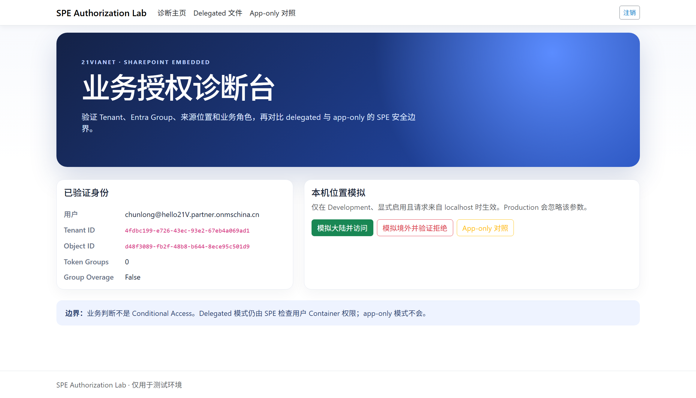
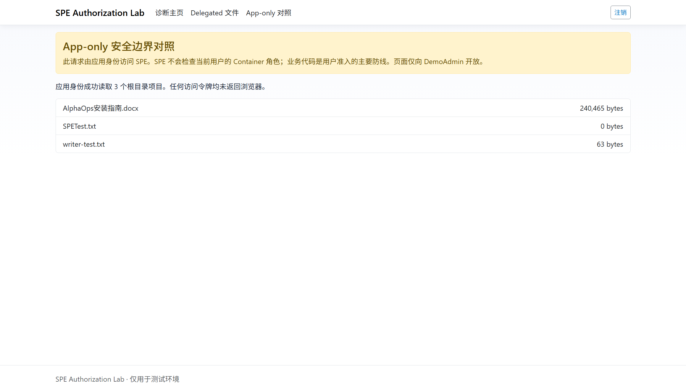

# SharePoint Embedded 业务授权 Demo（世纪互联）

## 项目简介

本项目使用 ASP.NET Core 9 验证如何在**业务代码层**控制 SharePoint Embedded（SPE）Container 访问：

- 只允许指定世纪互联 Entra Tenant；
- 使用 Entra Group 映射 Reader、Writer、DemoAdmin 业务角色；
- 只允许中国大陆位置；
- 对比 delegated 用户访问与 app-only 应用访问的安全边界。

测试环境：

- Tenant ID：`4fdbc199-e726-43ec-93e2-67eb4a069ad1`
- App ID：`84ddb0d9-4d5f-4b0e-80b4-b3530e345f9b`
- Container：`SPEContainerTest`
- China Graph：`https://microsoftgraph.chinacloudapi.cn`

> 业务代码控制不是 Conditional Access。生产环境仍建议保留 Container 权限、Restricted Access Control 或 Conditional Access 等平台控制。

## 授权模型

```text
允许访问 = Tenant 匹配
        AND Entra Group/业务角色匹配
        AND 来源位置允许
        AND Container 用户权限允许（delegated 模式）
```

- **Delegated**：SPE 继续检查真实用户的 Container 权限。
- **App-only**：SPE 使用应用身份，不检查当前用户的 Container 角色，因此只开放给 DemoAdmin。

## 测试对象

新建了三个测试账号：

| 账号 | Group | Container 权限 |
|---|---|---|
| `SPEAuthDemo Reader` | `SPEAuthDemo-Readers` | `reader` |
| `SPEAuthDemo Writer` | `SPEAuthDemo-Writers` | `writer` |
| `SPEAuthDemo Outside` | 无允许组 | 无 |

另外使用已有管理员账号加入 `SPEAuthDemo-Admins`，验证 app-only。

创建了四个 Group：

- `SPEAuthDemo-Readers`（Security Group）
- `SPEAuthDemo-Writers`（Security Group）
- `SPEAuthDemo-Admins`（Security Group）
- `SPEAuthDemo-M365-Transitive`（Microsoft 365 Group，预留传递成员测试）

Security Group 用于业务代码判断；Reader/Writer 用户被直接授予 Container 权限，因此 SharePoint Admin Center 的成员页面显示用户，而不是这些 Group。

## 快速配置

### 1. App Registration

在 `portal.azure.cn` 为 App 配置：

- Web Redirect URI：`https://localhost:7155/signin-oidc`
- Delegated：`FileStorageContainer.Selected`、`GroupMember.Read.All`
- Application：`FileStorageContainer.Selected`
- 创建 Client Secret，并完成管理员同意

如需运行管理脚本，另配置 Mobile/Desktop Redirect URI `http://localhost` 和 public client flow。

### 2. 本地配置

```powershell
Copy-Item .\src\SpeAuthorizationDemo\appsettings.Local.example.json `
  .\src\SpeAuthorizationDemo\appsettings.Local.json
```

在本地文件填写 Tenant ID、Container ID 和三个业务 Group ID。该文件已被 Git 忽略。

将 Secret 保存到 User Secrets，不要写入配置文件：

```powershell
dotnet user-secrets set "AzureAd:ClientSecret" "<secret>" `
  --project .\src\SpeAuthorizationDemo\SpeAuthorizationDemo.csproj
```

### 3. 编译与启动

```powershell
dotnet build .\SPEBusinessAuthorizationDemo.sln -warnaserror
dotnet test .\SPEBusinessAuthorizationDemo.sln --no-build
dotnet dev-certs https --trust
dotnet run --project .\src\SpeAuthorizationDemo\SpeAuthorizationDemo.csproj `
  --launch-profile https
```

打开：`https://localhost:7155`

## 测试步骤

1. 用户登录后在主页点击“验证 Container 访问权限”。
2. 主页先执行 Tenant、Group/角色和后台 IP 白名单等业务检查。
3. 业务层通过后，以当前用户 delegated 身份尝试读取 Container 根目录。
4. 页面分别显示“业务层”和“SPE Container”的通过/拒绝状态。
5. 验证成功时只显示根目录项目数量，不显示文件名。

业务层失败时不会调用 SPE，Container 状态显示“未验证”。原文件列表、上传、下载和 App-only 页面继续保留在导航中。

## 测试结果

| 场景 | 结果 |
|---|---|
| Reader/Writer 从白名单 IP 验证 | 业务层通过，Container 可访问，显示文件数量 |
| Outside 验证 | 业务层拒绝，Container 未验证 |
| DemoAdmin 无 Container 用户权限 | 业务层通过，Container 无权限 |
| 非白名单 IP | App Service 或业务层拒绝 |

自动验证：**53 项测试通过，0 失败**；PowerShell 脚本安全检查通过。

## 测试截图

原始管理员身份诊断截图（历史测试证据）：



App-only 成功读取 Container：



## 清理

测试后可删除：

- 三个测试用户；
- 四个 `SPEAuthDemo-*` Group；
- Reader/Writer Container 权限；
- `writer-test.txt`；
- App 中的临时 Client Secret 和临时管理权限。

删除本机 Secret：

```powershell
dotnet user-secrets remove "AzureAd:ClientSecret" `
  --project .\src\SpeAuthorizationDemo\SpeAuthorizationDemo.csproj
```
