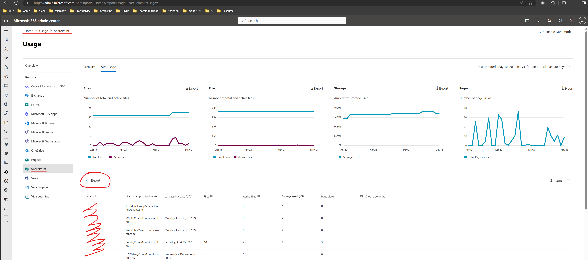
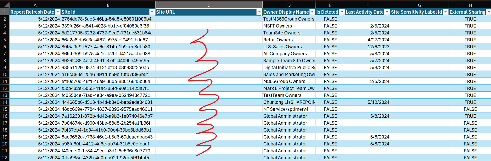
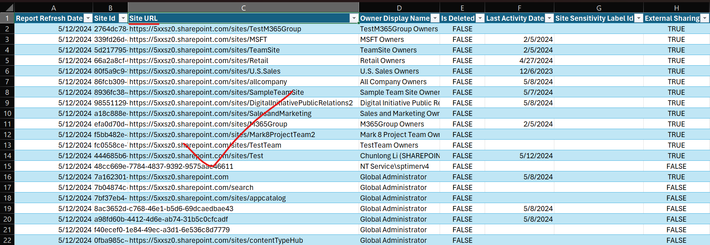
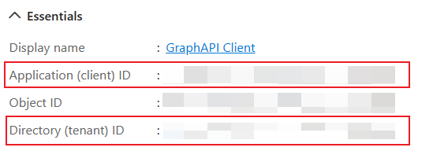
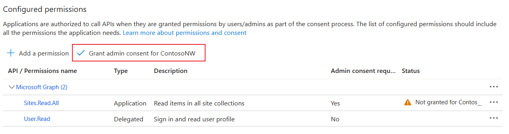
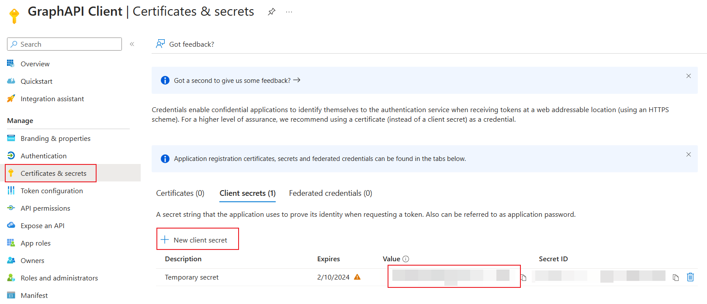
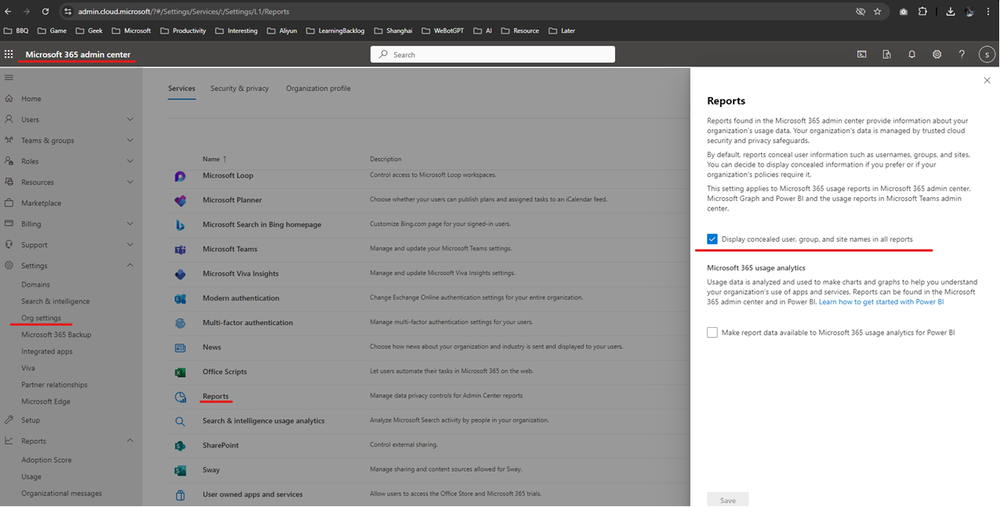

# SharePoint Site Usage Report URL Updation Script

Recently, due to security concerns, Microsoft has concealed the site URL information in the SharePoint site usage report. Consequently, we need an alternative method to retrieve site URL information for the site usage report. This article demonstrates how to utilize PowerShell to obtain SharePoint Site Usage Report's site URL information. See our official article here: https://learn.microsoft.com/en-us/microsoft-365/admin/activity-reports/resolve-site-urls?view=o365-worldwide#update-report-powershell-script

Export site usage report: 


Before running the script: 


After running the script:


## Usage Instructions

To use this script, follow these steps:

1. **Create an Entra ID Application**
   - Go to [Microsoft Entra admin center](https://go.microsoft.com/fwlink/p/?linkid=2067268) > Applications > App registrations.
   - On the App registrations page, select New registrations.
   - Provide a name for the application and use the default configuration to register the app.
   - Note down the client id and tenant id displayed in the app's Essentials section.

        

2. **Add Graph API permission to the app**
   - In the application’s Request API permissions page, add the `Sites.Read.All` permission.
   
        
   
   - Grant admin consent.

        

3. **Create a client secret**
   - In the application’s Certificates & secrets section, create a new client secret and securely store its value.

        

4. **Download the reports in Microsoft 365 admin center**
   - Refer to the first screenshot of this article and download the SharePoint site usage report in the Microsoft 365 admin center there.

5. **Run the script in PowerShell**
   - Replace the placeholders in the PowerShell script with your own values: `tenantId`, `clientId`, `clientSecret`, and `reportPath`.
   - The script updates the SharePoint site URL in the SharePoint site usage detail report, saving the updated report as a new file with "_Updated" appended to the original file name (e.g., `SharePointSiteUsageDetail5_14_2024 6_41_34 AM_Updated.csv`).

        ```powershell
        # Pls replace the tenantId, clientId, clientSecret and reportPath with your own values, this script will update the SharePoint site URL in the SharePoint site usage detail report, the updated report will be saved as a new file with "_Updated" appended to the original file name, e.g. SharePointSiteUsageDetail5_14_2024 6_41_34 AM_Updated.csv, this script can be run in PowerShell
        $tenantId = 'xxx'
        $clientId = 'xxx'
        $clientSecret = 'xxx'
        $reportPath = 'C:\Users\chunlonl\Downloads\SharePointSiteUsageDetail5_14_2024 6_41_34 AM.csv'

        function Get-AccessToken {
            param(
                [Parameter(Mandatory = $true)]
                [string]$tenantId,
                [Parameter(Mandatory = $true)]
                [string]$clientId,
                [Parameter(Mandatory = $true)]
                [string]$clientSecret,
                [Parameter(Mandatory = $false)]
                [string]$scope = "https://graph.microsoft.com/.default"
            )

            $tokenEndpoint = "https://login.microsoftonline.com/$tenantId/oauth2/v2.0/token"
            $tokenRequest = @{
                client_id     = $clientId
                scope         = $scope
                client_secret = $clientSecret
                grant_type    = "client_credentials"
            }

            $tokenResponse = Invoke-RestMethod -Uri $tokenEndpoint -Method Post -Body $tokenRequest
            return $tokenResponse.access_token
        }

        $cache = New-Object 'System.Collections.Generic.Dictionary[[String],[String]]'

        Write-Host "Getting information for all the sites..." -ForegroundColor Cyan

        $uri = "https://graph.microsoft.com/v1.0/sites/getAllSites?`$select=sharepointIds&`$top=10000"
        while ($uri -ne $null) {

            Write-Host $uri

            $isSuccess = $false
            while (-not $isSuccess) {
                try {
                    $accessToken = Get-AccessToken -tenantId $tenantId -clientId $clientId -clientSecret $clientSecret
                    $restParams = @{Headers = @{Authorization = "Bearer $accessToken" } }
                }
                catch {
                    Write-Host "Retrying...  $($_.Exception.Message)" -ForegroundColor Yellow
                    continue
                }
                try {
                    $sites = Invoke-RestMethod $uri @restParams
                    $isSuccess = $true
                }
                catch {
                    if ($_.Exception.Response -and $_.Exception.Response.Headers['Retry-After']) {
                        $retryAfter = [int]$_.Exception.Response.Headers['Retry-After']
                        Write-Output "Waiting for $retryAfter seconds before retrying..." -ForegroundColor Yellow
                        Start-Sleep -Seconds $retryAfter
                    }
                    Write-Host "Retrying...  $($_.Exception.Message)" -ForegroundColor Yellow
                    continue
                }
            }

            $sites.value | ForEach-Object {
                $cache[$_.sharepointIds.siteId] = $_.sharepointIds.siteUrl
            }

            $uri = $sites."@odata.nextLink"

            Write-Host "Total sites received: $($cache.Count)"
        }

        Write-Host
        Write-Host "Updating report $($reportPath) ..." -ForegroundColor Cyan
        
        $outputPath = $reportPath -replace "\.csv$", "_Updated.csv"
        $writer = [System.IO.StreamWriter]::new($outputPath)
        $reader = [System.IO.StreamReader]::new($reportPath)
        $rowCount = 0
        
        while ($null -ne ($line = $reader.ReadLine())) {
            $rowCount++
        
            $columns = $line.Split(",")
            $siteId = $columns[1]
        
            $_guid = New-Object System.Guid
            if ([System.Guid]::TryParse($siteId, [ref]$_guid)) {
                $siteUrl = $cache[$siteId]
                $columns[2] = $siteUrl
                $line = $columns -join ","
            }
                
            $writer.WriteLine($line)
        
            if ($rowCount % 1000 -eq 0) {
                Write-Host "Processed $($rowCount) rows"
            }
        }
        $writer.Close()
        $reader.Close()
        
        Write-Host "Processed $($rowCount) rows"
        Write-Host "Report updated: $($outputPath)" -ForegroundColor Cyan
        ```

6. If you see site id or user display name is blurred, then pls try below settings: 

    

----- 
----- 
----- 

# SharePoint站点使用报告URL更新脚本

最近，由于安全方面的考虑，微软已经隐藏了SharePoint站点使用报告中的站点URL信息。因此，我们需要一种替代方法来检索站点使用报告的站点URL信息。本文演示了如何使用PowerShell获取SharePoint站点使用报告的站点URL信息。请参考我们官方原文：https://learn.microsoft.com/en-us/microsoft-365/admin/activity-reports/resolve-site-urls?view=o365-worldwide#update-report-powershell-script

导出站点使用报告：


运行脚本之前：


运行脚本之后：


## 使用说明

要使用此脚本，请按照以下步骤操作：

1. **创建Entra ID应用程序**
   - 转到[Microsoft Entra管理中心](https://go.microsoft.com/fwlink/p/?linkid=2067268) > 应用程序 > 应用程序注册。
   - 在应用程序注册页面上，选择新注册。
   - 为应用程序提供一个名称，并使用默认配置注册应用程序。
   - 记下应用程序Essentials部分显示的客户端ID和租户ID。

        

2. **向应用程序添加Graph API权限**
   - 在应用程序的请求API权限页面中，添加 `Sites.Read.All` 权限。
   
        
   
   - 授予管理员同意。

        

3. **创建客户端密钥**
   - 在应用程序的证书和密码部分，创建一个新的客户端密钥，并安全地存储其值。

        

4. **在Microsoft 365管理中心中下载报告**
   - 参考本文的第一个截图，在Microsoft 365管理中心中下载SharePoint站点使用报告。

5. **在PowerShell中运行脚本**
   - 在PowerShell脚本中用你自己的值替换占位符：`tenantId`、`clientId`、`clientSecret` 和 `reportPath`。
   - 该脚本将更新SharePoint站点使用详细报告中的SharePoint站点URL，将更新后的报告保存为原始文件名添加了 "_Updated" 的新文件 (例如，`SharePointSiteUsageDetail5_14_2024 6_41_34 AM_Updated.csv`)。

        ```powershell
        # Pls replace the tenantId, clientId, clientSecret and reportPath with your own values, this script will update the SharePoint site URL in the SharePoint site usage detail report, the updated report will be saved as a new file with "_Updated" appended to the original file name, e.g. SharePointSiteUsageDetail5_14_2024 6_41_34 AM_Updated.csv, this script can be run in PowerShell
        $tenantId = 'xxx'
        $clientId = 'xxx'
        $clientSecret = 'xxx'
        $reportPath = 'C:\Users\chunlonl\Downloads\SharePointSiteUsageDetail5_14_2024 6_41_34 AM.csv'

        function Get-AccessToken {
            param(
                [Parameter(Mandatory = $true)]
                [string]$tenantId,
                [Parameter(Mandatory = $true)]
                [string]$clientId,
                [Parameter(Mandatory = $true)]
                [string]$clientSecret,
                [Parameter(Mandatory = $false)]
                [string]$scope = "https://graph.microsoft.com/.default"
            )

            $tokenEndpoint = "https://login.microsoftonline.com/$tenantId/oauth2/v2.0/token"
            $tokenRequest = @{
                client_id     = $clientId
                scope         = $scope
                client_secret = $clientSecret
                grant_type    = "client_credentials"
            }

            $tokenResponse = Invoke-RestMethod -Uri $tokenEndpoint -Method Post -Body $tokenRequest
            return $tokenResponse.access_token
        }

        $cache = New-Object 'System.Collections.Generic.Dictionary[[String],[String]]'

        Write-Host "Getting information for all the sites..." -ForegroundColor Cyan

        $uri = "https://graph.microsoft.com/v1.0/sites/getAllSites?`$select=sharepointIds&`$top=10000"
        while ($uri -ne $null) {

            Write-Host $uri

            $isSuccess = $false
            while (-not $isSuccess) {
                try {
                    $accessToken = Get-AccessToken -tenantId $tenantId -clientId $clientId -clientSecret $clientSecret
                    $restParams = @{Headers = @{Authorization = "Bearer $accessToken" } }
                }
                catch {
                    Write-Host "Retrying...  $($_.Exception.Message)" -ForegroundColor Yellow
                    continue
                }
                try {
                    $sites = Invoke-RestMethod $uri @restParams
                    $isSuccess = $true
                }
                catch {
                    if ($_.Exception.Response -and $_.Exception.Response.Headers['Retry-After']) {
                        $retryAfter = [int]$_.Exception.Response.Headers['Retry-After']
                        Write-Output "Waiting for $retryAfter seconds before retrying..." -ForegroundColor Yellow
                        Start-Sleep -Seconds $retryAfter
                    }
                    Write-Host "Retrying...  $($_.Exception.Message)" -ForegroundColor Yellow
                    continue
                }
            }

            $sites.value | ForEach-Object {
                $cache[$_.sharepointIds.siteId] = $_.sharepointIds.siteUrl
            }

            $uri = $sites."@odata.nextLink"

            Write-Host "Total sites received: $($cache.Count)"
        }

        Write-Host
        Write-Host "Updating report $($reportPath) ..." -ForegroundColor Cyan
        
        $outputPath = $reportPath -replace "\.csv$", "_Updated.csv"
        $writer = [System.IO.StreamWriter]::new($outputPath)
        $reader = [System.IO.StreamReader]::new($reportPath)
        $rowCount = 0
        
        while ($null -ne ($line = $reader.ReadLine())) {
            $rowCount++
        
            $columns = $line.Split(",")
            $siteId = $columns[1]
        
            $_guid = New-Object System.Guid
            if ([System.Guid]::TryParse($siteId, [ref]$_guid)) {
                $siteUrl = $cache[$siteId]
                $columns[2] = $siteUrl
                $line = $columns -join ","
            }
                
            $writer.WriteLine($line)
        
            if ($rowCount % 1000 -eq 0) {
                Write-Host "Processed $($rowCount) rows"
            }
        }
        $writer.Close()
        $reader.Close()
        
        Write-Host "Processed $($rowCount) rows"
        Write-Host "Report updated: $($outputPath)" -ForegroundColor Cyan
        ```

6. 如果你看到站点ID或用户显示名称被模糊化，请尝试以下设置：

    
