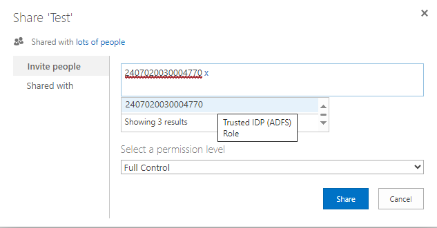
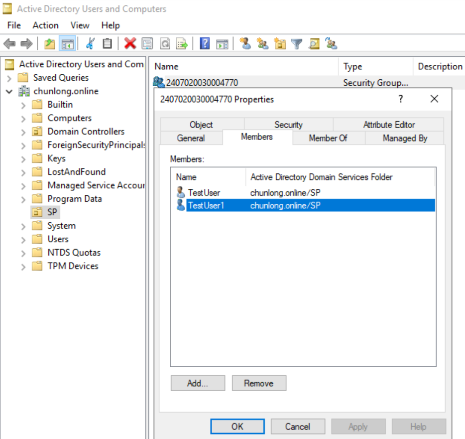
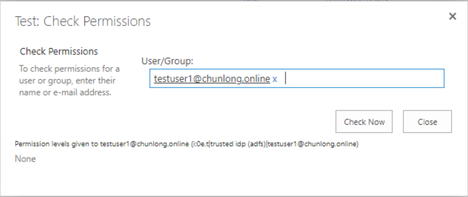
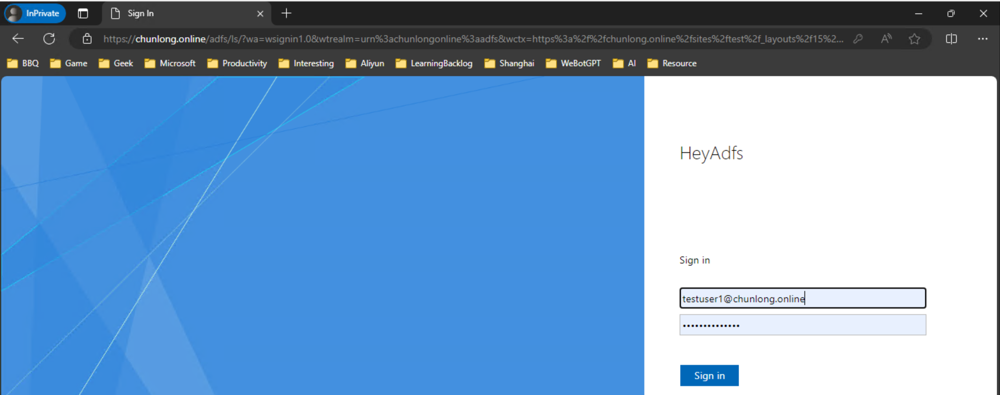
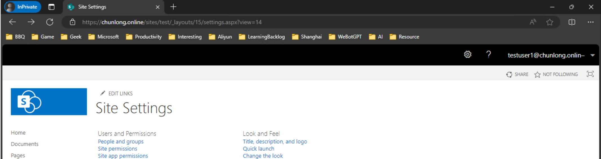
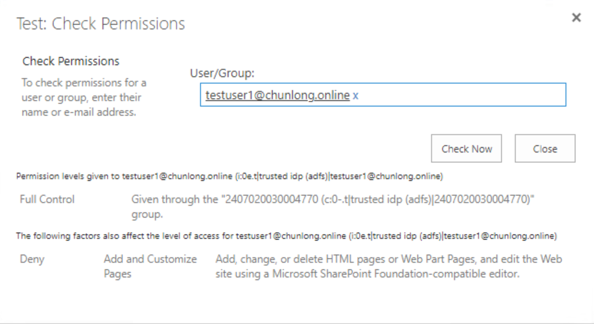

## Issue

Users are receiving an access denied error after being granted permissions via a security group – “Sorry, the site hasn’t been shared with you.”

## Repro Steps

1. Create a new security group in Active Directory.
2. Add a user to the new security group.
3. Navigate to the SharePoint site https://xxx.xxx.xxx.
4. Grant full control to the security group.
5. The user receives an access denied error.

## Assessments

1. Checked permissions for the security group; it shows full control, but checking permissions for the user shows none.
2. Tried another different security group; even though it shows the user is granted full control via the security group, the user still receives an access denied error.
3. Tried accessing https://xxx.xxx.xxx/_layouts/15/start.aspx#/_layouts/15/settings.aspx and https://xxx.xxx.xxx/_layouts/15/start.aspx#/_layouts/15/viewlsts.aspx with the same result.
4. Example of a security group: xxx; Example of a user: xxx.
5. If permissions are granted directly to the user (instead of via the security group), no issues occur.
6. Encountered the following error message from the SharePoint server; the same command works on the domain controller (DC):

```powershell
PS C:\Users\xxx> Get-ADPrincipalGroupMembership xxx | select name
Get-ADPrincipalGroupMembership : The server has rejected the client credentials.
At line:1 char:1
+ Get-ADPrincipalGroupMembership xxx | select name
+ ~~~~~~~~~~~~~~~~~~~~~~~~~~~~~~~~~~~~~~~~~~~
    + CategoryInfo : SecurityError: (:) [Get-ADPrincipalGroupMembership], AuthenticationException
    + FullyQualifiedErrorId : ActiveDirectoryCmdlet:System.Security.Authentication.AuthenticationException,Microsoft.ActiveDirectory.Management.Commands.GetADPrincipalGroupMembership
```

## Resolution

This is by design. 

`tp_exteranltoken` has a 24-hour lifetime, and users within the security group need to wait 24 hours to gain permissions.

```powershell
Set-SPSecurityTokenServiceConfig -WindowsTokenLifetime xx
```

Search "sharepoint session timeout" for more relevant details.

**Shared by Lambert:**

In your scenarios, there are two types of tokens involved:

1. **Security Token / Interactive Refresh:** The user logs in interactively, such as by browsing to a site.
   - Token Timeout (how long the external token is cached): 10 hours.

2. **External Token / Non-interactive Refresh:** Some other process (e.g., “check permissions”, alerts) must determine permissions non-interactively.
   - Token Timeout (how long the external token is cached): 24 hours.

When permissions are granted with AD groups, the membership for the user does not reflect in SharePoint in real time. SharePoint checks the cache for the above two types of tokens; unless the token expires, SharePoint does not refresh/request a new token. Users receive “access denied” because the cached Security Token did not include the newly added group, and when permissions are checked, the cached External Token did not include the newly added group either.

For Security Token, use the script below to reduce the time. The impact is that it would increase traffic to your domain controller.

```powershell
$sts = Get-SPSecurityTokenServiceConfig
$sts.WindowsTokenLifetime = (New-TimeSpan -Minutes 60)
$sts.Update()
```

For External Token, use the script below to reduce the time. The impact is that it would increase traffic to your domain controller.

```powershell
$cs = [Microsoft.SharePoint.Administration.SPWebService]::ContentService
$cs.TokenTimeout = New-TimeSpan -Minutes 60
$cs.Update()
```

### In an ADFS Environment:

After the new CU in 2024, this issue is resolved. When granting permissions to the Security Group, select the Role claim:





The image above shows no permissions (the user is not in the userinfo list, using the UPN claim), but the image below shows successful login to the site:




After logging in, permissions can be checked again, and they will display correctly. Without the new CU, the Check Permissions feature does not display correctly (the June 2024 patch is applied here):


